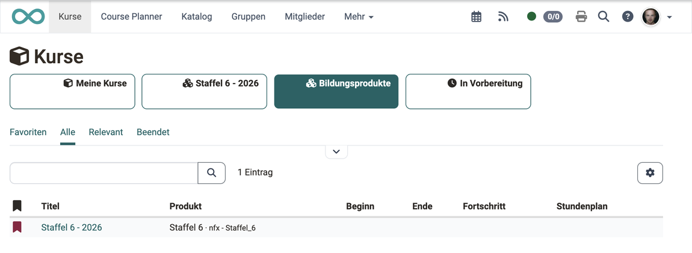

# Kurse finden {: #courses}

:octicons-device-camera-video-24: **Video-Einführung**: [Wo finde ich meine Kurse?](<https://www.youtube.com/embed/2sN32vLD9UY>){:target="_blank"}

Der Menüpunkt "Kurse" bietet Ihnen den Zugang zu den für Sie zugänglichen Kursen und eventuell weiteren Lernressourcen. Klicken Sie in der Hauptnavigation oben auf den Punkt "Kurse". Der Bereich steht allen angemeldeten Benutzer:innen offen; Gäste und Konten mit der Rolle Einladung sehen ihn nicht.

## Meine Kurse

Unter "Meine Kurse" können Sie sich standardmässig alle Kurse und Lernressourcen anzeigen lassen die aktiv oder beendet sind. Sie können auch Favoriten markieren und sich nur die Favoriten anzeigen lassen. Oder Sie nutzen die Suche um einen Kurs bzw. eine Lernressource basierend auf einem Stichwort zu finden.

Lernressourcen, bei denen Sie Betreuer:in oder Besitzer:in sind, finden Sie im Bereich "Coaching". Unter "Meine Kurse" finden Sie Lernressourcen, bei denen Sie selbst als Teilnehmer:in eingetragen sind. [:octicons-tag-16:{ title="ab Release 21.0 (OO-9576)" }](https://track.frentix.com/issue/OO-9576)

!!! info "Wichtig"
    Sind Sie in derselben Lernressource Teilnehmer:in und zugleich Betreuer:in oder Besitzer:in, erscheint sie an beiden Orten: unter "Meine Kurse" und im Bereich "Coaching".

Ihre Kurse können Sie auch anhand verschiedener Kriterien filtern, dazu gehören der Durchführungszeitraum, das Durchführungsformat, der Mitgliedsstatus, die Kursrolle und der Bewertungsstatus (Resultat). Klicken Sie auf den kleinen Pfeil um die weiteren Filteroptionen einzublenden.

{ class="shadow lightbox" }

Filter lassen sich auch kombinieren und speichern.

### Filtern nach Durchführungszeitraum [:octicons-tag-16:{ title="ab Release 20.3 (OO-9218)" }](https://track.frentix.com/issue/OO-9218)

Die verfügbaren Durchführungszeiträume stellt die Systemadministration über das Modul "Zeitabschnitte" bereit. Den Durchführungszeitraum können Sie auch als Sortierkriterium wählen. Klicken Sie dazu auf den Button rechts oben über der Liste. Der Button trägt immer das aktive Kriterium als Beschriftung, das Pfeilsymbol zeigt die Richtung.

{ class="shadow lightbox" }

!!! info "Wichtig"
    Die Sortierung nach Durchführungszeitraum erfolgt chronologisch nach dem **Zeitrahmen** und nicht alphabetisch nach der Bezeichnung: zuerst nach dem Beginndatum, ohne Beginndatum nach dem Enddatum. Innerhalb desselben Zeitraums wird alphabetisch sortiert. Kurse ohne Durchführungszeitraum erscheinen immer am Ende der Liste.

Wie Administrator:innen die Zeitabschnitte verwalten, beschreibt die Seite [Modul Zeitabschnitte](../../manual_admin/administration/Modules_Time_Period.de.md). Wie Sie Ihre Ansicht filtern, lesen Sie unter [Mit Tabellen arbeiten](../basic_concepts/Table_Concept.de.md).

Für die Ansicht der Kurse haben Sie zwei Möglichkeiten. Sie können sich die gewünschten Kurse in der Tabellenansicht wie im Screenshot oben oder in der Listensicht anzeigen lassen und auch die gewünschten Anzeigespalten auswählen.

### Suchen

Über die Suche sind alle Lernressourcen auffindbar, auf die Sie Zugriff haben. Geben Sie ein Stichwort oder den Kurstitel ein und lassen Sie sich die passenden Kurse oder Lernressourcen anzeigen. Kennen Sie die genaue Schreibweise nicht, setzen Sie den Stern `*` als Platzhalter für beliebig viele Zeichen ein: `Blog*` findet Kurse, deren Titel mit "Blog" beginnt, `ab*cd` Kurse, deren Titel mit "ab" beginnt und auf "cd" endet. Setzen Sie den Suchbegriff in Anführungszeichen, zum Beispiel `"Blog"`, findet die Suche nur Kurse, deren Titel genau so lautet. Klappen Sie die Filteroption auf um die Suche anhand der Filter weiter einzugrenzen.

{ class="shadow lightbox" }

Wenn Sie einen Kurs nicht finden, prüfen Sie, ob möglicherweise noch ein unerwünschter Filter aktiv ist (z. B. „nur nicht bestandene Kurse anzeigen“). Entfernen Sie in diesem Fall den entsprechenden Filter.

Sobald Sie den Kurs gefunden haben, können Sie ihn auch als Favorit markieren. Klicken Sie dazu auf die weisse Flagge, die sich anschliessend rot färbt. Beim nächsten Login finden Sie den Kurs direkt in Ihren Favoriten.

{ class="shadow lightbox" }

## Bildungsprodukte

Der Bereich "Bildungsprodukte" erscheint, wenn drei Bedingungen erfüllt sind:

* Administrator:innen haben den [Course Planner](../area_modules/Course_Planner.de.md) in der System-Administration aktiviert: `Administration > Module > Course Planner`.
* In diesem Modul ist die Einstellung [Produkt in "Meine Kurse"](../../manual_admin/administration/Modules_Course_Planner.de.md#product_in_my_courses) eingeschaltet.
* Sie sind in mindestens einer Durchführung eingetragen.

Die Liste zeigt Ihre Durchführungen, nicht einzelne Kurse. Ein Klick auf den Titel einer Durchführung öffnet deren Struktur, und erst dort sehen Sie die Kurse und Lernressourcen, die zu ihr gehören. Sind Sie in mehreren Durchführungen eingetragen, stehen sie alle in dieser Liste. Die Spalte "Produkt" nennt zu jeder Durchführung das Bildungsprodukt, zu dem sie gehört, die Spalte "Fortschritt" Ihren Lernfortschritt darin. [:octicons-tag-16:{ title="ab Release 21.0 (OO-9374)" }](https://track.frentix.com/issue/OO-9374){:target="_blank"}

{ class="shadow lightbox" }

Haben Sie eine Durchführung als Favorit markiert, erscheint sie zusätzlich als eigener Bereich vor "Bildungsprodukte". Der Bereich trägt den Titel der Durchführung, darunter ihren Zeitraum, sofern ein Beginn- oder Enddatum hinterlegt ist. Ein Klick darauf öffnet ihre Struktur direkt. [:octicons-tag-16:{ title="ab Release 20.0.2 (OO-8519)" }](https://track.frentix.com/issue/OO-8519)

Die Filter-Tabs "Favoriten", "Alle", "Relevant" und "Beendet" schränken die Liste ein, das Suchfeld darüber durchsucht Titel und Kennzeichen. Was die einzelnen Tabs zeigen und welche Spalten zur Verfügung stehen, beschreibt der Abschnitt [Die Liste filtern](../area_modules/Coaching_Educational_Products.de.md#filter). Er gilt für alle Bereiche, die Bildungsprodukte auflisten.

Einen Filter-Tab "Vorbereitung" gibt es hier nicht. Lernressourcen, die noch nicht veröffentlicht sind, finden Sie stattdessen im Bereich "In Vorbereitung".

## In Vorbereitung

Hier erscheinen die Lernressourcen die den Status "In Vorbereitung" haben und somit noch nicht für Teilnehmende zugänglich sind. Sind Teilnehmende schon als Mitglied der Lernressource eingetragen, erscheint für sie eine entsprechende Information.

{ class="shadow lightbox" }

Für Betreuer:innen und Kursbesitzer:innen ist der Kurs auch im Status "Vorbereitung" zugänglich.

---

## Weiterführende Informationen {: #further_information}

[Modul Zeitabschnitte >](../../manual_admin/administration/Modules_Time_Period.de.md) 
[Mit Tabellen arbeiten >](../basic_concepts/Table_Concept.de.md) 
[Course Planner >](../area_modules/Course_Planner.de.md) 
[Modul Course Planner >](../../manual_admin/administration/Modules_Course_Planner.de.md) 
[Coaching: Bildungsprodukte >](../area_modules/Coaching_Educational_Products.de.md)

**youtube** 
[Wo finde ich meine Kurse?](<https://www.youtube.com/embed/2sN32vLD9UY>)

[Zum Seitenanfang ^](#courses)
