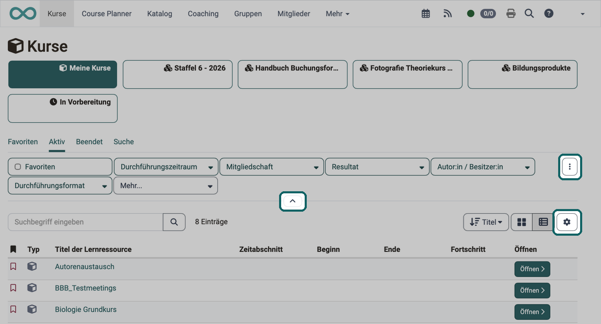
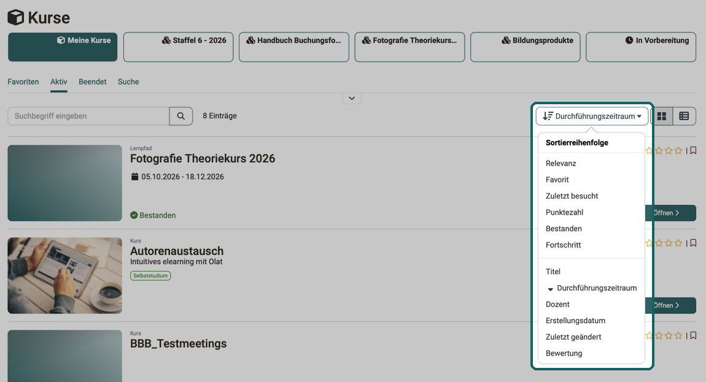
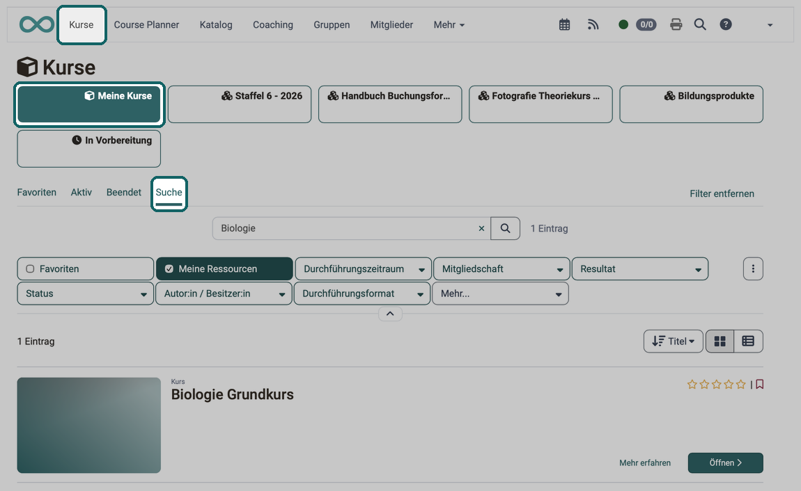
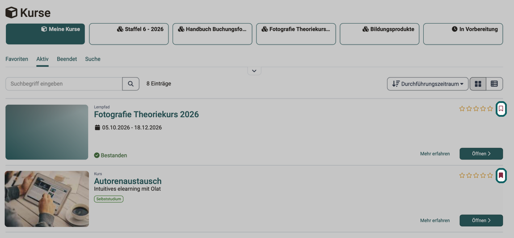
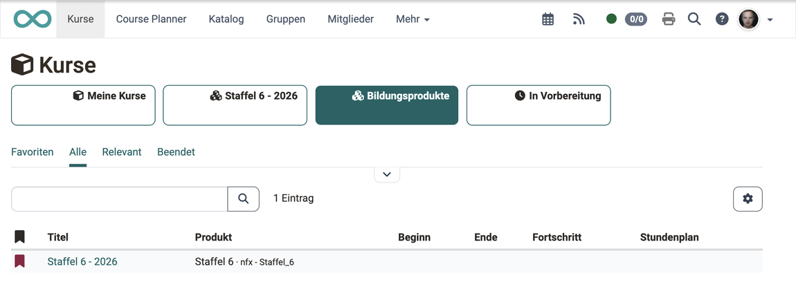
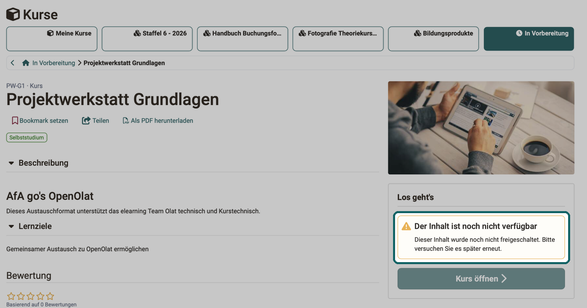

# Kurse finden {: #courses}

:octicons-device-camera-video-24: **Video-Einführung**: [Wo finde ich meine Kurse?](<https://www.youtube.com/embed/2sN32vLD9UY>){:target="_blank"}

Der Menüpunkt "Kurse" bietet Ihnen den Zugang zu den für Sie zugänglichen Kursen und eventuell weiteren Lernressourcen. Klicken Sie in der Hauptnavigation oben auf den Punkt "Kurse". Der Bereich steht allen angemeldeten Benutzer:innen offen; Gäste und Konten mit der Rolle Einladung sehen ihn nicht.

## Meine Kurse

Unter "Meine Kurse" können Sie sich standardmässig alle Kurse und Lernressourcen anzeigen lassen die aktiv oder beendet sind. Sie können auch Favoriten markieren und sich nur die Favoriten anzeigen lassen. Oder Sie nutzen die Suche um einen Kurs bzw. eine Lernressource basierend auf einem Stichwort zu finden.

Lernressourcen, bei denen Sie Betreuer:in oder Besitzer:in sind, finden Sie im Bereich "Coaching". Unter "Meine Kurse" finden Sie Lernressourcen, bei denen Sie selbst als Teilnehmer:in eingetragen sind. [:octicons-tag-16:{ title="ab Release 21.0 (OO-9576)" }](https://track.frentix.com/issue/OO-9576)

!!! info "Wichtig"
    Sind Sie in derselben Lernressource Teilnehmer:in und zugleich Betreuer:in oder Besitzer:in, erscheint sie an beiden Orten: unter "Meine Kurse" und im Bereich "Coaching".

Ihre Kurse können Sie auch filtern. Im Tab "Aktiv" stehen über der Liste die Filter "Favoriten", "Durchführungszeitraum", "Mitgliedschaft", "Resultat", "Autor:in / Besitzer:in" und "Durchführungsformat". Unter "Mitgliedschaft" wählen Sie die Rolle, in der Sie in der Lernressource eingetragen sind, etwa "Belegt als Teilnehmer:in". Unter "Resultat" wählen Sie "Bestanden", "Nicht bestanden" oder "Keine Bewertung". Über "Mehr..." blenden Sie einzelne Filter ein oder aus. Der kleine Pfeil unter den Filtern ("Suchfilter ausblenden") blendet die Filter aus und wieder ein.

{ class="shadow lightbox" title="Tab Aktiv im Bereich Meine Kurse · 2026.10.02" }

Filter lassen sich kombinieren. Eine Kombination, die Sie öfter brauchen, speichern Sie über das Menü mit den drei Punkten rechts neben den Filtern: "Filter speichern". Der gespeicherte Filter erscheint unter seinem Namen als zusätzlicher Tab. Welche Spalten die Tabelle zeigt, wählen Sie über das Zahnrad "Spalten auswählen" rechts über der Tabelle.

### Filtern nach Durchführungszeitraum [:octicons-tag-16:{ title="ab Release 20.3 (OO-9218)" }](https://track.frentix.com/issue/OO-9218)

Die verfügbaren Durchführungszeiträume stellt die Systemadministration über das Modul "Zeitabschnitte" bereit. Den Durchführungszeitraum können Sie auch als Sortierkriterium wählen. Klicken Sie dazu auf den Button rechts oben über der Liste und wählen Sie in der Liste "Sortierreihenfolge" den Eintrag "Durchführungszeitraum". Dieselbe Liste bietet weitere Kriterien, etwa "Relevanz", "Zuletzt besucht", "Fortschritt" oder "Titel". Der Button trägt immer das aktive Kriterium als Beschriftung, das Pfeilsymbol zeigt die Richtung.

{ class="shadow lightbox" title="Bereich Meine Kurse im Menü Kurse · 2026.10.02" }

!!! info "Wichtig"
    Die Sortierung nach Durchführungszeitraum erfolgt chronologisch nach dem **Zeitrahmen** und nicht alphabetisch nach der Bezeichnung: zuerst nach dem Beginndatum, ohne Beginndatum nach dem Enddatum. Innerhalb desselben Zeitraums wird alphabetisch sortiert. Kurse ohne Durchführungszeitraum erscheinen immer am Ende der Liste.

Wie Administrator:innen die Zeitabschnitte verwalten, beschreibt die Seite [Modul Zeitabschnitte](../../manual_admin/administration/Modules_Time_Period.de.md). Wie Sie Ihre Ansicht filtern, lesen Sie unter [Mit Tabellen arbeiten](../basic_concepts/Table_Concept.de.md).

Die Kurse lassen sich in der Tabellen- oder in der Listenansicht anzeigen.

### Suchen

Über die Suche sind alle Lernressourcen auffindbar, auf die Sie Zugriff haben. Geben Sie ein Stichwort oder den Kurstitel ein und lassen Sie sich die passenden Kurse oder Lernressourcen anzeigen. Kennen Sie die genaue Schreibweise nicht, setzen Sie den Stern `*` als Platzhalter für beliebig viele Zeichen ein: `Blog*` findet Kurse, deren Titel mit "Blog" beginnt, `ab*cd` Kurse, deren Titel mit "ab" beginnt und auf "cd" endet. Setzen Sie den Suchbegriff in Anführungszeichen, zum Beispiel `"Blog"`, findet die Suche nur Kurse, deren Titel genau so lautet.

{ class="shadow lightbox" title="Tab Suche im Bereich Meine Kurse · 2026.10.02" }

Im Tab "Suche" sind die Filter bereits eingeblendet. Anders als in den Tabs "Aktiv" und "Beendet" stehen hier auch die Filter "Meine Ressourcen" und "Status" zur Verfügung. "Meine Ressourcen" beschränkt die Treffer auf Lernressourcen, in denen Sie Mitglied sind. Unter "Status" wählen Sie "In Vorbereitung", "Aktiv" oder "Beendet".

Wenn Sie einen Kurs nicht finden, prüfen Sie, ob noch ein unerwünschter Filter aktiv ist, zum Beispiel "Resultat" mit dem Wert "Nicht bestanden". Solange ein Filter gesetzt ist, steht rechts neben den Tabs der Link "Filter entfernen". Er setzt alle Filter auf einmal zurück.

Sobald Sie den Kurs gefunden haben, können Sie ihn auch als Favorit markieren. Klicken Sie dazu auf das Fahnensymbol mit dem Hinweis "Bookmark setzen": in der Listenansicht rechts oben in der Kurszeile, in der Tabellenansicht in der ersten Spalte. Die leere, rot umrandete Fahne füllt sich rot, und der Kurs erscheint im Tab "Favoriten". Ein zweiter Klick entfernt das Bookmark wieder. Auf der Infoseite eines Kurses steht dafür der Button "Bookmark setzen" zur Verfügung. Beim nächsten Login finden Sie den Kurs direkt in Ihren Favoriten.

{ class="shadow lightbox" title="Tab Aktiv im Bereich Meine Kurse · 2026.10.02" }

## Bildungsprodukte

Der Bereich "Bildungsprodukte" erscheint, wenn drei Bedingungen erfüllt sind:

* Administrator:innen haben den [Course Planner](../area_modules/Course_Planner.de.md) in der System-Administration aktiviert: `Administration > Module > Course Planner`.
* In diesem Modul ist die Einstellung [Produkt in "Meine Kurse"](../../manual_admin/administration/Modules_Course_Planner.de.md#product_in_my_courses) eingeschaltet.
* Sie sind in mindestens einer Durchführung eingetragen.

Die Liste zeigt Ihre Durchführungen, nicht einzelne Kurse. Ein Klick auf den Titel einer Durchführung öffnet deren Struktur, und erst dort sehen Sie die Kurse und Lernressourcen, die zu ihr gehören. Sind Sie in mehreren Durchführungen eingetragen, stehen sie alle in dieser Liste. Die Spalte "Produkt" nennt zu jeder Durchführung das Bildungsprodukt, zu dem sie gehört, die Spalte "Fortschritt" Ihren Lernfortschritt darin. [:octicons-tag-16:{ title="ab Release 21.0 (OO-9374)" }](https://track.frentix.com/issue/OO-9374){:target="_blank"}

{ class="shadow lightbox" title="Bereich Bildungsprodukte im Menü Kurse" }

Haben Sie eine Durchführung als Favorit markiert, erscheint sie zusätzlich als eigener Bereich vor "Bildungsprodukte". Der Bereich trägt den Titel der Durchführung, darunter ihren Zeitraum, sofern ein Beginn- oder Enddatum hinterlegt ist. Ein Klick darauf öffnet ihre Struktur direkt. [:octicons-tag-16:{ title="ab Release 20.0.2 (OO-8519)" }](https://track.frentix.com/issue/OO-8519)

Die Filter-Tabs "Favoriten", "Alle", "Relevant" und "Beendet" schränken die Liste ein, das Suchfeld darüber durchsucht Titel und Kennzeichen. Was die einzelnen Tabs zeigen und welche Spalten zur Verfügung stehen, beschreibt der Abschnitt [Die Liste filtern](../area_modules/Coaching_Educational_Products.de.md#filter). Er gilt für alle Bereiche, die Bildungsprodukte auflisten.

Einen Filter-Tab "Vorbereitung" gibt es hier nicht. Lernressourcen, die noch nicht veröffentlicht sind, finden Sie stattdessen im Bereich "In Vorbereitung".

## In Vorbereitung [:octicons-tag-16:{ title="ab Release 20.0 (OO-8506)" }](https://track.frentix.com/issue/OO-8506)

Hier sehen Sie die Lernressourcen, in denen Sie schon als Mitglied eingetragen sind, die aber noch nicht für Teilnehmende freigegeben sind. Sie stehen im Status "Vorbereitung", "Review" oder "Freigabe Betreuer:innen". Ein Klick auf "Mehr erfahren" öffnet die Infoseite der Lernressource. Dort zeigt der Kasten "Los geht's" die Meldung "Der Inhalt ist noch nicht verfügbar", und der Button "Kurs öffnen" bleibt für Teilnehmende inaktiv, bis der Kurs veröffentlicht ist.

{ class="shadow lightbox" title="Infoseite eines Kurses im Bereich In Vorbereitung · 2026.10.02" }

Besitzer:innen öffnen den Kurs bereits im Status "Vorbereitung", Betreuer:innen ab dem Status "Freigabe Betreuer:innen".

---

## Weiterführende Informationen {: #further_information}

[Modul Zeitabschnitte >](../../manual_admin/administration/Modules_Time_Period.de.md) 
[Mit Tabellen arbeiten >](../basic_concepts/Table_Concept.de.md) 
[Course Planner >](../area_modules/Course_Planner.de.md) 
[Modul Course Planner >](../../manual_admin/administration/Modules_Course_Planner.de.md) 
[Coaching: Bildungsprodukte >](../area_modules/Coaching_Educational_Products.de.md)

**youtube** 
[Wo finde ich meine Kurse?](<https://www.youtube.com/embed/2sN32vLD9UY>)

[Zum Seitenanfang ^](#courses)
