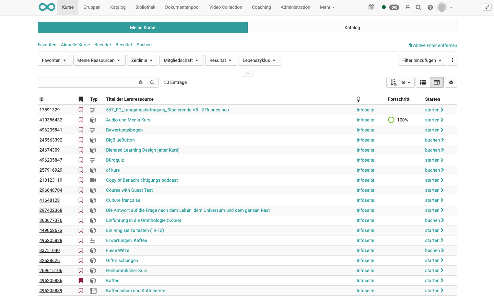
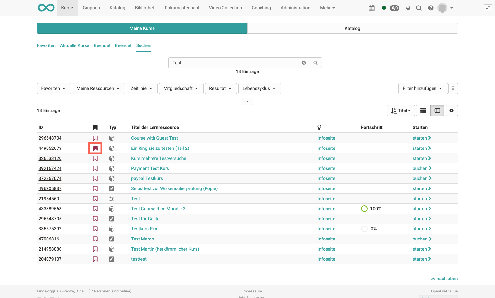

# Kurse finden

:octicons-device-camera-video-24: **Video-Einführung**: [Wo finde ich meine Kurse?](<https://www.youtube.com/embed/2sN32vLD9UY>){:target="_blank”}

Der Menüpunkt „Kurse“ bietet Ihnen den Zugang zu den für Sie zugänglichen
Kursen und eventuell weiteren Lernressourcen. Klicken Sie in der
Hauptnavigation oben auf den Punkt „Kurse“.

## Meine Kurse

Unter "Meine Kurse" können Sie sich standardmässig alle Kurse und Lernressourcen anzeigen
lassen die aktiv, in Vorbereitung oder beendet sind. Sie können auch Favoriten markieren und sich nur die Favoriten anzeigen lassen. Oder Sie nutzen die Suche um einen Kurs bzw. eine Lernressource
basierend auf einem Stichwort zu finden.

Ihre Kurse können Sie auch anhand verschiedener Kriterien filtern, darunter
nach Aktualität, Mitgliedsstatus und nach Bewertungsstatus. Klicken Sie dafür
auf den kleinen Pfeil und weitere Filteroptionen erscheinen.
[Hier](../basic_concepts/Table_Concept.de.md) erfahren Sie mehr darüber wie Sie Ihre
Ansicht optimal filtern können.

### Suchen

Über die Suche sind alle Lernressourcen auffindbar, auf die Sie Zugriff haben.
Geben Sie ein Stichwort oder den Kurstitel ein und lassen Sie sich die
passenden Kurse oder Lernressourcen anzeigen. Klappen Sie die Filteroption auf
um die Suche anhand der Filter weiter einzugrenzen. Sie können die
Filtereinstellung auch speichern.

Wenn Sie mal einen Kurs nicht finden, achten Sie darauf eventuell noch ein
nicht gewünschter Filter aktiviert ist z.B. nur Kurse gefunden, die Sie noch
nicht bestanden haben. Entfernen Sie in diesem Fall den entsprechenden Filter.

Markieren Sie den Kurs als Favorit, wenn Sie ihn gefunden haben. Klicken Sie
dazu die weisse Flagge an, die sich dann rot färbt. Beim nächsten Login finden
Sie den Kurs dann direkt in Ihren Favoriten.

## Katalog

Wird der OpenOlat Katalog 1.0 in Ihrer Instanz verwendet sehen Sie den Tab "Katalog" im Bereich der Kurse. 

Der OpenOlat Katalog ähnelt einem Vorlesungsverzeichnis in Papierform. Der Aufbau des Katalogs kann vom OpenOlat Administrator eingerichtet werden. Für OpenOlat Benutzer bietet sich der Katalog für die Suche nach bestimmten Kursen und Lernressourcen an. Weitere Informationen zum Katalog 1.0  finden Sie [hier](../area_modules/catalog1.0.de.md).

!!! Info 

    Ist der Katalog generell deaktiviert erscheint der Menüpunkt _nicht_. 
    Wird der [Katalog 2.0](../area_modules/catalog2.0.de.md) :octicons-tag-24: Release 17.0 verwendet dann erscheint der Katalog als eigener Menüpunkt in der obersten Navigation und nicht unter "Kurse". 

## Curriculum

Verfügt ein User auch über Kurse, die einem [Curriculum](Curriculum_Management.de.md)zugeordnet sind, erscheint im Menü "Kurse" auch
der Bereich "Lehrgänge".