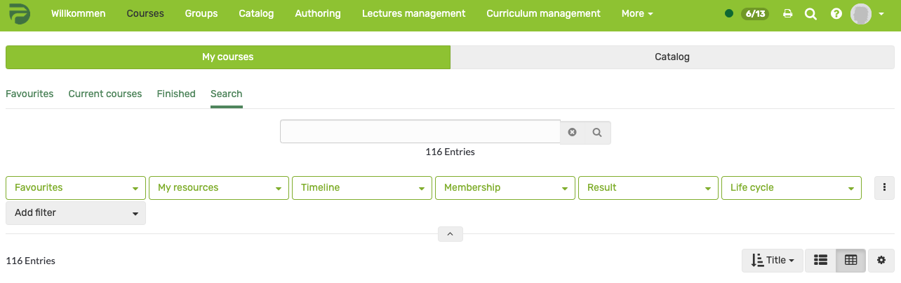

# Finding courses

The "Courses" menu item gives you access to the courses and possibly other learning resources available to you. Click on the "Courses" menu item in the main navigation at the top.

## My courses

Under "My Courses", you can view all courses and learning resources that are active, in preparaion or finished. Or use the search to find a course or learning resource based on a keyword.

You can also filter your courses based on various criteria, including the timeline, membership status, and results. To do so, click the small arrow and more filter options will appear. Learn more about how to best filter your tables [here](../basic_concepts/Table_Concept.md).

## Search

Use the search function to find all the learning resources you have access to. Enter a keyword or the course title and have the matching courses or learning resources displayed. Unfold the filter option to further narrow the search based on the filters. You can also save the filter setting.

If you do not find a course, make sure that you have not activated a filter that you do not want, e.g. only courses that you have not yet passed are found. In this case, remove the corresponding filter.

Mark the course as a favorite when you have found it. To do this, click on the white flag, which will then turn red. The next time you log in, you will find the course directly in your favorites.

## Catalog

If the OpenOlat catalog 1.0 is used in your instance, you will see the "Catalog" tab in the course area.

The OpenOlat catalog is similar to a paper version of the course catalog. The structure of the catalog can be set up by the OpenOlat administrator. OpenOlat users can use the catalog to search for specific courses and learning resources. Further information on catalog 1.0 can be found [here](../area_modules/catalog1.0.md).

!!! Info 

    If the catalog is generally deactivated, the menu item _not_ appears. If the [catalog 2.0](../area_modules/catalog2.0.md) :octicons-tag-24: Release 17.0 is used, the catalog appears as a separate menu item in the top navigation and not under "Courses". 

