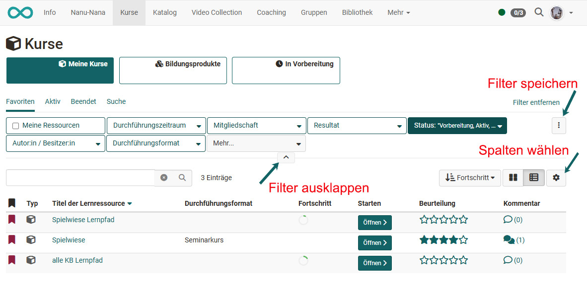
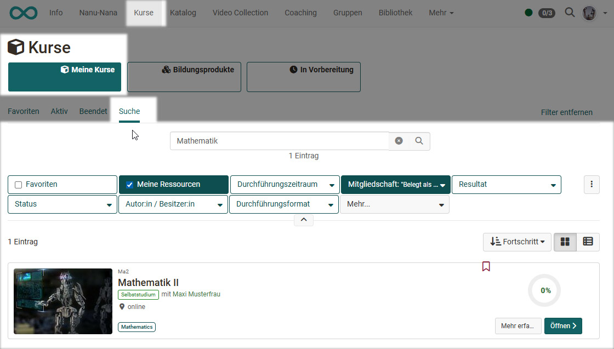
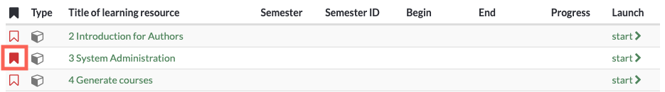
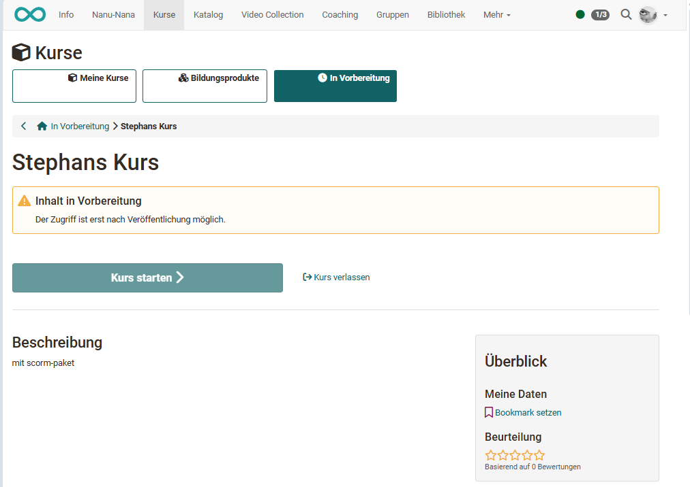

# Finding courses

The "Courses" menu item gives you access to the courses and possibly other learning resources available to you. Click on the "Courses" menu item in the main navigation at the top.

## My courses

Under "My Courses", you can view all courses and learning resources that are active or finished. You can also mark favorites and display only the favorites. Or you can use the search function to find a course or learning resource based on a keyword.

You can also filter your courses based on various criteria, including execution period, membership, result, status, author/owner odr implementation format. To do so, click the small arrow and more filter options will appear. 

Filters can also be combined and saved. 
Learn more about how to best filter your tables [here](../basic_concepts/Table_Concept.md).

You have two options for viewing the courses. You can display the desired courses in the table view as shown in the screenshot above or in the list view and also select the desired display columns.

### Search

Use the search function to find all the learning resources you have access to. Enter a keyword or the course title and have the matching courses or learning resources displayed. Unfold the filter option to further narrow the search based on the filters. You can also save the filter setting.

If you do not find a course, make sure that you have not activated a filter that you do not want, e.g. only courses that you have not yet passed are found. In this case, remove the corresponding filter.

Mark the course as a favorite when you have found it. To do this, click on the white flag, which will then turn red. The next time you log in, you will find the course directly in your favorites.

## Education products

Der Bereich "Bildungsprodukte" wird angezeigt wenn der [Course Planner](../area_modules/Course_Planner.de.md) in der Administration aktiviert wurde. 

Unter Bildungsprodukte werden dann dem User die Kurse und Lernressourcen angezeigt, die zu den Bildungsgängen (Durchführungen) des Users gehören. Hat sich ein User z.B. in einem Bildungsgang eingeschrieben der mit dem Course Planner organisiert wird, erscheinen hier alle Kurse, die diesem Bildungsgang zugeordnet sind. Ist der User in mehreren Durchführungen eingeschrieben sieht er unter Bildungsprodukte alle zugehörigen Kurse. 

Ferner können hier auch nur die Favoriten die aktiven oder beendeten Kurse der Durchführungen angezeigt oder gezielt nach Kursen gesucht werden. Unter Bildungsprodukte gelangen Lernende also schnell und fokussiert zu den für ihren Bildungang/ihr Modul/ihre Durchführung relevanten Kurse und Lernressourcen. 

## In preparation

Hier erscheinen die Lernressourcen die den Status "In Vorbereitung" haben und somit noch nicht für Teilnehmende zugänglich sind. Sind Teilnehmende schon als Mitglied der Lernressource eingetragen, erscheint für sie  eine entsprechende Information. 

Für Betreuer:innen und Kursbesitzer:innen ist der Kurs auch im Status "Vorbereitung" zugänglich. 

