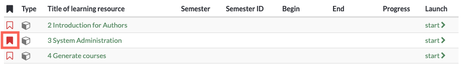

# Finding courses {: #courses}

:octicons-device-camera-video-24: **Video introduction (German)**: [Wo finde ich meine Kurse?](<https://www.youtube.com/embed/2sN32vLD9UY>){:target="_blank"}

The "Courses" menu item gives you access to the courses and possibly other learning resources available to you. Click on the "Courses" menu item in the main navigation at the top. The area is open to all logged-in users; guests and accounts with the role Invitee do not see it.

## My courses

Under "My Courses", you can view all courses and learning resources that are active or finished. You can also mark favorites and display only the favorites. Or you can use the search function to find a course or learning resource based on a keyword.

Learning resources in which you are a coach or owner are found in the "Coaching" area. Under "My Courses", learning resources are displayed in which you yourself are entered as a participant. [:octicons-tag-16:{ title="from Release 21.0 (OO-9576)" }](https://track.frentix.com/issue/OO-9576)

!!! info "Important"
    If both roles are assigned to you, the learning resource is displayed in both "tabs".

You can also filter your courses based on various criteria, including the execution period, the implementation format, the membership status, the course role and the assessment status (result). Click the small arrow to display the further filter options.

{ class="shadow lightbox" }

Filters can also be combined and saved.

### Filter by implementation period [:octicons-tag-16:{ title="from Release 20.3 (OO-9218)" }](https://track.frentix.com/issue/OO-9218)

The system administration provides the available execution periods through the "Time periods" module. You can also choose the execution period as a sort criterion. To do so, click the button at the top right above the list. The button always carries the active criterion as its label, and the arrow symbol shows the direction.

{ class="shadow lightbox" }

!!! info "Important"
    Sorting by execution period is chronological according to the **time frame** and not alphabetical by the label: first by the begin date, without a begin date by the end date. Within the same period the sorting is alphabetical. Courses without an execution period always appear at the end of the list.

How administrators manage the time periods is described on the page [Module Time periods](../../manual_admin/administration/Modules_Time_Period.md). How you filter your view is described under [Working with tables](../basic_concepts/Table_Concept.md).

You have two options for viewing the courses. You can display the desired courses in the table view as shown in the screenshot above or in the list view and also select the desired display columns.

### Search

Use the search function to find all the learning resources you have access to. Enter a keyword or the course title and have the matching courses or learning resources displayed. If you do not know the exact spelling, use the asterisk `*` as a wildcard for any number of characters: `Blog*` finds courses whose title begins with "Blog", `ab*cd` courses whose title begins with "ab" and ends with "cd". If you put the search term in quotation marks, for example `"Blog"`, the search only finds courses whose title reads exactly like that. Unfold the filter option to further narrow the search based on the filters.

{ class="shadow lightbox" }

If you do not find a course, check whether an unwanted filter is still active (e.g. "show only courses not passed"). In this case, remove the corresponding filter.

Once you have found the course, you can also mark it as a favorite. To do this, click on the white flag, which will then turn red. The next time you log in, you will find the course directly in your favorites.

{ class="shadow lightbox" }

## Educational products

The "Educational products" area appears when three conditions are met:

* Administrators have activated the [Course Planner](../area_modules/Course_Planner.md) in the system administration: `Administration > Modules > Course Planner`.
* In this module, the setting [Product in "My courses"](../../manual_admin/administration/Modules_Course_Planner.md#product_in_my_courses) is switched on.
* You are entered in at least one implementation.

The list shows your implementations, not individual courses. A click on the title of an implementation opens its structure, and only there do you see the courses and learning resources that belong to it. If you are entered in several implementations, they all stand in this list. The column "Product" names the educational product each implementation belongs to, the column "Progress" your learning progress in it. [:octicons-tag-16:{ title="from Release 21.0 (OO-9374)" }](https://track.frentix.com/issue/OO-9374){:target="_blank"}

The filter tabs "Favourites", "All", "Relevant" and "Finished" narrow down the list, the search field above it searches the title and the reference. What the individual tabs show and which columns are available is described in the section [Filtering the list](../area_modules/Coaching_Educational_Products.md#filter). It applies to all areas that list educational products.

There is no filter tab "Preparation" here. Learning resources that are not yet published you find in the area "In preparation" instead.

## In preparation

The learning resources with the status "In preparation" appear here. They are not yet accessible to participants. If participants are already entered as members of the learning resource, a corresponding information is displayed for them.

{ class="shadow lightbox" }

For coaches and course owners, the course is also accessible in the status "Preparation".

---

## Further information {: #further_information}

[Module Time periods >](../../manual_admin/administration/Modules_Time_Period.md) 
[Working with tables >](../basic_concepts/Table_Concept.md) 
[Course Planner >](../area_modules/Course_Planner.md) 
[Module Course Planner >](../../manual_admin/administration/Modules_Course_Planner.md) 
[Coaching: Educational products >](../area_modules/Coaching_Educational_Products.md)

**youtube** 
[Wo finde ich meine Kurse?](<https://www.youtube.com/embed/2sN32vLD9UY>)

[To the top of the page ^](#courses)
