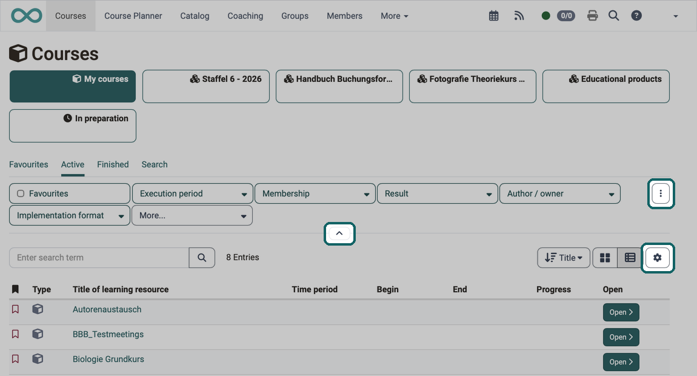
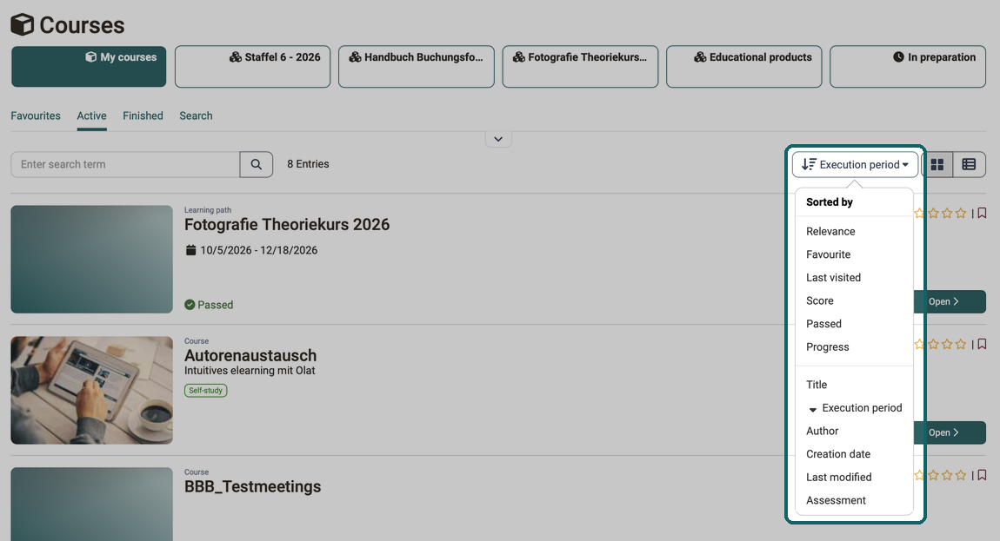
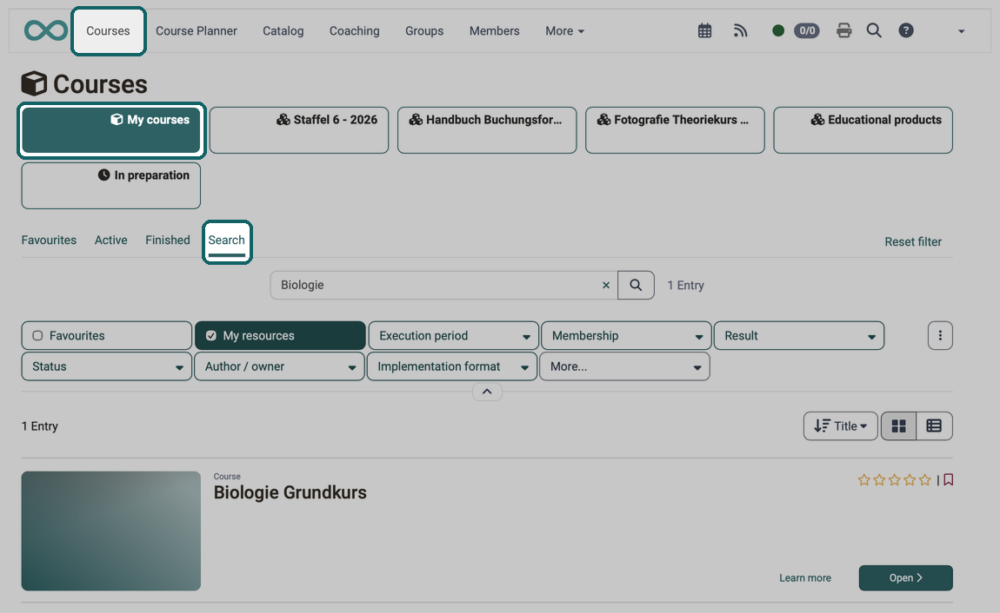
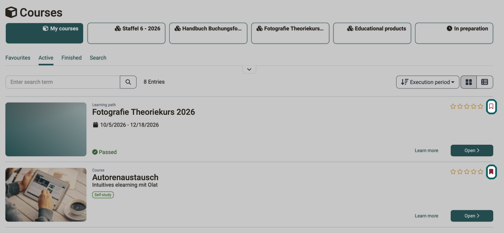
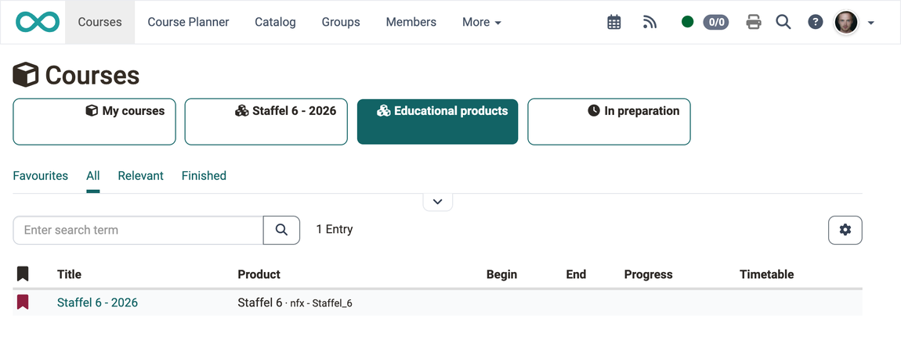
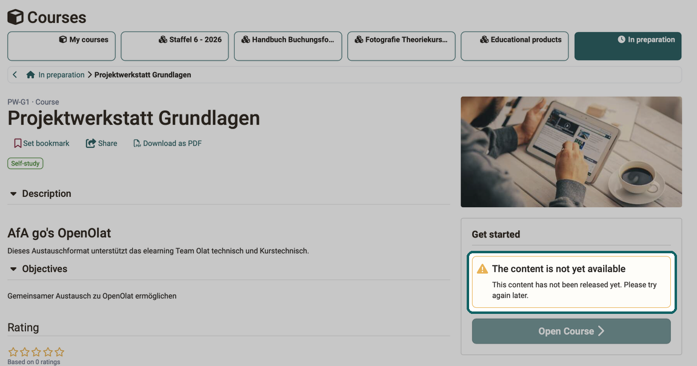

# Finding courses {: #courses}

:octicons-device-camera-video-24: **Video introduction (German)**: [Wo finde ich meine Kurse?](<https://www.youtube.com/embed/2sN32vLD9UY>){:target="_blank"}

The "Courses" menu item gives you access to the courses and possibly other learning resources available to you. Click on the "Courses" menu item in the main navigation at the top. The area is open to all logged-in users; guests and accounts with the role Invitee do not see it.

## My courses

Under "My Courses", you can view all courses and learning resources that are active or finished. You can also mark favourites and display only the favourites. Or you can use the search function to find a course or learning resource based on a keyword.

Learning resources in which you are a coach or owner are found in the "Coaching" area. Under "My Courses", learning resources are displayed in which you yourself are entered as a participant. [:octicons-tag-16:{ title="from Release 21.0 (OO-9576)" }](https://track.frentix.com/issue/OO-9576)

!!! info "Important"
    If you are a participant in the same learning resource and at the same time a coach or owner, it appears in both places: under "My courses" and in the "Coaching" area.

You can also filter your courses. In the tab "Active", the filters "Favourites", "Execution period", "Membership", "Result", "Author / owner" and "Implementation format" stand above the list. Under "Membership" you choose the role in which you are entered in the learning resource, for example "Booked as participant". Under "Result" you choose "Passed", "Not passed" or "No assessment". Via "More..." you show or hide individual filters. The small arrow below the filters ("Hide search filters") hides the filters and shows them again.

{ class="shadow lightbox" title="Tab Active in the My courses area · 2026.10.02" }

Filters can be combined. A combination you need more often you save via the menu with the three dots to the right of the filters: "Save filter". The saved filter appears under its name as an additional tab. You choose which columns the table shows via the gear "Customize columns" at the top right above the table.

### Filter by execution period [:octicons-tag-16:{ title="from Release 20.3 (OO-9218)" }](https://track.frentix.com/issue/OO-9218)

The system administration provides the available execution periods through the "Time periods" module. You can also choose the execution period as a sort criterion. To do so, click the button at the top right above the list and select the entry "Execution period" in the list "Sorted by". The same list offers further criteria, for example "Relevance", "Last visited", "Progress" or "Title". The button always carries the active criterion as its label, and the arrow symbol shows the direction.

{ class="shadow lightbox" title="My courses area in the Courses menu · 2026.10.02" }

!!! info "Important"
    Sorting by execution period is chronological according to the **time frame** and not alphabetical by the label: first by the begin date, without a begin date by the end date. Within the same period the sorting is alphabetical. Courses without an execution period always appear at the end of the list.

How administrators manage the time periods is described on the page [Module Time periods](../../manual_admin/administration/Modules_Time_Period.md). How you filter your view is described under [Working with tables](../basic_concepts/Table_Concept.md).

The courses can be displayed in the table view or in the list view.

### Search

Use the search function to find all the learning resources you have access to. Enter a keyword or the course title and have the matching courses or learning resources displayed. If you do not know the exact spelling, use the asterisk `*` as a wildcard for any number of characters: `Blog*` finds courses whose title begins with "Blog", `ab*cd` courses whose title begins with "ab" and ends with "cd". If you put the search term in quotation marks, for example `"Blog"`, the search only finds courses whose title reads exactly like that.

{ class="shadow lightbox" title="Tab Search in the My courses area · 2026.10.02" }

In the tab "Search", the filters are already shown. Unlike in the tabs "Active" and "Finished", the filters "My resources" and "Status" are also available here. "My resources" limits the hits to learning resources in which you are a member. Under "Status" you choose "In preparation", "Active" or "Finished".

If you do not find a course, check whether an unwanted filter is still active, for example "Result" with the value "Not passed". As long as a filter is set, the link "Reset filter" stands to the right of the tabs. It resets all filters at once.

Once you have found the course, you can also mark it as a favourite. To do this, click the flag symbol with the hint "Set bookmark": in the list view at the top right of the course row, in the table view in the first column. The empty flag with the red outline fills red, and the course appears in the tab "Favourites". A second click removes the bookmark again. On the info page of a course, the button "Set bookmark" serves the same purpose. The next time you log in, you will find the course directly in your favourites.

{ class="shadow lightbox" title="Tab Active in the My courses area · 2026.10.02" }

## Educational products

The "Educational products" area appears when three conditions are met:

* Administrators have activated the [Course Planner](../area_modules/Course_Planner.md) in the system administration: `Administration > Modules > Course Planner`.
* In this module, the setting [Product in "My courses"](../../manual_admin/administration/Modules_Course_Planner.md#product_in_my_courses) is switched on.
* You are entered in at least one implementation.

The list shows your implementations, not individual courses. A click on the title of an implementation opens its structure, and only there do you see the courses and learning resources that belong to it. If you are entered in several implementations, they all stand in this list. The column "Product" names the educational product each implementation belongs to, the column "Progress" your learning progress in it. [:octicons-tag-16:{ title="from Release 21.0 (OO-9374)" }](https://track.frentix.com/issue/OO-9374){:target="_blank"}

{ class="shadow lightbox" title="Educational products area in the Courses menu" }

If you have marked an implementation as a favourite, it additionally appears as its own area before "Educational products". The area carries the title of the implementation, below it its period, provided a begin or end date is entered. A click on it opens its structure directly. [:octicons-tag-16:{ title="from Release 20.0.2 (OO-8519)" }](https://track.frentix.com/issue/OO-8519)

The filter tabs "Favourites", "All", "Relevant" and "Finished" narrow down the list, the search field above it searches the title and the reference. What the individual tabs show and which columns are available is described in the section [Filtering the list](../area_modules/Coaching_Educational_Products.md#filter). It applies to all areas that list educational products.

There is no filter tab "Preparation" here. Learning resources that are not yet published you find in the area "In preparation" instead.

## In preparation [:octicons-tag-16:{ title="from Release 20.0 (OO-8506)" }](https://track.frentix.com/issue/OO-8506)

Here you see the learning resources in which you are already entered as a member, but which are not yet released for participants. They are in the status "Preparation", "Review" or "Access for coach". A click on "Learn more" opens the info page of the learning resource. There the box "Get started" shows the message "The content is not yet available", and for participants the button "Open Course" stays inactive until the course is published.

{ class="shadow lightbox" title="Info page of a course in the In preparation area · 2026.10.02" }

Owners open the course already in the status "Preparation", coaches from the status "Access for coach".

---

## Further information {: #further_information}

[Module Time periods >](../../manual_admin/administration/Modules_Time_Period.md) 
[Working with tables >](../basic_concepts/Table_Concept.md) 
[Course Planner >](../area_modules/Course_Planner.md) 
[Module Course Planner >](../../manual_admin/administration/Modules_Course_Planner.md) 
[Coaching: Educational products >](../area_modules/Coaching_Educational_Products.md)

**youtube** 
[Wo finde ich meine Kurse?](<https://www.youtube.com/embed/2sN32vLD9UY>)

[To the top of the page ^](#courses)
