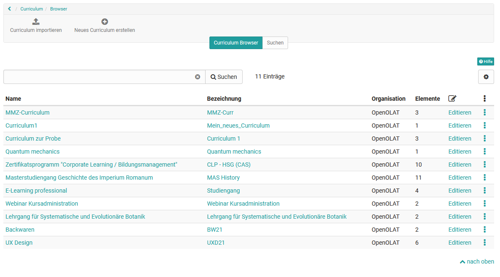
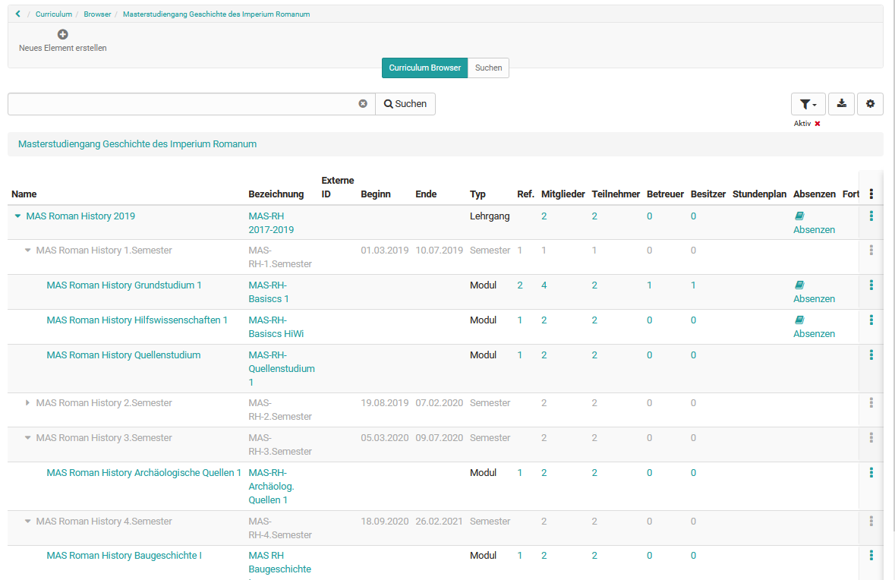
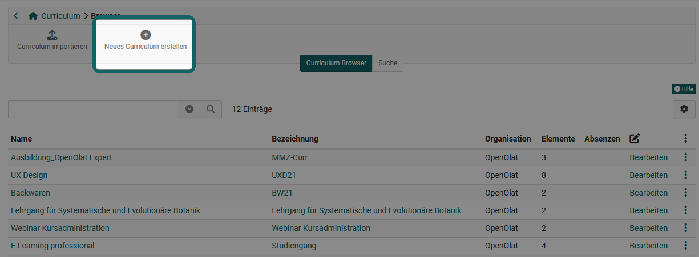
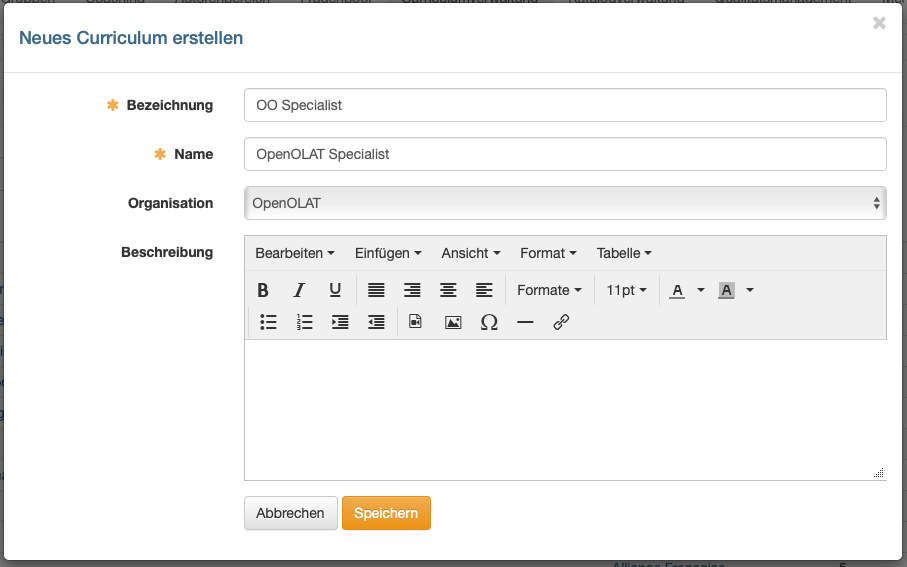
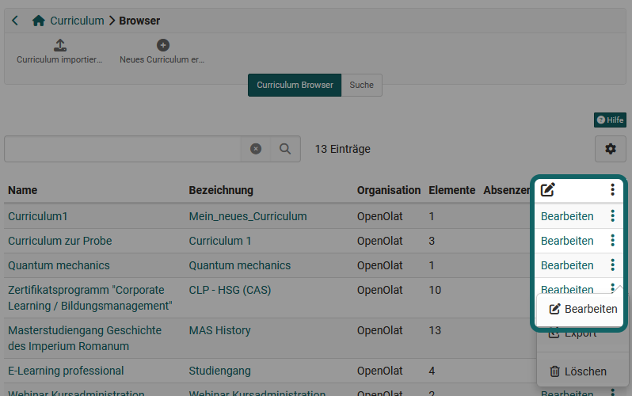
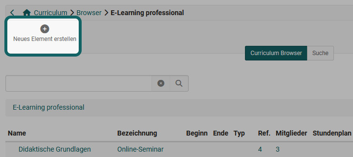
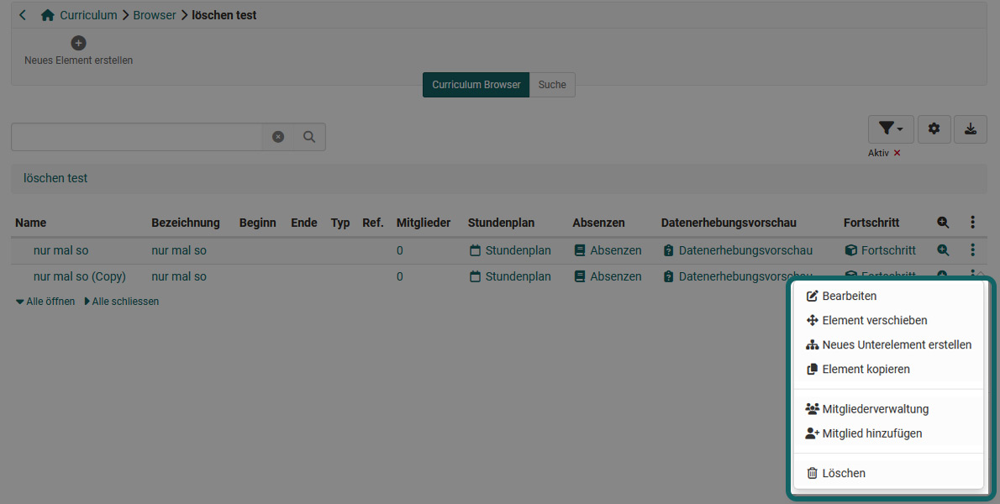
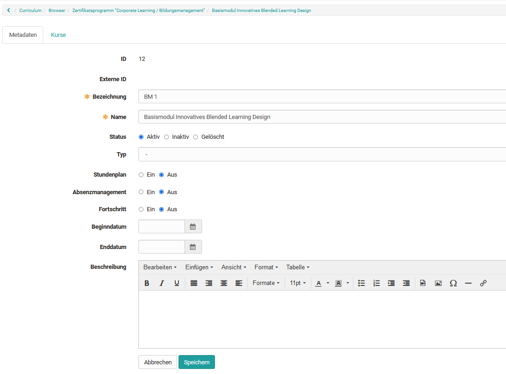
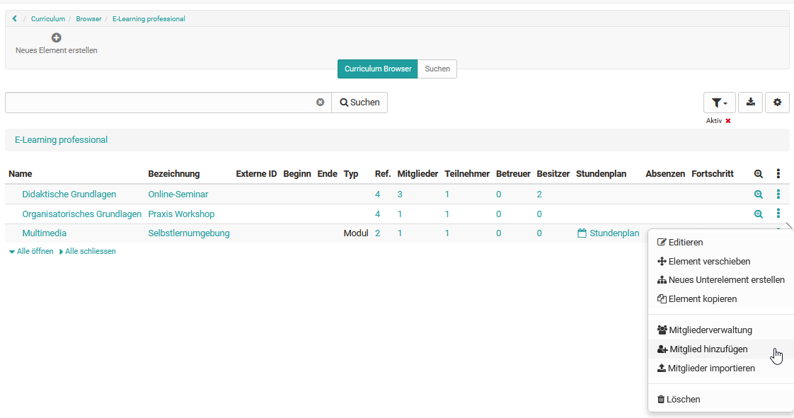

# Curriculumverwaltung

## Allgemeines zu Curriculum

Was bedeutet Curriculum in OpenOlat?

Ein Curriculum ist ein eng mit Lehrzielen und Lehrinhalten verknüpfter, einem bestimmten Ablauf folgender Lehrplan. In OpenOlat dient das Curriculum vor allem der strukturieren Darstellung des Bildungsangebotes. So können Kurse und Lernressourcen in zeitlicher Abfolge in einer Baumstruktur abgebildet und somit in einen konkreten Bildungskontext gesetzt werden.

## Curriculumrollen

Die Erstellung und Verwaltung von Curricula und Curriculumelementen obliegt folgenden Rollen:

* Curriculumverwalter
* Curriculumbesitzer
* Curriculumelementbesitzer

Informationen zu den Rollen finden Sie [hier](../basic_concepts/Authorisation_Concept.de.md).

Die verschiedenen Curricula in OpenOlat werden in dem Menü Curriculumverwaltung administriert. Die Verwaltung der Curricula obliegt in der Regel dem Curriculumverwalter.

## Curriculum Browser

 **Ebene Curriculum**

Auf Curriculum-Ebene werden die bereits erstellten Curricula tabellarisch angezeigt. Die Anzahl der Curriculumelemente, die zu einem Curriculum gehören, ist ebenfalls ersichtlich. Die Curricula können auf dieser obersten Ebene zum Bearbeiten wieder geöffnet oder auch gelöscht werden.

**Ebene Curriculumelement**

Befindet man sich in einem Curriculum, wird dessen Baumstruktur im Curriculum Browser abgebildet. Zudem sind sämtliche Metadaten wie Beginn- und Enddatum, Curriculumtyp und Stundenplan ersichtlich.

Darüber hinaus können u.a. folgende Daten in der Tabelle dargestellt werden:

* **Ref.:** Zeigt an, wie viele welche Kurse diesem Curriculumelement zugeordnet sind.
* **Mitglieder:** Zeigt die Anzahl aller zu diesem Element zugeordneten Mitglieder an.
* **Teilnehmer:** Zeigt die Anzahl aller zu diesem Element zugeordneten Teilnehmer (User) an.
* **Betreuer:** Zeigt die Anzahl aller zu diesem Element zugeordneten Betreuer an.
* **Besitzer:** Zeigt die Anzahl aller zu diesem Element zugeordneten Besitzer an.

## Curriculum erstellen

Zunächst muss ein Curriculum im Tab "Curriculum Browser" als oberste Ebene erstellt werden. 

Diesem Curriculum können anschliessend Curriculumelemente untergeordnet werden.

Über "Neues Curriculum erstellen" kann neben der Bezeichnung und dem Namen auch eine Beschreibung eingetragen werden. Ausserdem kann die Verknüpfung zu einer Organisation oder einem Organisationselement erfolgen. Zur Auswahl stehen dabei alle Organisationselemente, auf die der Curriculumverwalter Zugriff hat.

Ist das Curriculum erstellt, können die *Curriculumelemente* angelegt werden.

## Curriculum bearbeiten und Curriculumverwalter hinzufügen

Im Curriculum Browser kann über den Link "Bearbeiten" oder das 3-Punkte Menü das Curriculum bearbeitet und die Metadaten geändert werden.

Neben dem Tab "Metadaten" erfolgt im Tab "Benutzerverwaltung" die Verwaltung und Organisation der Curriculumverwalter. Hier können neue Curriculumbesitzer hinzugefügt oder gelöscht werden. 

## Curriculum suchen

Im Curriculum Browser ist die Suche nach bestehenden Curricula möglich.

Im Tab "Suchen" kann ausserdem nach Curriculumelementen gesucht werden, welchen beispielsweise ein bestimmter Kurs zugeordnet ist. In der "Erweiterten Suche" können die Suchkriterien weiter eingeschränkt werden.

## Curriculumelement erstellen
Befindet man sich in einem Curriculum können dort Curriculumelemente erstellt werden

Über das 3-Punkte-Menü stehen weitere Optionen zur Verfügung. 

Es ist auch möglich, das Element im Curriculum zu verschieben, ein neues Unterelement zu erstellen oder das Element zu löschen.

## Curriculumelement bearbeiten

Wählt man "bearbeiten" erscheinen die beiden Tabs "Metadaten" und "Kurse" und es können weitere Einstellungen vorgenommen werden. 

### Metadaten bearbeiten

Nach der Auswahl des Curriculumelements werden dessen Metadaten angezeigt. Diese können mit entsprechender Berechtigung geändert werden.

### Kurse zum Curriculumelement hinzufügen

Im Tab "Kurse" des Curriculumelements können einem Curriculumelement Kurse zugeordnet werden. In der Auswahl unter "Kurse hinzufügen" werden nur Kurse angezeigt, für die entsprechende Zugriffsrechte vorliegen.

### Benutzer und Rollen zum Curriculumelement hinzufügen

Jedem Curriculumelement können direkt Benutzer:innen mit bestimmten Rollen zugewiesen werden. Nach dem Eintragen hat die Person automatisch Zugriff auf alle Kurse, die mit dem jeweiligen Curriculum verbunden sind.

Unter "Benutzer hinzufügen" stehen folgende Rollen zur Verfügung:

* Elementbesitzer
* Klassenlehrer
* Kursbesitzer
* Betreuer
* Teilnehmer

