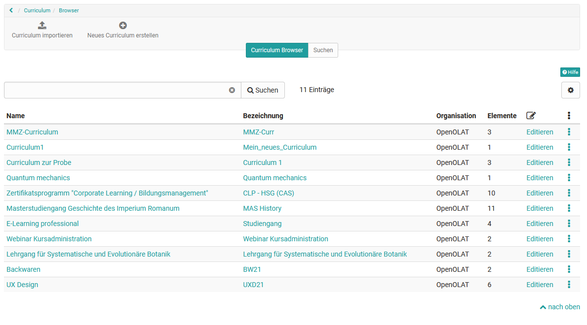
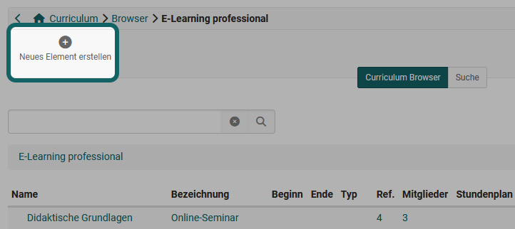
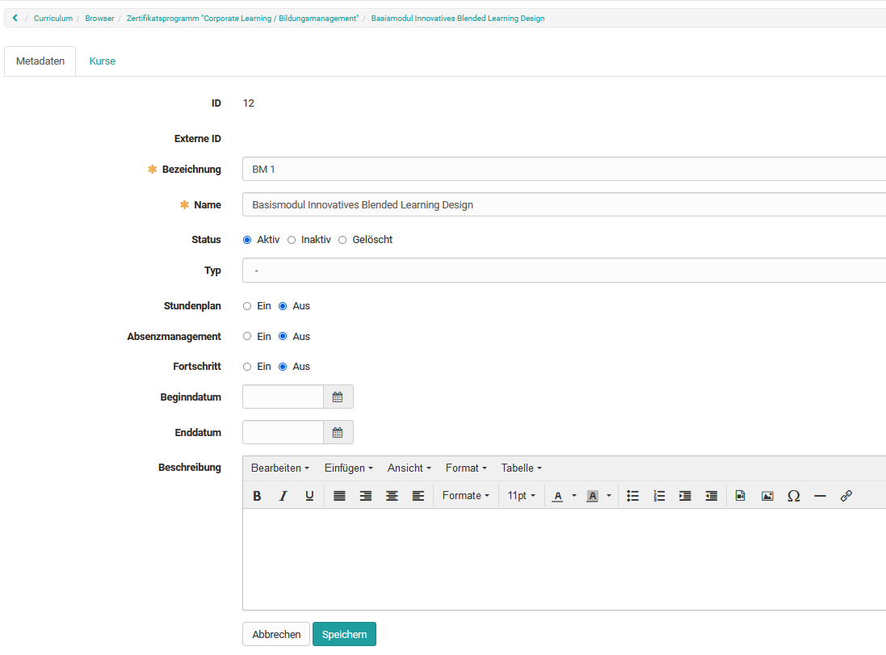
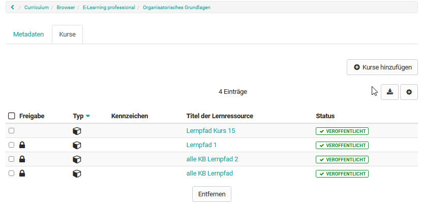
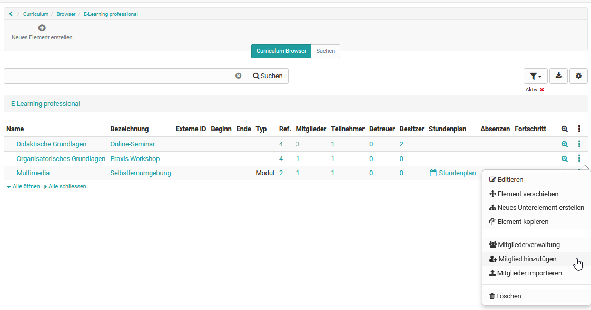

# Curriculum Management

## General information about Curriculum

What does curriculum mean in OpenOlat?

Curriculums closely linked to teaching objectives and contents and which follows a certain sequence of events. In OpenOlat, the curriculum primarily serves to structure the educational offerings. This way, courses and learning resources can be displayed in chronological order in a tree structure and thus placed in a concrete educational context.

## Curriculum roles

The following roles are responsible for creating and managing curricula and curriculum elements:

* Curriculum administrator
* Curriculum owner
* Curriculum element owner

Detailed information on the roles can be found [here](../basic_concepts/Authorisation_Concept.md).

The various curricula in OpenOlat are administered in the curriculum administration. As a rule, the curriculum administrator is responsible for administering the curricula.

## Curriculum Browser

**Level Curriculum**

At curriculum level, the curricula that have already been created are displayed in tabular form. The number of curriculum elements is also displayed. Curricula can be opened again for editing or deletion.

**Curriculum element level**

If you are in a curriculum, its tree structure is displayed in the Curriculum Browser. All metadata such as start and end date, curriculum type and timetable are also visible.

In addition, the following data can be displayed in the table:

* **Ref.:** Shows how many courses are assigned to this curriculum element.
* **Members:** Displays the number of all members assigned to this element.
* **Participants:** Displays the number of all participants (users) assigned to this element.
* **Coaches:** Displays the number of hosts assigned to this item.
* **Owners:** Displays the number of all owners assigned to this element.

## Create curriculum

First, a curriculum must be created as the top level. Curriculum elements can then be subordinate to this.

Curriculum elements can then be subordinated to this curriculum.

Via "Create New Curriculum" you can enter a description in addition to the identifier and the name. You can also create a link to an organization or organizational element. All organizational elements to which the curriculum administrator has access are available for selection.

Once the curriculum has been created, the *curriculum elements* can be created.

## Edit Curriculum and add Curriculum Administrator

In the Curriculum Browser, the curriculum can be edited and the metadata changed via the "Edit" link or the 3-dot menu.

In addition to the "Metadata" tab, the "User administration" tab is used to manage and organize curriculum administrators. New curriculum owners can be added or deleted here. 

## Search Curriculum

In the Curriculum Browser you can search for existing Curricula.

In the tab "Search" you can also search for curriculum elements, which for example are assigned to a certain course. In the "Advanced search" the search criteria can be further restricted.

## Creating a Curriculum Element

Befindet man sich in einem Curriculum können dort Curriculumelemente erstellt werden

Über das 3-Punkte-Menü stehen weitere Optionen zur Verfügung. 

Es ist auch möglich, das Element im Curriculum zu verschieben, ein neues Unterelement zu erstellen oder das Element zu löschen.

## Edit Curriculum Element

If you select "Edit", the two tabs "Metadata" and "Courses" appear and further settings can be made. 

### Edit Metadata

After you have selected the curriculum element, its metadata is displayed. This can be changed with the appropriate authorization.

### Adding courses to the curriculum element

Courses can be assigned directly to each curriculum element. In the selection under "Add courses", only courses for which corresponding access rights exist are displayed.

### Adding Users and Roles to the Curriculum Element

Users with specific roles can be assigned directly to each curriculum element. Once enrolled, the user will automatically have access to all courses associated with that curriculum.

The following roles are available under "Add Users":

* Element owner
* Master coach
* Course owner
* Coach
* Participant

