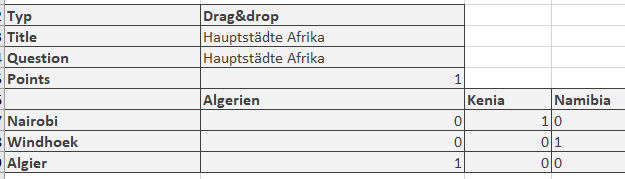

# Handhabung der Daten - Fragen erstellen oder importieren

Die Tabellenansicht der Fragen die im Fragenpool abgelegt sind bietet
vielfältige Möglichkeiten. Achten Sie darauf, dass alle für Sie relevanten
Spalten über das Zahnrad Symbol ausgewählt sind.

Besonders relevante Fragen können Sie als **Favorit** markieren und so schnell wiederfinden. Eine weitere Möglichkeit ist mehrere Fragen in **Listen** zu organisieren und so eine individuelle Systematik für Ihre
Fragen aufzubauen.

Sie können Fragen im Bereich "Meine Fragen", in einer Liste oder in einer Gruppenfreigabe erstellen oder importieren. Dabei werden die Frageitems aber grundsätzlich unter "Meine Fragen" abgelegt und dann referenziert. 

Eine Übersicht der **Fragetypen**, die  erstellt und importiert werden können finden Sie im Kapitel ["Test Fragetypen"](../learningresources/Test_question_types.de.md) 

## Fragen im Fragenpool erstellen

Frageitems können im Fragenpool über den Button "Frage erstellen" im QTI 2.1 Format erstellt und direkt zur weiteren
Nutzung gespeichert werden. 

Bei der Erstellung wird ein Titel angegeben, anschliessend der Fragetyp und zum Schluss, wenn vorhanden, der Fachbereich ausgewählt. Die so erstellten Fragen können dann in die OpenOlat Lernressource Test importiert und verwendet werden.

Informationen zur _Testerstellung_ finden [hier](.../../manual_how-to/test_creation_procedure/test_creation_procedure.de.md).
Informationen zur weiteren Ausgestaltung einer Frage im Kapitel
"[Detailansicht einer Frage"](Item_Detailed_View.de.md).

##  Fragen im Fragenpool importieren {: #import}

Es gibt drei Möglichkeiten QTI 2.1 Fragen über den Import-Button in den Fragenpool zu importieren.

  *  **ZIP-Datei** von lokalem Computer: Falls Ihnen ein Set an QTI 2.1 Fragen oder ein Test als .zip-Datei zur Verfügung steht, können Sie diese hier importieren.
  *  **Lernressource Test** aus Autorenbereich: Wählen Sie aus den verfügbaren Test Lernressourcen den Test aus, den Sie importieren möchten. Klicken Sie dazu in der entsprechenden Zeile auf den Link „Auswählen“. Alle Fragen der gewählten Lernressource werden direkt in den Fragenpool importiert. 
    
  * QTI 2.1 **Excelimport** über Copy&Paste: Bereiten Sie die Fragen in einem Tabellenkalkulationsprogramm wie Excel entsprechend der Excelimport-Vorlage, die Ihnen während des Imports angezeigt wird, vor. Kopieren Sie die Exeltabelle dann in das Formular-Feld. 

### Nutzung der Datei "Vorlage Excelimport" 

Starten Sie den Excelimport über Copy&Paste und laden Sie sich die Vorlage Excelimport herunter. Sie bildet die Basis für Ihr weiteres Vorgehen.

Mit dem Fragenimport über Exceldateien können viele Fragen auf einen Schlag auf einfache Art und Weise importiert werden. Dieser Weg bietet sich beispielsweise auch an, um Fragen aus anderen Systemen zu importieren, welche im QTI-Standard 2.1 vorliegen. 

Die Excel Vorlage beinhaltet vier Spalten:

a) Keyword/Punkte: Aspekt um den es geht

b) Value: der gewünschte Wert oder Text

c) Extra: Extra Informationen

d) Erklärung: weitere Erläuterungen z.B. ob dieses Element optional ist.

Die Vorlage enthält Informationen für den Import der folgenden Fragetypen:
* FIB (Lückentext)
* Numerical (Numerische Eingabe)
* MC (Multiple Choice)
* Inlinechoice (Lückentext mit Dropdown)
* SC (Single Choice)
* KPRIM
* Essay (Freitext)
* Matrix
* Drag&Drop
* Truefalse

Die Fragen werden mit jeweils
einer Trennzeile untereinander aufgeführt. Beim Kopieren wandelt Excel bzw. ein ähnliches Programm wie OpenOffice oder Numbers die Daten in einen Komma-Separierten Text um. 

Im Folgenden werden die Möglichkeiten der in der Vorlage enthaltenen  Fragetypen vorgestellt:

#### Multiple-Choice Fragen

 **type**|MC für Multiple-Choice    
---|---  
 **title**|Titel der Frage / Themengebiet   
 **question**|  Der Fragetext. Minimale HTML Formatierung ist erlaubt.  
 **max. answers**|  Max. Anzahl möglicher Antworten.  
 **min. answers**|  Min. Anzahl möglicher Antworten.  
 **points**|Maximal erreichbare Punktzahl. Die minimale Punktzahl ist 0.
 
Sie können beliebig viele Antworten, jeweils in einer separaten Zeile erstellen.
Die Punktwerte für die einzelnen Antworten können ebenfalls definiert werden z.B.

  
#### Single-Choice Fragen

 **type**| SC für Single-Choice    
---|---  
 **title**| Titel der Frage / Themengebiet    
 **question**| Der Fragetext. Minimale HTML Formatierung ist erlaubt.    
 **points**| Maximal erreichbare Punktzahl. Die minimale Punktzahl ist 0.   
 **Punkte wenn Option gewählt z.B. "1" (richtig) oder "0" (falsch)**|Optionstext. Es können beliebig viele Optionen angegeben werden, jede Option verwendet eine eigene Zeile mit der jeweiligen Punktzahl.  
  
#### Lückentext Fragen

 **type**| FIB für Lückentext 
---|---
 **title**|Titel der Frage / Themengebiet
 **points**| Maximal erreichbare Punktzahl. Die minimale Punktzahl ist 0.  
 **text**|  Ein Textelement
 **Punkte, wenn Lücke korrekt z.B. "1"**|Korrekte Antwort in Lücke. Synonyme werden mit ";" getrennt. Grösse der Lücke und die maximale Anzahl Zeichen, z.B: "10,8".  

#### Numerische Eingabe

 **type**| Numerical für numerische Eingabe
---|---
 **title**|Titel der Frage / Themengebiet
 **points**| Maximal erreichbare Punktzahl. Die minimale Punktzahl ist 0.  
 **text**|  Ein Textelement, die Fragestellung
 **Punkte, wenn Lücke korrekt z.B. "1"**|Korrekte Antwort in Lücke. Synonyme werden mit ";" getrennt. 

 Beispiel:

 

#### Lückentext mit Dropdown

 **type**| Inlinechoice für Lückentext mit Dropdown
---|---
 **title**|Titel der Frage / Themengebiet
 **Question** | Fragestellung bzw. erstes Textelement der Frage 
 **points**| Maximal erreichbare Punktzahl. Die minimale Punktzahl ist 0.  
 **text**|  Textelemente mit weiteren Teilen für die Frage bzw. Zwischentexte vor und nach den Lücken.
  **Punkte, wenn Lücke korrekt z.B. "1"**|die optionalen Antworten der Dropdown-Liste getrennt. Die korrekte Antwort wird in die folgende Spalte eingetragen.
  
 Beispiel:

#### KPRIM Fragen

 **type**|  KPRIM  
---|---  
 **title**|  Titel der Frage / Themengebiet  
 **question**|  Fragentext  
 **points**|  Maximal erreichbare Punktzahl. Die minimale Punktzahl ist 0.  
+| korrekte Antwort  
-| falsche Antwort  
-| falsche Antwort  
+| korrekte Antwort  

Korrekte Antworten werden also mit einem **+** und falsche mit **-** gekennzeichnet.
  
#### Essay Fragen

**type**|  ESSAY  
---|---  
 **title**|  Titel der Frage / Themengebiet  
 **question**|  Fragentext  
 **points**|  Maximal erreichbare Punktzahl. Die minimale Punktzahl ist 0.  
 **min**|  Mindestanzahl Wörter  
 **max**|  Maximale Anzahl Wörter  
  
  

#### Matrix Fragen

**type**|  MATRIX|  
---|---
 **title**|  Titel der Frage / Themengebiet 
 **question**|  Fragentext   
 **points**|  Maximal erreichbare Punktzahl. Die minimale Punktzahl ist 0.|    

Die Maxtrix selbst verteilt sich über die Spalten und Zeilen. Die entsprechenden Punkte werden in das passende Feld eingetragen.
Hier ein Beispiel mit 3 Spalten und 3 Zeilen:

 

  
#### Drag & Drop Fragen

**type**|  Drag&drop  
---|---
 **title**|  Titel der Frage / Themengebiet  
 **question**|  Fragentext  
 **points**|  Maximal erreichbare Punktzahl. Die minimale Punktzahl ist 0. 

Die Umsetzung in der Excel-Vorlage ist ähnlich wie bei Matrix Fragen und verteilt sich über mehrere Spalten und Zeilen. Die entsprechenden Punkte werden in das passende Feld eingetragen. Hier ein Beispiel mit 3 Spalten und 3 Zeilen:   
  
 
  
#### TrueFalse Fragen

 **type**|  Truefalse  
---|---
 **title**|  Titel der Frage / Themengebiet|  
 **question**|  Fragentext  
 **points**|  Maximal erreichbare Punktzahl. Die minimale Punktzahl ist 0.  
 
 Spalte **unanswered**: Punkte die vergeben oder abgezogen werden wenn vom User keine Entscheidung getroffen wird.

Spalte: **Right**: Punkte die vergeben werden, wenn die Antwort "Richtig" vom User ausgewählt wird.

Spalte **Wrong**: Punkte die vergeben werden, wenn die Antwort "Falsch" vom User ausgewählt wird.

Beispiel:

!!! Info

    Neben den aufgeführten Feldern gibt es noch weitere optionale Felder wie
    "Topic", "Keywords", "License" usw. Weitere Details dazu finden Sie direkt in der bereitgestellten Datei "Vorlage Excelimport".

