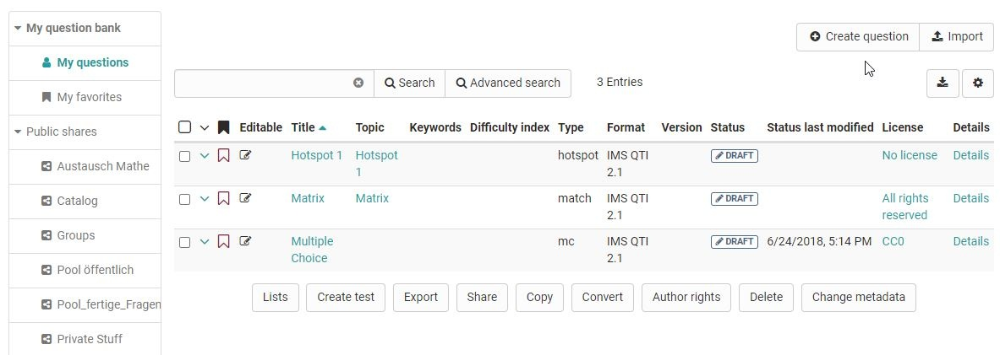
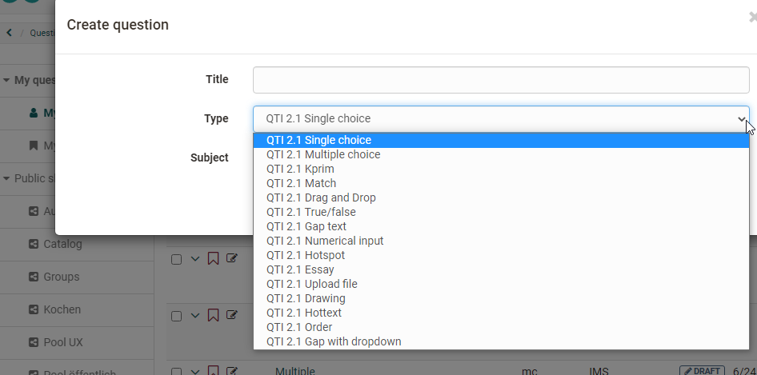

# Data Management - Create or import questions {: #data_management}

{ class="shadow lightbox" }

The table view of the questions stored in the question bank offers a variety of options. Make sure that all columns relevant to you are selected via the gear icon.

You can mark particularly relevant questions as **favorites** and thus find them again quickly. Another option is to organize several questions in **lists** and thus build up an individual system for your questions.

You can create or import questions in the area "My questions", in a list or in a group share. However, the question items are always stored under "My questions" and then referenced.

An overview of the **question types** that can be created and imported can be found in the chapter ["Test question types"](../learningresources/Test_question_types.md).

## Create questions in the question bank

Question items can be created in the question bank in QTI 2.1 format using the button "Create question" and saved directly for further use.

{ class="shadow lightbox" }

A title is specified during creation, followed by the question type and, if available, the subject at the end. The questions created this way can then be imported into the OpenOlat learning resource Test and used.

Information on _test creation_ can be found [here](../../manual_how-to/test_creation_procedure/test_creation_procedure.md). Information on the further design of a question in the chapter ["Item Detailed View"](Item_Detailed_View.md).

## Import questions in the question bank {: #import}

There are three ways to import QTI 2.1 questions into the question bank using the import button.

{ class="shadow lightbox" }

  *  **ZIP-file** from local computer: If you have a set of QTI 2.1 questions or a test as a .zip file, you can import it here.
  *  **Tests from authoring environment**: Select the test you want to import from the available test learning resources. To do this, click on the link "Select" in the corresponding row. All questions of the selected learning resource are imported directly into the question bank.
  * QTI 2.1 **Excel import** via copy&paste: Prepare the questions in a spreadsheet program such as Excel according to the Excel import template that is displayed to you during the import. Then copy the Excel table into the form field.

### Usage of the file "Excel import template"

Start the Excel import via copy&paste and download the Excel import template. It forms the basis for your further procedure.

The question import via Excel files allows you to import many questions at once in a simple way. This method is also suitable, for example, for importing questions from other systems that are available in the QTI 2.1 standard.

The Excel template contains four columns:

a) Keyword/Points: Aspect at issue

b) Value: the desired value or text

c) Extra: Extra information

d) Explanation: further explanations, e.g. whether this element is optional.

The template contains information for importing the following question types:

* FIB (Gap text)
* Numerical (Numerical input)
* MC (Multiple Choice)
* Inlinechoice (Gap with dropdown)
* SC (Single Choice)
* KPRIM
* Essay
* Matrix
* Drag&Drop
* Truefalse

The questions are each listed one below the other with a separator line. When copying, Excel or a similar program such as OpenOffice or Numbers converts the data into a comma-separated text.

The options for the question types contained in the template are presented below:

#### Multiple-choice questions

 **type**|MC for multiple-choice
---|---
 **title**|Title of the question / topic
 **question**|  The question text. Minimal HTML formatting is allowed.
 **max. answers**|  Max. number of possible answers.
 **min. answers**|  Min. number of possible answers.
 **points**|Maximum achievable score. The minimum score is 0.

You can create as many answers as you like, each in a separate row. The point values for the individual answers can also be defined, e.g.

{ class="shadow lightbox" }

#### Single-choice questions

 **type**| SC for single-choice
---|---
 **title**| Title of the question / topic
 **question**| The question text. Minimal HTML formatting is allowed.
 **points**| Maximum achievable score. The minimum score is 0.
 **Points when option is selected, e.g. "1" (correct) or "0" (incorrect)**|Option text. Any number of options can be specified, each option uses its own row with the respective score.

#### Gap text questions

 **type**| FIB for gap text
---|---
 **title**|Title of the question / topic
 **points**| Maximum achievable score. The minimum score is 0.
 **text**|  A text element
 **Points when the gap is correct, e.g. "1"**|Correct answer in the gap. Synonyms are separated with ";". Size of the gap and the maximum number of characters, e.g. "10,8".

#### Numerical input

 **type**| Numerical for numerical input
---|---
 **title**|Title of the question / topic
 **points**| Maximum achievable score. The minimum score is 0.
 **text**|  A text element, the question
 **Points when the gap is correct, e.g. "1"**|Correct answer in the gap. Synonyms are separated with ";".

 Example:

{ class="shadow lightbox" }

#### Gap with dropdown

 **type**| Inlinechoice for gap with dropdown
---|---
 **title**|Title of the question / topic
 **Question** | Question or first text element of the question
 **points**| Maximum achievable score. The minimum score is 0.
 **text**|  Text elements with further parts for the question or intermediate texts before and after the gaps.
**Points when the gap is correct, e.g. "1"**|the optional answers of the dropdown list, separated. The correct answer is entered in the following column.

 Example:

{ class="shadow lightbox" }

#### KPRIM questions

 **type**|  KPRIM
---|---
 **title**|  Title of the question / topic
 **question**|  Question text
 **points**|  Maximum achievable score. The minimum score is 0.
+| correct answer
-| incorrect answer
-| incorrect answer
+| correct answer

Correct answers are therefore marked with **+** and incorrect ones with **-**.

#### Essay questions

**type**|  ESSAY
---|---
 **title**|  Title of the question / topic
 **question**|  Question text
 **points**|  Maximum achievable score. The minimum score is 0.
 **min**|  Minimum number of words
 **max**|  Maximum number of words

#### Matrix questions

**type**|  MATRIX
---|---
 **title**|  Title of the question / topic
 **question**|  Question text
 **points**|  Maximum achievable score. The minimum score is 0.

The matrix itself is distributed across the columns and rows. The corresponding points are entered in the appropriate field.
Here is an example with 3 columns and 3 rows:

{ class="shadow lightbox" }

#### Drag & Drop questions

**type**|  Drag & drop
---|---
 **title**|  Title of the question / topic
 **question**|  Question text
 **points**|  Maximum achievable score. The minimum score is 0.

The implementation in the Excel template is similar to matrix questions and is spread over several columns and rows. The corresponding points are entered in the appropriate field. Here is an example with 3 columns and 3 rows:

{ class="shadow lightbox" }

#### TrueFalse questions

 **type**|  Truefalse
---|---
 **title**|  Title of the question / topic
 **question**|  Question text
 **points**|  Maximum achievable score. The minimum score is 0.

 Column **unanswered**: Points that are awarded or deducted if the user makes no decision.

Column: **Right**: Points that are awarded if the user selects the answer "Right".

Column **Wrong**: Points that are awarded if the user selects the answer "Wrong".

Example:

{ class="shadow lightbox" }

!!! note "Note"

    In addition to the listed fields, there are further optional fields such as "Topic", "Keywords", "License" etc. You can find further details directly in the provided file "Excel import template".

## Further information {: #further_information}

[Test question types >](../learningresources/Test_question_types.md) 
[How do I proceed when I create a test? >](../../manual_how-to/test_creation_procedure/test_creation_procedure.md) 
[Item Detailed View >](Item_Detailed_View.md)

[To the top of the page ^](#data_management)
