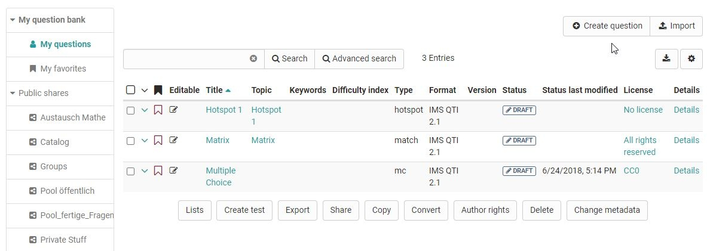

# Data Management - Create or import questions

  

  
The table view of the questions stored in the question pool offers a variety
of options. Make sure that all columns relevant to you are selected via the
cogwheel icon

You can mark particularly relevant questions that you have created as
favorites and thus quickly find them again. Another possibility is to organize
several questions in lists and thus build up an individual systematics for
your questions.  

Sie können Fragen im Bereich "Meine Fragen", in einer Liste oder in einer Gruppenfreigabe erstellen oder importieren. Dabei werden die Frageitems aber grundsätzlich unter "Meine Fragen" abgelegt und dann referenziert.

Eine Übersicht der **Fragetypen**, die  erstellt und importiert werden können finden Sie im Kapitel ["Test Fragetypen"](../tests/Test_question_types.md) 

## Create question in the question

Frageitems können im Fragenpool über den Button "Create question" im QTI 2.1 Format erstellt and stored directly for
further use.  

A title is specified during creation, followed by the question
type and, if available, the subject selected at the end. The questions created this way can then be imported into the OpenOlat learning resource Test and be
utilized.

Information on test creation can be found [here](../tests/Four_Steps_to_Your_Test_or_Self-test.md). Information on the further design of a question in the chapter [Item Detailed view](Item_Detailed_View.md).

##  Import questions in the question bank {: #import}

Es gibt drei Möglichkeiten QTI 2.1 Fragen über den Import-Button in den Fragenpool zu importieren.

  *  **ZIP-file** from local computer: Choose this option if you have a set of questions or a test as .zip-file.
  *  **Tests from authoring environment**: Select the test you want to import from the available learning resources. To do this, click on the "Import learning resource" link in the corresponding line. All questions of the selected learning resource are imported directly into the question pool. 
  * QTI 2.1 **Excel import** via copy&paste: Prepare the questions in the "template excel import" you can find in the import wizard. When you are finished creating your questions in the Excel file, select the the questions in Excel and copy&paste them to the input field.

### Nutzung der Datei "Vorlage Excelimport"   

Starten Sie den Excelimport über Copy&Paste und laden Sie sich die Vorlage Excelimport herunter. Sie bildet die Basis für Ihr weiteres Vorgehen.

The question import via Excel files allows you to import multiple questions at
once in simple way. The import of excel questions can for example be used to
import questions from other systems when the questions do also support the QTI
2.1 standards. 

Die Excel Vorlage beinhaltet vier Spalten:

a) Keyword/Punkte: Aspekt um den es geht

b) Value: der gewünschte Wert oder Text

c) Extra: Extra Informationen

d) Erklärung: weitere Erläuterungen z.B. ob dieses Element optional ist.

Die Vorlage enthält Informationen für den Import der folgenden Fragetypen:
* FIB (Fill in the blank)
* Numerical 
* MC (Multiple Choice)
* Inlinechoice 
* SC (Single Choice)
* KPRIM
* Essay 
* Matrix
* Drag&Drop
* Truefalse

Die Fragen werden mit jeweils
einer Trennzeile untereinander aufgeführt.
When copying the questions, Excel will convert the cells to a comma separated
formatting. The same does also work with other tools like Apple Numbers or
OpenOffice.

Im Folgenden werden die Möglichkeiten der in der Vorlage enthaltenen  Fragetypen vorgestellt:

#### Multiple-choice question

 **type**|MC for multiple-choice  
---|--- 
 **title**|Title of the question / topic    
 **question**|The question text. Minimal HTML formatting is allowed.   
 **max. answers**|  Max. number of possible answers.  
 **min. answers**|  Min. number of possible answers.  
 **points**|The maximal score. The minimal score is always set to 0.  
  
You can have as many options as you like, each on a separated
line with a point configuration  
  
Die Punktwerte für die einzelnen Antworten können ebenfalls definiert werden z.B.

  

#### Single-choice question

 **type**| SC für Single-Choice    
---|---  
 **title**|Title of the question / topic    
 **question**|The question text. Minimal HTML formatting is allowed.    
 **points**|The maximal score. The minimal score is always set to 0.
 **Points when this option is selected, e.g. "1" (correct) or "-1" (incorrect)**| Options text. You can have as many options as you like, each on a separated line with a "0" or "1" point configuration  
  

#### Fill-in-blank (gap) question

 **type**|FIB for fill-in-blank  
 ---|---
 **title**|Title of the question / topic
  **points**|The maximal score. The minimal score is always set to 0.
  **text**| A text element  
 **Points when the gap is correctly answered, e.g. "1"**|Correct answer in a gap. Synonyms can be entered separated with ";". Size of the gap and the maximum characters that can be entered is configured, e.g. "10,8".  

#### Numerical Input

 **type**| Numerical Input
---|---
 **title**|Title of the question / topic
 **points**|The maximal score. The minimal score is always set to 0.
 **text**|  Ein Textelement, die Fragestellung
 **Punkte, wenn Lücke korrekt z.B. "1"**|Korrekte Antwort in Lücke. Synonyme werden mit ";" getrennt. 

 Beispiel:

 

#### Gap with dropdown

 **type**|Inlinechoice for gab with dropdown
---|---
 **title**|Title of the question / topic
 **Question** | Fragestellung bzw. erstes Textelement der Frage 
 **points**| The maximal score. The minimal score is always set to 0.
 **text**|  Textelemente mit weiteren Teilen für die Frage bzw. Zwischentexte vor und nach den Lücken.
  **Punkte, wenn Lücke korrekt z.B. "1"**|die optionalen Antworten der Dropdown-Liste getrennt. Die korrekte Antwort wird in die folgende Spalte eingetragen.
  
 Beispiel:

#### KPRIM question

 **type**|  KPRIM  
---|---  
 **title**|  Title of the question / topic  
 **question**|  The question text. Minimal HTML formatting is allowed.  
 **points**|  Maximal erreichbare Punktzahl. Die minimale Punktzahl ist 0.  
+| korrekte Antwort  
-| falsche Antwort  
-| falsche Antwort  
+| korrekte Antwort
 
Korrekte Antworten werden also mit einem **+** und falsche mit **-** gekennzeichnet.

#### Essay question

 **type**|  ESSAY  
---|---  
 **title**|  Title of the question / topic  
 **question**|  The question text. Minimal HTML formatting is allowed.  
 **points**|  The maximal score. The minimal score is always set to 0.  
 **min**|  Minimum word count  
 **max**|  Maximum word count  
  
  

#### MATCH question

 **type**|  MATCH 
---|---
 **title**|  Title of the question / topic  
 **question**|  The question text. Minimal HTML formatting is allowed.  
 **points**|  The maximal score. The minimal score is always set to 0.  
  
Die Maxtrix selbst verteilt sich über die Spalten und Zeilen. Die entsprechenden Punkte werden in das passende Feld eingetragen.
Hier ein Beispiel mit 3 Spalten und 3 Zeilen:

 

  
#### Drag and Drop question

 **type**| Drag and Drop  
---|---
 **title**|  Title of the question / topic  
 **question**|  The question text. Minimal HTML formatting is allowed.  
 **points**|  The maximal score. The minimal score is always set to 0.

Die Umsetzung in der Excel-Vorlage ist ähnlich wie bei Matrix Fragen und verteilt sich über mehrere Spalten und Zeilen. Die entsprechenden Punkte werden in das passende Feld eingetragen. Hier ein Beispiel mit 3 Spalten und 3 Zeilen:   
  
    
  

#### TrueFalse question

 **type**|  Truefalse  
---|---
 **title**|  Title of the question / topic  
 **question**|  The question text. Minimal HTML formatting is allowed.  
 **points**|  Maximum achievable score. The minimum score is 0.

 Spalte **unanswered**: Punkte die vergeben oder abgezogen werden wenn vom User keine Entscheidung getroffen wird.

Spalte: **Right**: Punkte die vergeben werden, wenn die Antwort "Richtig" vom User ausgewählt wird.

Spalte **Wrong**: Punkte die vergeben werden, wenn die Antwort "Falsch" vom User ausgewählt wird.

Beispiel:

 
  
 
!!! info  

    In addition to the listed fields, there are other optional fields such as "Topic", "Keywords", "License", etc. For more details, see the Excel import  template provided as part of the import process.

