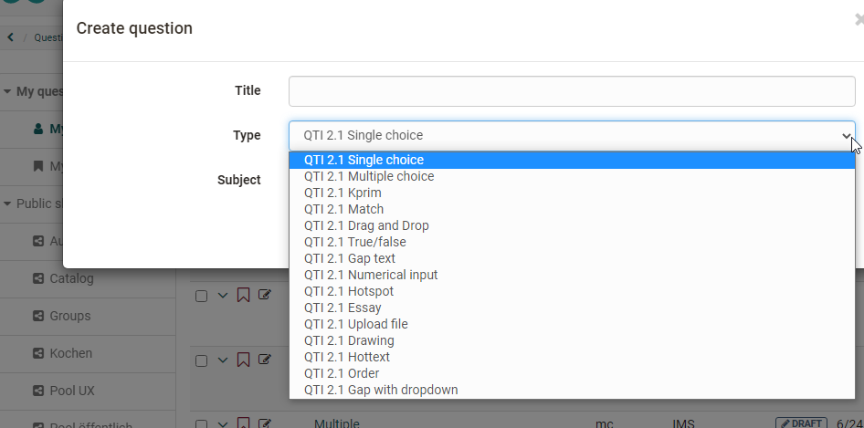
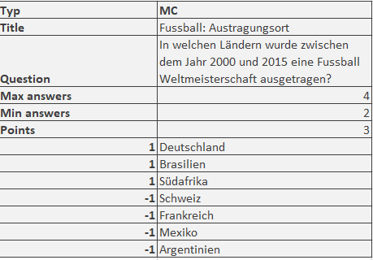

# Data Management - Create or import questions

The table view of the questions stored in the question pool offers a variety of options. Make sure that all columns relevant to you are selected via the cogwheel icon

You can mark particularly relevant questions that you have created as **favorites** and thus quickly find them again. Another possibility is to organize several questions in **** and thus build up an individual systematics for your questions.  

You can create or import questions in the "My questions" area, in a list or in a group share. However, the question items are always stored under "My questions" and then referenced.

An overview of the **question types** that can be created and imported can be found in the chapter ["Test question types"](../learningresources/Test_question_types.md) 

## Create question in the question

Question items can be created in the question pool using the "Create question" button in QTI 2.1 format and stored directly for further use.  

A title is specified during creation, followed by the question type and, if available, the subject selected at the end. The questions created this way can then be imported into the OpenOlat learning resource Test and be utilized.

Information on _test creation_ can be found [here](https://docs.openolat.org/manual_how-to/test_creation_procedure/test_creation_procedure/). Information on the further design of a question in the chapter ["Item Detailed View"](Item_Detailed_View.md).

##  Import questions in the question bank {: #import}

There are three ways to import QTI 2.1 questions into the question pool using the import button.

  *  **ZIP-file** from local computer: Choose this option if you have a set of questions or a test as .zip-file.
  *  **Tests from authoring area**: Select the test you want to import from the available learning resources. To do this, click on the "Import learning resource" link in the corresponding line. All questions of the selected learning resource are imported directly into the question pool. 
  * QTI 2.1 **Excel import** via copy&paste: Prepare the questions in the "template excel import" you can find in the import wizard. When you are finished creating your questions in the Excel file, select the the questions in Excel and copy&paste them to the input field.

### Usage of the file "Excel Import Template"   

Start the Excel import via Copy&Paste and download the Excel import template. It forms the basis for your further procedure.

The question import via Excel files allows you to import multiple questions at once in simple way. The import of excel questions can for example be used to import questions from other systems when the questions do also support the QTI 2.1 standards. 

The Excel template contains four columns:

a) Keyword/Score: Aspect at issue

b) Value: the desired value or text

c) Extra: Extra information

d) Explanation: Further explanations, e.g. whether this element is optional.

The template contains information for importing the following question types:

* FIB (Fill in the blank)
* Numerical 
* MC (Multiple Choice)
* Inlinechoice 
* SC (Single Choice)
* KPRIM
* Essay 
* Matrix
* Drag&Drop
* Truefalse

The questions are each listed one below the other with a separator line. When copying, Excel or a similar program such as OpenOffice or Numbers converts the data into a comma-separated text.

The options for the question types contained in the template are presented below:

#### Multiple-choice question

 **type**|MC for multiple-choice  
---|--- 
 **title**|Title of the question / topic    
 **question**|The question text. Minimal HTML formatting is allowed.   
 **max. answers**|  Max. number of possible answers.  
 **min. answers**|  Min. number of possible answers.  
 **points**|The maximal score. The minimal score is always set to 0.  
  
You can create as many answers as you like, each in a separate line. The point values for the individual answers can also be defined, e.g.

  

#### Single-choice question

 **type**| SC für Single-Choice    
---|---  
 **title**|Title of the question / topic    
 **question**|The question text. Minimal HTML formatting is allowed.    
 **points**|The maximal score. The minimal score is always set to 0.
 **Points when this option is selected, e.g. "1" (correct) or "-1" (incorrect)**| Options text. Any number of options can be specified, each option uses its own line with the respective number of points.  
  

#### Fill-in-blank (gap) question

 **type**|FIB for fill-in-blank  
 ---|---
 **title**|Title of the question / topic
  **points**|The maximal score. The minimal score is always set to 0.
  **text**| A text element  
 **Points when the gap is correctly answered, e.g. "1"**|Correct answer in a gap. Synonyms can be entered separated with ";". Size of the gap and the maximum characters that can be entered is configured, e.g. "10,8".  

#### Numerical Input

 **type**| Numerical Input
---|---
 **title**|Title of the question / topic
 **points**|The maximal score. The minimal score is always set to 0.
 **text**|  A text element, the question
 **Points when the gap is correctly answered, e.g. "1"**|Correct answer in a gap. Synonyms can be entered separated with ";". 

 Example:

 

#### Gap with dropdown

 **type**|Inlinechoice for gab with dropdown
---|---
 **title**|Title of the question / topic
 **Question** | The question text.
 **points**| The maximal score. The minimal score is always set to 0.
 **text**|  Text elements with further parts for the question or texts before and after the gaps.
 **Points when the gap is correctly answered, e.g. "1"**|The optional answers of the dropdown list seperated. The correct answer is entered in the following column.
  
 Example:

#### KPRIM question

 **type**|  KPRIM  
---|---  
 **title**|  Title of the question / topic  
 **question**|  The question text. 
 **points**|  The maximal score. The minimal score is always set to 0.  
+| Correct answer  
-| Incorrect answer 
-| Incorrect answer  
+| Correct answer
 
Correct answers are therefore marked with **+** and incorrect answers with **-**.

#### Essay question

 **type**|  ESSAY  
---|---  
 **title**|  Title of the question / topic  
 **question**|  The question text. 
 **points**|  The maximal score. The minimal score is always set to 0.  
 **min**|  Minimum word count  
 **max**|  Maximum word count  
  
  

#### Matrix question

 **type**|  MATRIX 
---|---
 **title**|  Title of the question / topic  
 **question**|  The question text. 
 **points**|  The maximal score. The minimal score is always set to 0.  
  
The matrix itself is distributed across the columns and rows. The corresponding points are entered in the appropriate field.
Here is an example with 3 columns and 3 rows:

 

  
#### Drag and Drop question

 **type**| Drag & drop  
---|---
 **title**|  Title of the question / topic  
 **question**|  The question text. 
 **points**|  The maximal score. The minimal score is always set to 0.

The implementation in the Excel template is similar to Matrix questions and is spread over several columns and rows. The corresponding points are entered in the appropriate field. Here is an example with 3 columns and 3 rows:  
  
    
  
#### TrueFalse question

 **type**|  Truefalse  
---|---
 **title**|  Title of the question / topic  
 **question**|  The question text. Minimal HTML formatting is allowed.  
 **points**|  Maximum achievable score. The minimum score is 0.

 Column **unanswered**: Points that are awarded or deducted if no decision is made by the user.

Column **Right**: Points awarded when the answer "Right" is selected by the user.

Column **Wrong**: Points awarded if the answer "False" is selected by the user.

Example:

 
  
!!! info  

    In addition to the listed fields, there are other optional fields such as "Topic", "Keywords", "License", etc. For more details, see the Excel import template provided as part of the import process.

