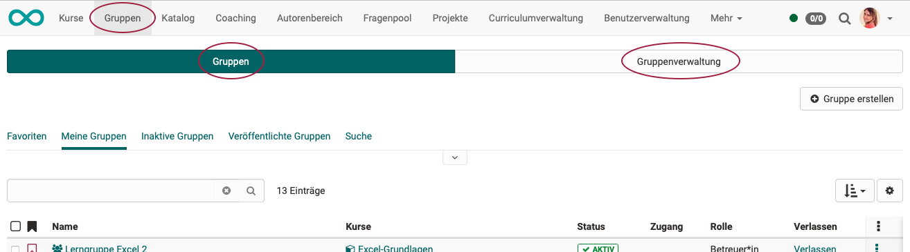
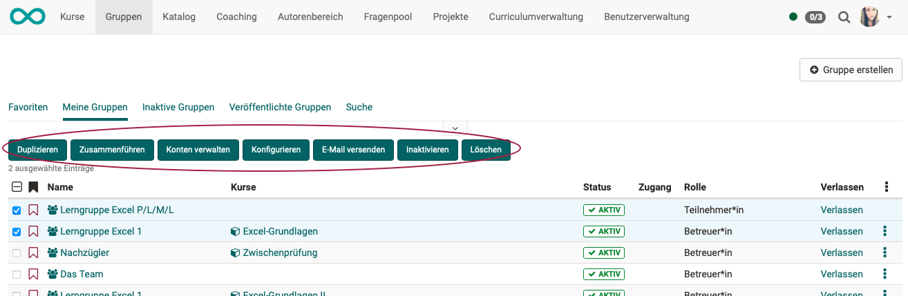

# Gruppenverwaltung

Wenn in der Hauptnavigation die Gruppen aufgerufen werden, öffnet sich **für Teilnehmer:innen, Betreuer:innen und Besitzer:innen** das Menü Gruppen.

{ class="shadow lightbox" }

Wenn in der Hauptnavigation die Gruppen durch **Gruppenbetreuer** aufgerufen werden, werden 2 Tabs angezeigt. Neben der Ansicht, wie sie auch die Teilnehmer:innen, Betreuer:innen und Besitzer:innen haben (hier im Tab Gruppen), erscheint zusätzlich der Tab „Gruppenverwaltung“.

{ class="shadow lightbox" }

## Werkzeuge zum Verwalten

In allen Listenansichten gibt es die Möglichkeit einzelne Gruppen durch Anklicken eines Gruppennamens zu bearbeiten.

Sollen mehrere Gruppen gemeinsam bearbeitet werden, können in der ersten Spalte die betreffenden Checkboxen ausgewählt werden. Durch Klick auf die Checkbox in der Titelzeile werden alle Gruppen an- bzw. abgewählt. Dadurch erscheinen Buttons zur gemeinsamen Bearbeitung direkt über der Liste.

{ class="shadow lightbox" }

!!! hint "Hinweis"

	Damit Sie die entsprechenden Optionen sehen und nutzen können, müssen Sie mindestens eine Gruppe ausgewählt haben und Betreuer der Gruppe sein.

Nach Auswahl einer oder mehrerer Gruppen können Sie folgende Aktionen ausführen:

  *  **Duplizieren**: Das Duplizieren von Gruppen erspart Ihnen die einzelne manuelle Konfiguration der kollaborativen Werkzeuge, wenn diese in allen Gruppen identisch sein soll.
  *  **Zusammenführen**: Ausgewählte Gruppen werden zu einer Gruppe zusammengeführt  nachdem die Zielgruppe im Wizard ausgewählt wurde. Dazu müssen mindestens 2 Gruppen ausgewählt werden.
  *  **Benutzer verwalten**: Für die ausgewählten Gruppen können bereits eingeschriebene Mitglieder aus der Gruppe entfernt werden, neue Benutzer als Betreuer oder Teilnehmer hinzugefügt oder auf die Warteliste gesetzt werden.
  *  **Konfigurieren**: Legen Sie für die ausgewählten Gruppen fest, welche Werkzeuge in der Gruppe verwendet werden. In einem nächsten Schritt können Sie noch Kurse in die Gruppen einbinden.
  *  **E-Mail versenden:** Versenden Sie E-Mails auf diese Weise an mehrere Gruppen gleichzeitig.
  *  **Inaktivieren**: Die Gruppe erhält den Status "inaktiv".
  *  **Löschen**: Als Gruppen-Betreuer können Sie alle von Ihnen betreuten Gruppen löschen. Wenn die Gruppe mit einem Kurs verbunden ist, wird nur die Gruppe nicht der Kurs gelöscht. 

## Gruppenverwaltung für Teilnehmer:innen, Betreuer:innen, Besitzer:innen

Über die unterschiedlichen Filtermöglichkeiten können Sie sich alle Ihre Gruppen (Meine Gruppen), Ihre favorisierten Gruppen, inaktive Gruppen oder alle veröffentlichten Gruppen anzeigen lassen oder gezielt nach einer Gruppe suchen. 

{ class="shadow lightbox" }

 *  **Favoriten:** Hier werden nur Gruppen angezeigt, die Sie in der 2. Spalte durch Klick auf das Fähnchen als Favorit markiert haben.

* **Meine Gruppen:** Hier finden Sie alle Gruppen aufgelistet, in denen Sie Mitglied sind.

* **Inaktive Gruppen:** Nicht benutzte Gruppen können automatisch nach einer bestimmten Zeit auf den Status inaktiv gesetzt werden. (Gruppenverwalter:innen können diesen Mechanismus aktivieren und die Frist festlegen.)

* **Veröffentlichte Gruppen:** Alle Gruppen, die mit einer Buchungsmethode veröffentlicht wurden, können hier eingesehen und ausgewählt werden. Die Tabelle gewährt eine Übersicht über die Anzahl freier Plätze, die Art der Buchungsmethode und - soweit festgelegt - die Buchungskosten. Gruppen können direkt aus der Tabelle heraus mit einem Klick auf die Links „Beitreten“ oder „Warteliste eintragen“
belegt werden.

* **Suche:** Hier können Sie gezielt nach einer bestimmten Gruppe suchen.

---

## Gruppenverwaltung für Gruppenverwalter:innen

Benutzer mit der Rolle Gruppenverwalter:in verfügen im Tab "Gruppen" über die gleichen Listen und Werkzeuge, wie die Teilnehmer:innen, Betreuer:innen und Besitzer:innen. Im zweiten Tab „Gruppenverwaltung“ sehen sie zusätzlich alle veröffentlichten und privaten Gruppen und können diese im selben Umfang verwalten, wie Gruppenbetreuer:innen ihre Gruppen. 

Gruppenverwalter:innen können zudem Gruppen ohne Mitglieder und Kursanbindung finden und löschen. Auch haben sie Zugriff auf den Lebenszyklus der Gruppen und können den Löschprozess starten oder Gruppen reaktivieren. 

{ class="shadow lightbox" }

Zum automatischen Gruppenlebenszyklus finden Sie mehr im [Administrationshandbuch](https://docs.openolat.org/de/manual_admin/administration/Automatic_Group_Lifecycle/).

