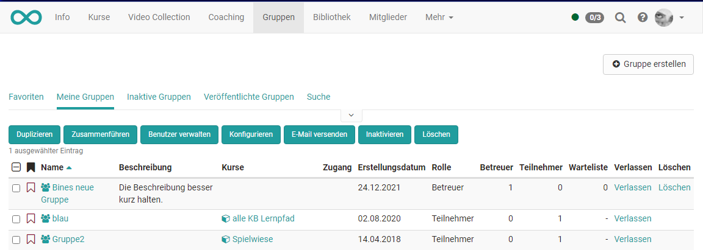
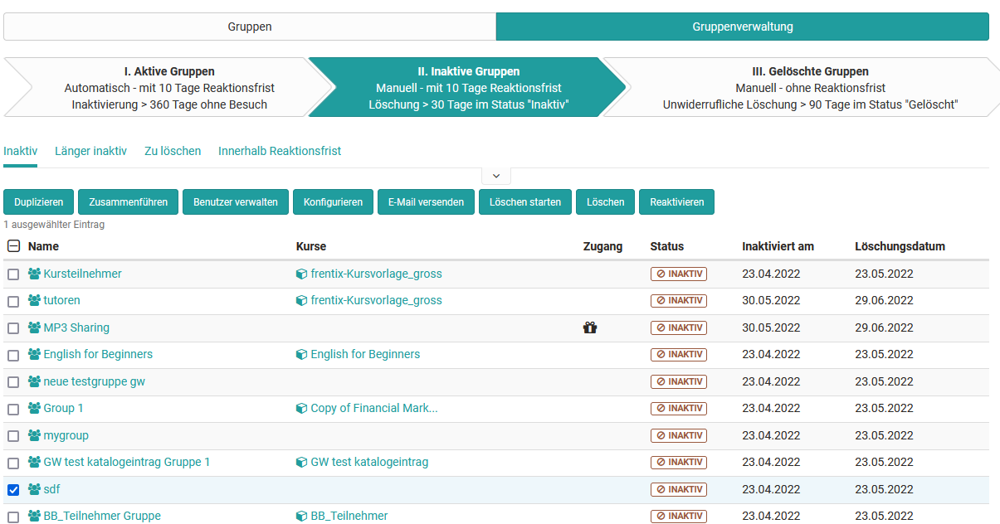

# Gruppenverwaltung

## Meine Gruppen

{ class="shadow lightbox" }

Nach Auswahl einer oder mehrerer Gruppen können Sie folgende Aktionen
ausführen:

  *  **Duplizieren**: Das Duplizieren von Gruppen erspart Ihnen die einzelne manuelle Konfiguration der kollaborativen Werkzeuge, wenn diese in allen Gruppen identisch sein soll.
  *  **Zusammenführen**: Ausgewählte Gruppen werden zu einer Gruppe zusammengeführt  nachdem die Zielgruppe im Wizard ausgewählt wurde. Dazu müssen mindestens 2 Gruppen ausgewählt werden.
  *  **Benutzer verwalten**: Für die ausgewählten Gruppen können bereits eingeschriebene Mitglieder aus der Gruppe entfernt werden, neue Benutzer als Betreuer oder Teilnehmer hinzugefügt oder auf die Warteliste gesetzt werden.
  *  **Konfigurieren**: Legen Sie für die ausgewählten Gruppen fest, welche Werkzeuge in der Gruppe verwendet werden. In einem nächsten Schritt können Sie noch Kurse in die Gruppen einbinden.
  *  **E-Mail versenden:** Versenden Sie E-Mails auf diese Weise an mehrere Gruppen gleichzeitig.
  *  **Inaktivieren**: Die Gruppe erhält den Status "inaktiv".
  *  **Löschen**: Als Gruppen-Betreuer können Sie alle von Ihnen betreuten Gruppen löschen. Wenn die Gruppe mit einem Kurs verbunden ist, wird nur die Gruppe nicht der Kurs gelöscht. 

!!! hint "Tipp"

	Damit Sie die entsprechenden Optionen sehen und nutzen können, müssen Sie mindestens eine Gruppe ausgewählt haben und Betreuer der Gruppe sein.

Über die unterschiedlichen Filtermöglichkeiten können Sie sich alle Ihre Gruppen (Meine Gruppen), Ihre favorisierten Gruppen, inaktive Gruppen oder alle veröffentlichten Gruppen anzeigen lassen oder gezielt nach einer Gruppe suchen.   

###  Veröffentlichte Gruppen

 Alle Gruppen, die mit einer Buchungsmethode veröffentlicht wurden, können hier eingesehen und ausgewählt werden. Die Tabelle gewährt eine Übersicht über die Anzahl freier Plätze, die Art der Buchungsmethode und, soweit festgelegt, die Buchungskosten. Gruppen können direkt aus der Tabelle
heraus mit einem Klick auf die Links „Beitreten“ oder „Warteliste eintragen“
belegt werden.

## Gruppenverwaltung für Gruppenverwalter

Benutzer mit der Rolle Gruppenverwalter verfügen zusätzlich noch über den Tab „Gruppenverwaltung“. Gruppenverwalter sehen dort alle veröffentlichten und privaten
Gruppen, und können diese im selben Umfang verwalten wie ein Gruppenbetreuer seine Gruppen. 

Der Gruppenverwalter kann zudem Gruppen ohne Mitglieder und Kursanbindung finden und löschen. Auch hat er Zugriff auf den Lebenszyklus der Gruppen und kann den Löschprozess starten oder Gruppen reaktivieren. 

{ class="shadow lightbox" }

