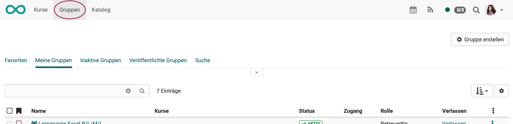
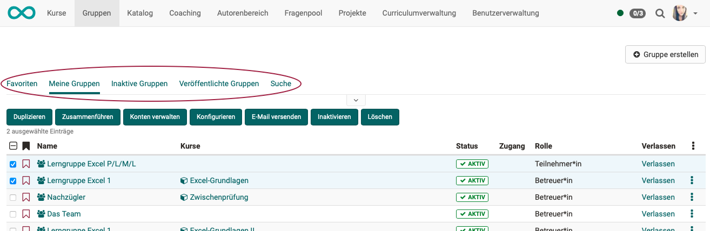
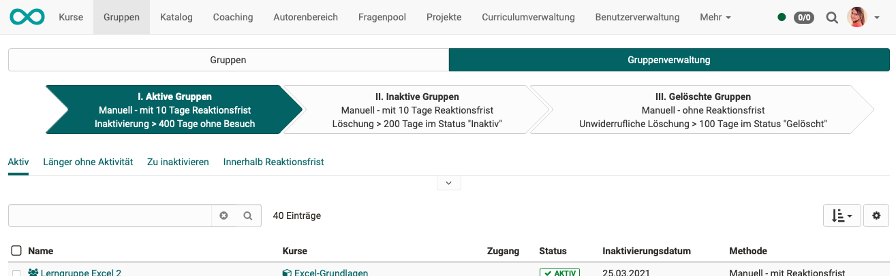
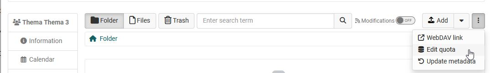

# Group Management

If the groups are called up in the main navigation, the Groups menu opens **for participants, coaches and owners**.

{ class="shadow lightbox" }

You can use the various filter options to display all your groups (My groups), your favorite groups, inactive groups or all published groups, or search for a specific group.

* **My groups**: Here you can find all the groups you are a member of.

* **Inactive groups**: Unused groups can be [automatically](../../../manual_admin/docs/administration/Automatic_Group_Lifecycle.md) set to inactive status after a certain period of time. Group administrators can activate this mechanism and set the deadline.

* **Published Groups**: All groups that have been published with a booking method can be viewed and selected here. The table provides an overview of the number of free places, the type of booking method and - where specified - the booking costs. Book or enter a group directly by clicking either the links "Book" or "Add to waiting
list".

* **Search**: Here you can search for a specific group.

{ class="shadow lightbox" }

## Management tools

In all list views, you can edit individual groups by clicking on a group name.

If several groups are to be edited together, the relevant checkboxes can be selected in the first column. Click on the checkbox in the title bar to select or deselect all groups. As a result, buttons for joint editing appear directly above the list.

After selecting at least one group, you can perform the following actions:

  * **Duplicate**: Copying groups will spare you the individual manual configuration of collaborative tools if those are identical in all of your groups.
  * **Merge**: Selected groups are merged into one single group, after selecting the target group in the wizard. At least two groups must be selected for this.
  * **Manage members**: This allows you to collectively remove enrolled members from groups, add new users as either coach, participant or put them on the waiting list.
  * **Configure**: Define which collaborative tools should be available for all selected groups. The next wizard step allows you to link one or more courses to the groups.
  * **Send E-mail**: Send E-mails to multiple groups simultaneously.
  * **Inactive**: The group receives the status "inactive".
  * **Delete**: Coaches are able to delete all the groups they supervise. If a group is deleted which is connected to a course, only the group is deleted, but not the course.

!!! hint "Note"

    To be able to see and use the corresponding options, you must have selected at least one group and be the coach of the group.

---

## Group Management for group administrators

Users with the role of **group administrators** also have the tab "Group management" in the groups menu.

{ class="shadow lightbox" }

Here, group administrators also see all published and private groups in the system and can manage these groups to the same extent as group administrators can manage their own groups. 

A group manager can find and manage so-called "Orphans", groups without members and linked resources. He also has access to the life cycle of the groups and can start the deletion process or reactivate groups.You can find more about the automatic groups lifecycle in the [admin manual](../../manual_admin/administration/Automatic_Group_Lifecycle.md)

In addition, group administrators can also change the quota of the collaborative tool "Folder" of a group.

