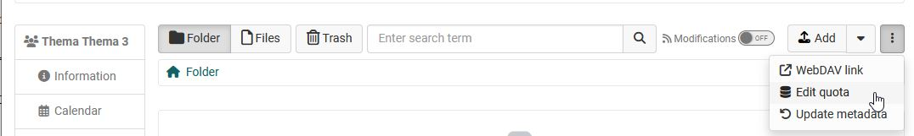

# Group Management {: #group_management}

If the Groups tab is selected in the OpenOlat main navigation, the Groups menu opens **for participants, coaches and owners** as follows:

{ class="shadow lightbox" }

You can use the various filter options to display all your groups (My groups), your favorite groups, inactive groups or all published groups, or search for a specific group.

* **My groups**: Here you can find all the groups you are a member of, regardless of the role.

* **Inactive groups**: Unused groups can be [automatically](../../manual_admin/administration/Automatic_Group_Lifecycle.md) set to the status inactive after a certain period of time. Group managers can activate this mechanism and set the deadline.

* **Published groups**: All groups that have been published with an offer can be viewed and selected here. The table provides an overview of the number of free places, the type of offer and, where specified, the booking costs. Groups can be booked directly from the table by clicking on the links "Book" or "Add to waiting list".

* **Search**: Here you can search for a specific group.

{ class="shadow lightbox" }

## Management tools

In all list views, you can edit individual groups by clicking on a group name.

If several groups are to be edited together, the relevant checkboxes can be selected in the first column. Click on the checkbox in the title row to select or deselect all groups. Buttons for joint editing then appear directly above the list.

After selecting one or more groups, you can perform the following actions:

* **Duplicate**: Duplicating groups spares you the individual manual configuration of the collaborative tools if these are to be identical in all groups.
* **Merge**: Selected groups are merged into one group after the target group has been selected in the wizard. At least 2 groups must be selected for this.
* **Manage members**: For the selected groups, already enrolled members can be removed from the group, new users can be added as coaches or participants or put on the waiting list.
* **Configure**: Define which tools are used in the selected groups. In a next step, you can also link courses to the groups.
* **Send E-mail:** Send e-mails to several groups at the same time in this way.
* **Inactivate**: The group receives the status "inactive".
* **Delete**: As group coach, you can delete all groups you coach. If the group is linked to a course, only the group is deleted, not the course.

!!! note "Note"

    To be able to see and use the corresponding options, you must have selected at least one group and be the coach of the group.

---

## Group management for group managers

Persons with the **role group manager** additionally have the tab "Group management" in the "Groups" menu.

{ class="shadow lightbox" }

Here, group managers additionally see all published and private groups of the system and can manage these groups to the same extent as group coaches manage their own groups.

Group managers can also find and delete groups without members and course link. They also have access to the life cycle of the groups and can start the deletion process or reactivate groups. You can find more information on the automatic group life cycle in the [administration manual](../../manual_admin/administration/Automatic_Group_Lifecycle.md).

In addition, group managers can also change the quota of the "Folder" tool of a group.

{ class="shadow lightbox" }

[To the top of the page ^](#group_management)

---

## Further information {: #further_information}

[Automatic Group Lifecycle (administration manual) >](../../manual_admin/administration/Automatic_Group_Lifecycle.md)

[To the top of the page ^](#group_management)
