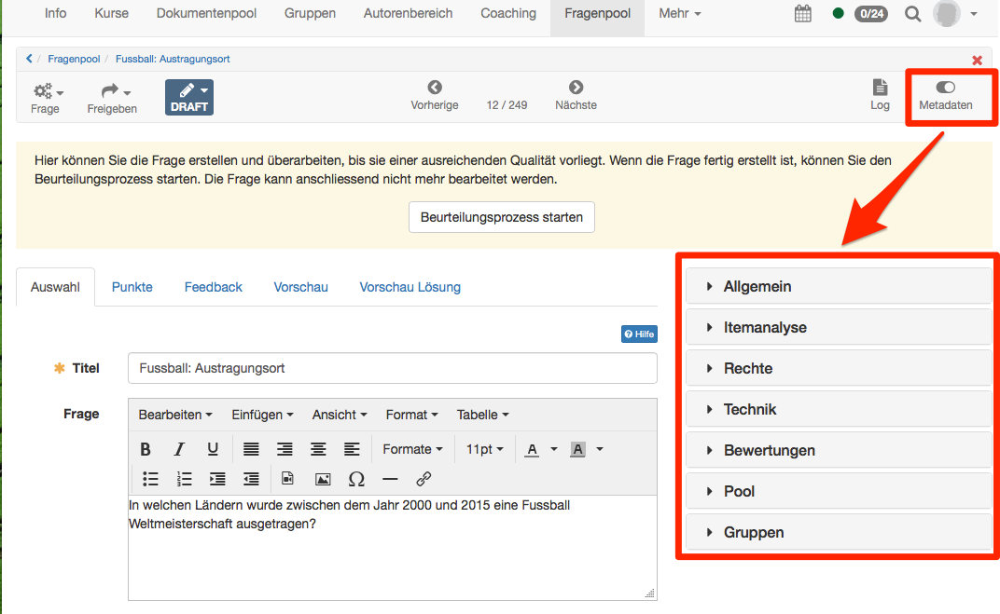
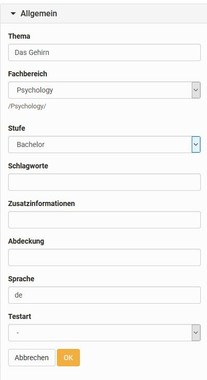
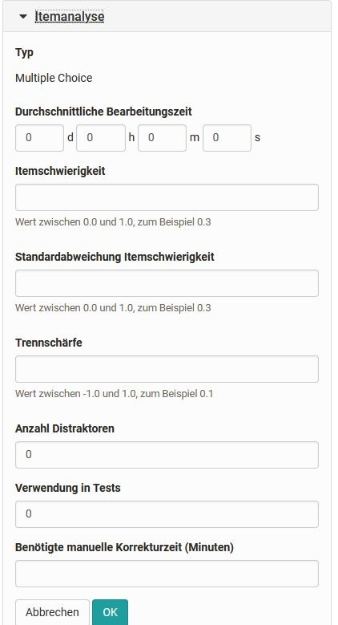
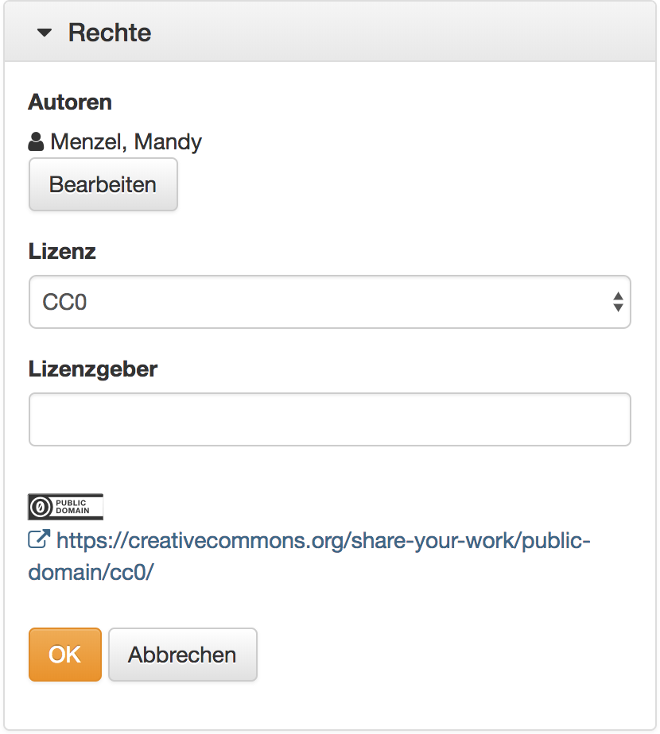
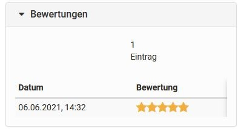

# Detailansicht einer Frage

Wenn Sie eine Frage im Fragenpool auswählen sehen Sie Details zu dieser Frage
und können weitere Konfigurationen vornehmen. In der Toolbar können sie über
das Menü "Frage" die ausgewählte Frage kopieren oder löschen. Unter
"Freigeben" können Sie die Frage exportieren oder einem Pool oder einer Gruppe
freigeben. Auch der Status einer Frage kann definiert werden. So kann man
schnell erkennen ob es sich bei dieser Frage um einen Entwurf oder eine finale
Frage handelt bzw. in welcher Stufe einer möglichen Revision sich die Frage
befindet.

Im Fragenpool besteht eine Frage respektive ein Item nicht nur aus der Frage
selbst. Zusätzlich können noch weitere Informationen über die Frage selbst,
sogenannte Metainformationen oder auch Metadaten, vorhanden sein. Sie
beschreiben ein Item genauer und ermöglichen und vereinfachen Testautoren
dadurch die Auswahl und Zusammenstellung. Der Grossteil der Metadaten muss von
einem Autor eingetragen werden.

Insgesamt stehen im Fragenpool mehr als 20 Metadatenfelder gemäss den
[Learning Objects
Metadata](http://de.wikipedia.org/wiki/Learning_Objects_Metadata "Learning
Objects Metadata")  zur Beschreibung zur Verfügung. Wenn Sie das Recht zur
Bearbeitung besitzen, können Sie diese unter den Punkten _**Allgemein** ,
**Itemanalyse** , **Rechte** , _und _**Technik**_ anpassen. Bitte beachten Sie
jedoch, dass insbesondere Änderungen unter Itemanalyse nur mit diesbezüglichen
Vorkenntnissen vorgenommen werden sollten.

In der Detailansicht befinden Sie sich direkt im Editor der Frage. In der
Toolbar rechts oben können die Metadaten aktiviert werden. Sie werden
anschliessend rechts des Frageneditors angezeigt und können direkt bearbeitet
werden. Die Eingaben müssen anschliessend noch mit OK gespeichert werden.
Sofern der Beurteilungsprozess aktiviert ist, können die Metadaten im Status
Draft und In Revision bearbeitet werden. Benutzer mit Verwalten-Recht,
Poolmanager oder Systemadministratoren können die Metadaten zudem im Status
Review und Final bearbeiten.

## Metadatenbereiche

### Allgemein

Dieser Einstellungsbereich enthält Informationen zur Kategorisierung wie Thema
und Fachbereich sowie die Verschlagwortung. Die Auswahl an Fachbereichen
sollte die Bereiche Ihrer Institution abdecken. Sie können hier aus denjenigen
Fachbereichen auswählen, die Ihnen zugeordnet worden sind. Nehmen Sie Kontakt
mit Ihrem Poolverwalter oder Administrator auf falls Fachbereiche fehlen.

Unter Stufe kann beispielsweise eine Schul- oder Hochschulstufe ausgewählt
werden. Hier bieten sich auch Kompetenzstufen oder Schwierigkeitsgrade an.
Auch diese wurden zuvor durch den Administrator definiert.

Unter Zusatzinformationen können weitere Metadaten eingegeben werden.
Abdeckung beschreibt das Themengebiet und grenzt dieses zusammen mit den
Schlagworten ein. Bei der Sprache wird standardmässig Ihre OpenOlat-Sprache
eingetragen und bei der Testart können Sie auswählen, ob die Frage für einen
summativen oder formativen Test oder für beide Varianten gedacht ist.

  

  

###  Itemanalyse

Enthält Informationen zur Itemanalyse und der Verwendung in Tests. Die
Itemanalyse ist ein Satz an (statistischen) Verfahren, mit dem einzelne Fragen
im Hinblick auf ihre Eignung zur Wissensmessung respektive Wissensabfrage des
Untersuchungszieles bewertet und beurteilt werden. Typische Kennwerte sind die
Itemschwierigkeit und die Trennschärfe.

Geben Sie an, mit welchen durchschnittlichen Bearbeitungszeit Sie für die
Bearbeitung der Frage ausgehen. So können Sie später Tests für eine bestimmten
Bearbeitungsdauer leichter zusammenstellen.

Die  _ **Itemschwierigkeit**_  drückt mit einem Wert zwischen 0 und 1 aus, wie
schwer eine Frage zu beantworten ist, und gibt damit an wie viele Personen
einer Kandidatengruppe die Frage korrekt lösen im Verhältnis zur maximal
erreichbaren Punktzahl. Zweck des Schwierigkeitsindexes ist die Unterscheidung
von Personen mit hoher Merkmalsausprägung und Personen mit niedriger
Merkmalsausprägung. Unbrauchbar sind demzufolge alle Items, die von allen
Personen, bzw. Items, die von keiner Person gelöst werden konnten oder bejaht
wurden (Index-Wert nahe 1 bzw. 0). Items mit Werten nahe 1 sind zu einfach und
unterscheiden nicht zwischen den Leistungen von Personen und Items mit Werten
nahe 0 sind zu schwierig. Beachten Sie, dass bei einer Multiple Choice Frage
mit 5 Antwortalternativen (4 Distraktoren) die Ratewahrscheinlichkeit bereits
20% beträgt. Für eine gute Leistungsdifferenzierung eignen sich Items im
Bereich 0.4-0.9 oder 40-90%.

Die  _ **Standardabweichung**_  (der Itemschwierigkeit) gibt mit einem Index-
Wert zwischen 0 und 1 an, wie stark sich die Antworten auf eine Frage zwischen
mehreren Personen unterscheiden, wie hoch die Antworten um den Mittelwert
streuen (Schwankungsbreite). Eine Standardabweichung umfasst etwas mehr als
68% aller Werte um den Mittelwert, zwei Standardabweichungen umfassen knapp
95.5% aller Werte in der Werteverteilung. Je kleiner die Standardabweichung
ist, desto "stabiler" ist die Itemschwierigkeit über eine oder auch mehrere
Testkandidatenpopulationen, je grösser, desto "instabiler" ist sie. Items mit
einer hohen Standardabweichung sind demzufolge mit etwas Vorsicht auszuwählen.

Die  _ **Trennschärfe**_  gibt mit einem Wert zwischen -1 und +1 die Fähigkeit
eines Items an, Kandidaten mit guter und schlechter Leistung in der
Gesamtprüfung zu trennen. Sie gibt an, ob eine Frage etwas Ähnliches abfragt
wie der übrige Test. Die Trennschärfe ist daher der wichtigste Kennwert in der
Itemselektion. Sie wird berechnet als Korrelationskoeffizient zwischen der
erreichten Punktzahl in diesem Item und der Gesamtpunktzahl in der Prüfung
ohne dieses Item. Für eine gute Leistungsdifferenzierung sind Items mit klar
positiver Trennschärfe erforderlich, wenn möglich grösser oder gleich 0.2,
sicher aber grösser als 0.1. Items mit Trennschärfen um 0 tragen nichts zur
Differenzierung bei, solche mit negativer Trennschärfe laufen sogar dem
Differenzierungsziel entgegen und sollten in Folgetests nicht mehr verwendet
werden.

Weiterhin können hier Angaben zu den _**Distraktoren**_ gemacht werden, also
wieviele Antwortalternativen zur Verfügung stehen, sowie festgelegt werden ob
sich das Frageitem für summative (bewertende), formative (diagnostische) oder
beide Arten von Tests eignet _**(Testart)**_. Ob das Item bereits in einem
Test verwendet wird, wird vom System automatisch festgelegt. Sie finden hier
die genaue Anzahl. Dies wird bei Einbindung in einen Test automatisch erhöht.

Auch die voraussichtliche Korrekturzeit für eine manuelle Bewertung kann dem
Item zugeordnet werden.

In der Teststatistik eines Tests wird für jedes Frageitem eine Itemanalyse
durchgeführt und ausgegeben. Die Daten können anschliessend manuell von der
Teststatistik in die Metadaten des Frageitems übertragen werden.

Alle anderen Parameter werden _nicht_ von OpenOlat berechnet. Wenn Daten dazu
vorliegen (z.B. aus anderen Systemen oder nach manueller Berechnung) können
diese  _manuell_ am Frageitem eingetragen werden.

  

  

###  Rechte

Enthält Informationen über den Urheber bzw. den Verfasser des Frageitems. Alle
Personen, welche die Frage erstellt oder editiert haben werden als Autoren
aufgelistet. Die Autoren können zudem manuell hinzugefügt oder entfernt
werden. Der Urheber wird kann nur manuell hinzugefügt oder entfernt werden.

Weiter kann das Copyright definiert werden. Standardmässig stehen Creative
Commons Lizenzen zur Auswahl. Informationen zu Creative Commons finden Sie in
der [Wikipedia](http://de.wikipedia.org/wiki/Creative_Commons "Wikipedia") und
unter [www.creativecommons.org](http://www.creativecommons.org/
"www.creativecommons.org"). Werden weitere zusätzliche Lizenzen benötigt,
können diese vom Systemadministrator erstellt werden.

Sowohl Lizenzgeber als auch Lizenz können manuell hinzugefügt werden und haben
keine weiteren Auswirkungen. Ist eine initiale Lizenz bzw. ein initialer
Lizenzgeber für den Fragenpool in der Administration konfiguriert, so werden
diese automatisch beim Anlegen einer neuen Frage eingetragen. Sobald jemand
die Rechte zur Bearbeitung eines Frageitems hat, kann diese Person auch die
Lizenz und den Lizenzgeber anpassen.

  

###  Technik

Unter Technik finden Sie Informationen zum Editor in der die Frage erstellt
wurde, sowie dessen Version. Das Format gibt an, welches technische Format die
Frage hat. Erstellt und letzte Änderung geben an, wann die Frage erstellt bzw.
importiert wurde und ob z.B. anschliessend noch Änderungen daran vorgenommen
wurden.

Sofern der Beurteilungsprozess aktiviert ist, wird die Version automatisch
erstellt. Jedes Mal, wenn eine Frage in die Beurteilung und somit in den
Status Review gegeben wird, wird die Version um einen Zähler erhöht. Ist der
Beurteilungsprozess nicht aktiviert, kann die Version manuell eingetragen und
angepasst werden.

Alle anderen Attribute im Bereich Technik können nicht bearbeitet werden.

### Bewertungen

Sofern der Beurteilungsprozess aktiviert ist, werden in diesem Abschnitt die
Bewertungen der Frage angezeigt.

###  Pool und Gruppen

Listet die Pools und Gruppen in welchen das Frageitem freigegeben wurde.

Achtung

Wenn ein Frageitem aus einem Test im Standard QTI 2.1 in den Fragepool
importiert wird, verliert es alle Metadaten.

