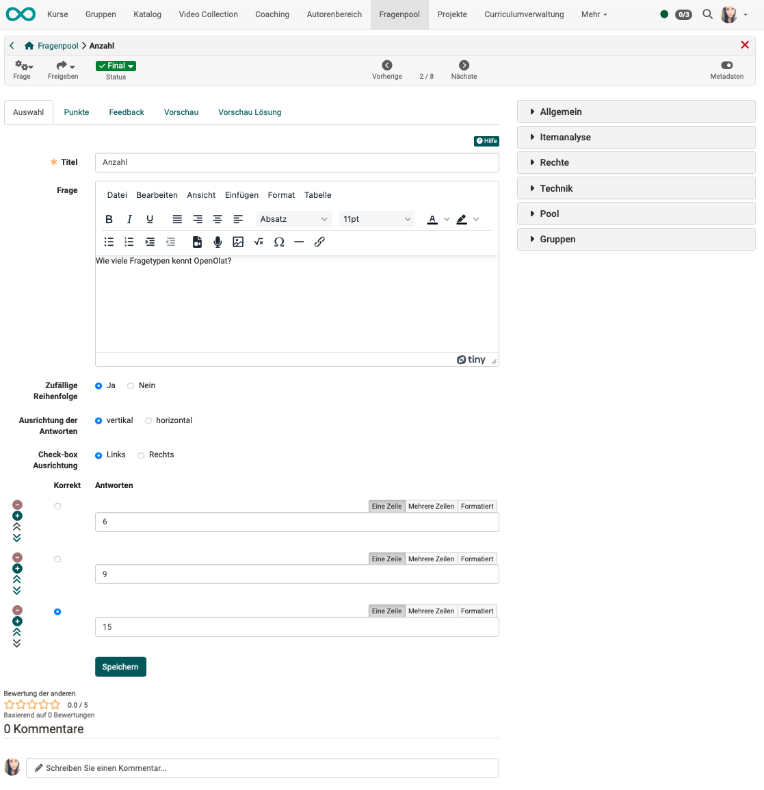
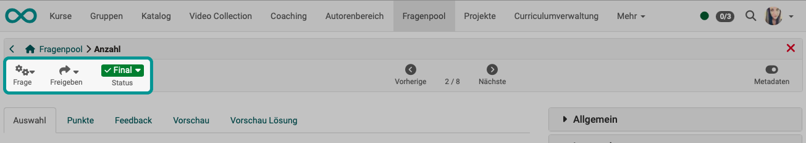
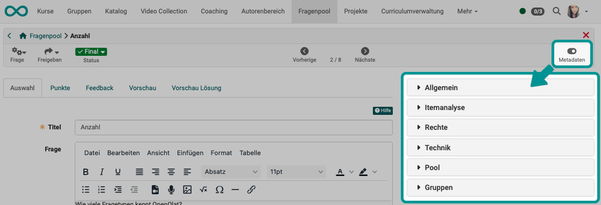
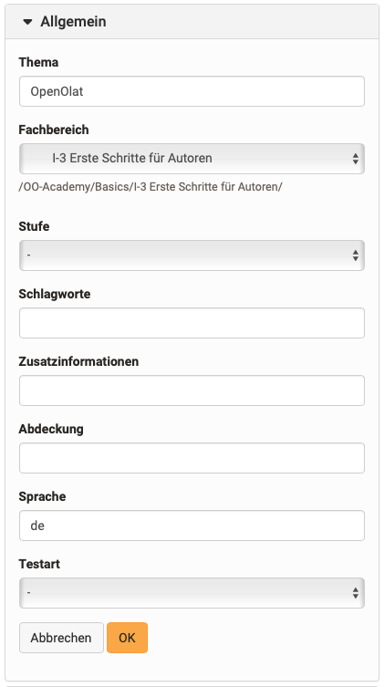
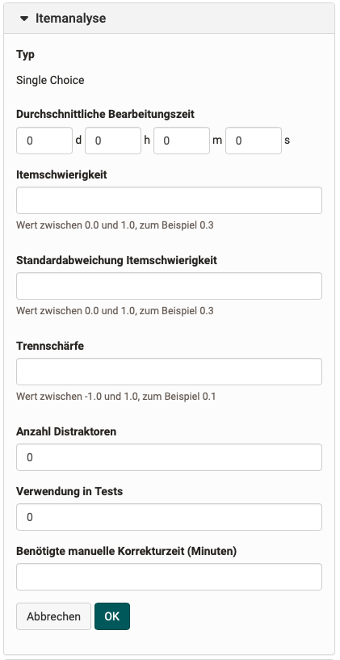
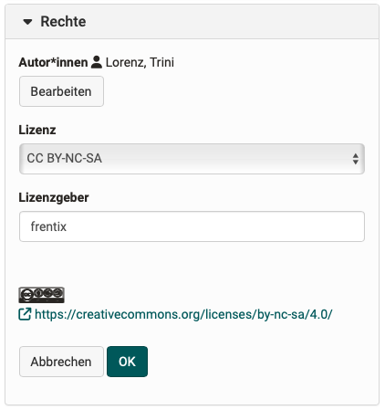
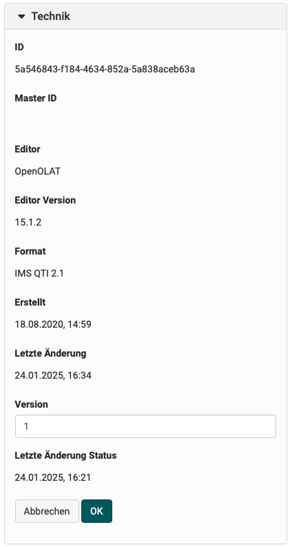

# Fragenpool: Detailansicht einer Frage {: #question_details}

Wenn Sie eine Frage im Fragenpool auswählen, befinden Sie sich in ihrer Detailansicht und direkt im Editor der Frage.
Sie können dort die Frage bearbeiten, sowie weitere Konfigurationen vornehmen, z.B. Metadaten zuordnen.

{ class="shadow lightbox" }

## Toolbar {: #toolbar}

{ class="shadow lightbox" }

In der Toolbar können Sie über das Menü "**Frage**" die ausgewählte Frage kopieren oder löschen.

Unter "**Freigeben**" können Sie

* die Frage exportieren 
* oder einem Pool 
* oder einer Gruppe freigeben. 

Auch der **Status** einer Frage kann definiert werden. So kann man schnell erkennen, ob es sich bei dieser Frage um einen Entwurf oder eine finale Frage handelt bzw. in welcher Stufe einer möglichen Revision sich die Frage befindet.

[Zum Seitenanfang ^](#question_details)

## Editor

Für die Erstellung und Bearbeitung der Fragen im Fragenpool wird der gleiche Editor verwendet, wie bei der Erstellung von Fragen in einer Test-Lernressource.

[Zu den Details des Frage-Editors >](../learningresources/Configure_test_questions.de.md) 
[Zum Seitenanfang ^](#question_details)

## Metadaten {: #metadata}

Im Fragenpool besteht eine Frage, respektive ein Item, nicht nur aus der Frage selbst. Zusätzlich können noch weitere Informationen über die Frage, sogenannte Metainformationen oder auch Metadaten, vorhanden sein. Sie beschreiben ein Frage-Item genauer und ermöglichen und vereinfachen Autor:innen die Auswahl und Zusammenstellung von Fragen zu einem Test. Der Grossteil der Metadaten wird von den Autor:innen erfasst.
Insgesamt stehen im Fragenpool mehr als 20 Metadatenfelder gemäss den [Learning Objects Metadata](http://de.wikipedia.org/wiki/Learning_Objects_Metadata "Learning Objects Metadata") zur Beschreibung zur Verfügung. 

Die Metadaten können in der Detailansicht durch einen Toggle-Button rechts oben angezeigt werden.

{ class="shadow lightbox" }

!!! info "Info"

    Ist der [Beurteilungsprozess](Question_Bank_Review_Process.de.md) aktiviert, wird zusätzlich die Option ["Bewertung"](#metadata_ratings) angzeigt.

[Zum Seitenanfang ^](#question_details)

### Metadaten bearbeiten {: #metadata_edit}

Sofern der Beurteilungsprozess aktiviert ist, können die Metadaten im Status "Draft" und "In Revision" bearbeitet werden. Benutzer:innen mit "Verwalten"-Recht, Poolmanager:innen oder Systemadministrator:innen können die Metadaten zudem im Status "Review" und "Final" bearbeiten.

Bearbeitbar sind die Metadaten unter den Punkten **Allgemein**, **Itemanalyse**, **Rechte** und **Technik**. Bitte beachten Sie jedoch, dass insbesondere Änderungen unter Itemanalyse nur mit diesbezüglichen Vorkenntnissen vorgenommen werden sollten.
Die Eingaben müssen anschliessend noch mit "OK" gespeichert werden.

[Zum Seitenanfang ^](#question_details)

### Allgemein {: #metadata_general}

{ class="aside-right lightbox"}

Dieser Einstellungsbereich enthält Informationen zur Kategorisierung der Frage. 

Das **Thema** kann frei formuliert werden und sich am Inhalt der Frage orientieren.

Der **Fachbereich** bezieht sich auf die für den Fragenpool hinterlegte Taxonomie. Die angebotene Auswahl sollte die Bereiche Ihrer Institution abdecken. Sie können hier aus denjenigen Fachbereichen auswählen, die Ihnen zugeordnet worden sind. Nehmen Sie deshalb Kontakt mit Ihrem Poolverwalter oder Administrator auf, falls Fachbereiche fehlen.

Unter "**Stufe**" kann beispielsweise eine Schul- oder Hochschulstufe ausgewählt werden. Hier bieten sich auch Kompetenzstufen oder Schwierigkeitsgrade an. Auch diese wurden zuvor durch den Administrator definiert.

**Schlagworte** können frei vergeben werden. Sie sind im Unterschied zum Fachbereich nicht an eine Taxonomie gekoppelt.

Unter **Zusatzinformationen** können weitere Metadaten eingegeben werden. 

**Abdeckung** beschreibt das Themengebiet und grenzt dieses zusammen mit den Schlagworten ein.

Bei der **Sprache** wird standardmässig Ihre OpenOlat-Sprache eingetragen.

Bei der **Testart** können Sie auswählen, ob die Frage für einen summativen (bewertenden) oder formativen (diagnostischen) Test oder für beide Varianten gedacht ist. 

[Zum Seitenanfang ^](#question_details)

### Itemanalyse {: #metadata_item_analysis}

{ class="aside-right lightbox"}

Enthält Informationen zur Itemanalyse und der Verwendung in Tests. 

Die Itemanalyse ist ein Satz an (statistischen) Verfahren, mit dem einzelne Fragen im Hinblick auf ihre Eignung zur Wissensmessung respektive Wissensabfrage des Untersuchungszieles bewertet und beurteilt werden. Typische Kennwerte sind die Itemschwierigkeit und die Trennschärfe.

Geben Sie an, mit welchen _**durchschnittlichen Bearbeitungszeit**_ Sie für die Bearbeitung der Frage ausgehen. So können Sie später Tests für eine bestimmten Bearbeitungsdauer leichter zusammenstellen.

Die  _**Itemschwierigkeit**_  drückt mit einem Wert zwischen 0 und 1 aus, wie schwer eine Frage zu beantworten ist und gibt damit an, wieviele Personen einer Kandidatengruppe die Frage korrekt lösen im Verhältnis zur maximal erreichbaren Punktzahl. Zweck des Schwierigkeitsindexes ist die Unterscheidung von Personen mit hoher Merkmalsausprägung und Personen mit niedriger Merkmalsausprägung. Unbrauchbar sind demzufolge alle Items, die von allen Personen, bzw. Items, die von keiner Person gelöst werden konnten oder bejaht wurden (Index-Wert nahe 1 bzw. 0). Items mit Werten nahe 1 sind zu einfach und unterscheiden nicht zwischen den Leistungen von Personen und Items mit Werten nahe 0 sind zu schwierig. Beachten Sie, dass bei einer Multiple Choice Frage mit 5 Antwortalternativen (4 Distraktoren) die Ratewahrscheinlichkeit bereits 20% beträgt. Für eine gute Leistungsdifferenzierung eignen sich Items im Bereich 0.4-0.9 oder 40-90%.

Die  _**Standardabweichung**_  (der Itemschwierigkeit) gibt mit einem Index- Wert zwischen 0 und 1 an, wie stark sich die Antworten auf eine Frage zwischen mehreren Personen unterscheiden, wie hoch die Antworten um den Mittelwert streuen (Schwankungsbreite). Eine Standardabweichung umfasst etwas mehr als 68% aller Werte um den Mittelwert, zwei Standardabweichungen umfassen knapp 95.5% aller Werte in der Werteverteilung. Je kleiner die Standardabweichung ist, desto "stabiler" ist die Itemschwierigkeit über eine oder auch mehrere Testkandidatenpopulationen, je grösser, desto "instabiler" ist sie. Items mit einer hohen Standardabweichung sind demzufolge mit etwas Vorsicht auszuwählen.

Die  _**Trennschärfe**_  gibt mit einem Wert zwischen -1 und +1 die Fähigkeit eines Items an, Kandidaten mit guter und schlechter Leistung in der Gesamtprüfung zu trennen. Sie gibt an, ob eine Frage etwas Ähnliches abfragt wie der übrige Test. Die Trennschärfe ist daher der wichtigste Kennwert in der Itemselektion. Sie wird berechnet als Korrelationskoeffizient zwischen der erreichten Punktzahl in diesem Item und der Gesamtpunktzahl in der Prüfung ohne dieses Item. Für eine gute Leistungsdifferenzierung sind Items mit klar positiver Trennschärfe erforderlich, wenn möglich grösser oder gleich 0.2, sicher aber grösser als 0.1. Items mit Trennschärfen um 0 tragen nichts zur Differenzierung bei, solche mit negativer Trennschärfe laufen sogar dem Differenzierungsziel entgegen und sollten in Folgetests nicht mehr verwendet werden.

Weiterhin können hier Angaben zu den _**Distraktoren**_ gemacht werden, also wieviele Antwortalternativen zur Verfügung stehen. 

Ob das Item bereits **in einem Test verwendet** wird, wird vom System automatisch festgelegt. Sie finden hier die genaue Anzahl. Bei Einbindung in einen Test wird sie automatisch erhöht.

Auch die voraussichtliche **Korrekturzeit für eine manuelle Bewertung** kann dem Item zugeordnet werden.

In der Teststatistik eines Tests wird für jedes Frageitem eine Itemanalyse durchgeführt und ausgegeben. Die Daten können anschliessend manuell von der Teststatistik in die Metadaten des Frageitems übertragen werden.

Alle anderen Parameter werden _nicht_ von OpenOlat berechnet. Wenn Daten dazu vorliegen (z.B. aus anderen Systemen oder nach manueller Berechnung) können diese _manuell_ am Frageitem eingetragen werden.

[Zum Seitenanfang ^](#question_details)

### Rechte {: #metadata_rights}

{ class="aside-right lightbox"}

Dieser Abschnitt enthält Informationen über den Urheber bzw. den Verfasser des Frageitems. Alle Personen, welche die Frage erstellt oder editiert haben, werden als Autor:innen aufgelistet. Die Autor:innen können zudem manuell hinzugefügt oder entfernt werden. Der Urheber kann nur manuell hinzugefügt oder entfernt werden.

Weiter kann das Copyright definiert werden. Standardmässig stehen Creative Commons Lizenzen zur Auswahl. Informationen zu Creative Commons finden Sie in der [Wikipedia](http://de.wikipedia.org/wiki/Creative_Commons "Wikipedia") und unter [www.creativecommons.org](http://www.creativecommons.org/ "www.creativecommons.org"). Werden weitere zusätzliche Lizenzen benötigt, können diese vom Systemadministrator erstellt werden.

Sowohl Lizenzgeber als auch Lizenz können manuell hinzugefügt werden und haben keine weiteren Auswirkungen. Ist eine initiale Lizenz bzw. ein initialer Lizenzgeber für den Fragenpool in der Administration konfiguriert, so werden diese automatisch beim Anlegen einer neuen Frage eingetragen. Sobald jemand die Rechte zur Bearbeitung eines Frageitems hat, kann diese Person aber die Lizenz und den Lizenzgeber anpassen.

[Zum Seitenanfang ^](#question_details)

### Technik {: #metadata_technical}

{ class="aside-right lightbox"}

Unter "Technik" finden Sie Informationen zum **Editor**, in der die Frage erstellt wurde, sowie dessen **Version**. Das **Format** gibt an, welches technische Format die Frage hat. **Erstellt** und **letzte Änderung** geben an, wann die Frage erstellt bzw. importiert wurde und ob z.B. anschliessend noch Änderungen daran vorgenommen wurden.

Sofern der Beurteilungsprozess aktiviert ist, wird die Version automatisch erstellt. Jedes Mal, wenn eine Frage in die Beurteilung und somit in den Status Review gegeben wird, wird die Version um einen Zähler erhöht. Ist der Beurteilungsprozess nicht aktiviert, kann die Version manuell eingetragen und angepasst werden.

Alle anderen Attribute im Bereich Technik können nicht bearbeitet werden.

[Zum Seitenanfang ^](#question_details)

### Bewertungen {: #metadata_ratings}

{ class="aside-right lightbox"}

Sofern der Beurteilungsprozess aktiviert ist, werden in diesem Abschnitt die Bewertungen der Frage im Zusammenhang mit dem Beurteilungsprozess angezeigt. Diese Bewertungen aus dem Beurteilungsprozess werden zusätzlich noch bei den [Kommentaren und Bewertungen](#comments) durch andere Personen am unteren Rand des Bildschirms angezeigt.

Ist der Beurteilungsprozess nicht aktiviert, fehlt das Dropdown "Bewertungen" in den Metadaten.

[Details zum Beurteilungsprozess >](Question_Bank_Review_Process.de.md) 
[Aktivierung des Beurteilungsprozesses durch Administrator:innen >](../../manual_admin/administration/eAssessment_Question_bank.de.md) 
[Zum Seitenanfang ^](#question_details)

###  Pool {: #metadata_pool}

Listet die Pools in welchen das Frageitem freigegeben wurde.

[Zum Seitenanfang ^](#question_details)

###  Gruppen {: #metadata_groups}

Listet die Gruppen in welchen das Frageitem freigegeben wurde.

[Zum Seitenanfang ^](#question_details)

!!! Achtung

    Wenn ein Frageitem aus einem Test im Standard QTI 2.1 in den Fragepool importiert wird, verliert es alle Metadaten.

## Kommentare {: #comments}

{ class="shadow lightbox" }

Die Kommentare und Bewertungen (Sterne), die hier am unteren Rand der Detailansicht zu einer Frage eingegeben werden, stammen von Autor:innen und Personen, die zur Administration Zugriff auf diese Frage haben. Jede Person mit Zugriff kann hier einen Kommentar abgeben. 

Die Bewertungen im Zusammenhang mit einem Beurteilungsprozess (siehe Metadaten) werden zusätzlich darunter angezeigt.

[Zum Seitenanfang ^](#question_details)

## Weitere Informationen {: #further_info}

[Frage erstellen >](Question_Bank_Create_Questions.de.md) 
[Fragen importieren >](Question_Bank_Import_Questions.de.md) 
[Details zum Beurteilungsprozess >](Question_Bank_Review_Process.de.md) 
[Details zur Freigabe >](Question_Pool_Sharing_Options.de.md) 
[Anleitung zur Testerstellung >](../../manual_how-to/test_creation_procedure/test_creation_procedure.de.md)  

[Zum Seitenanfang ^](#create_questions)