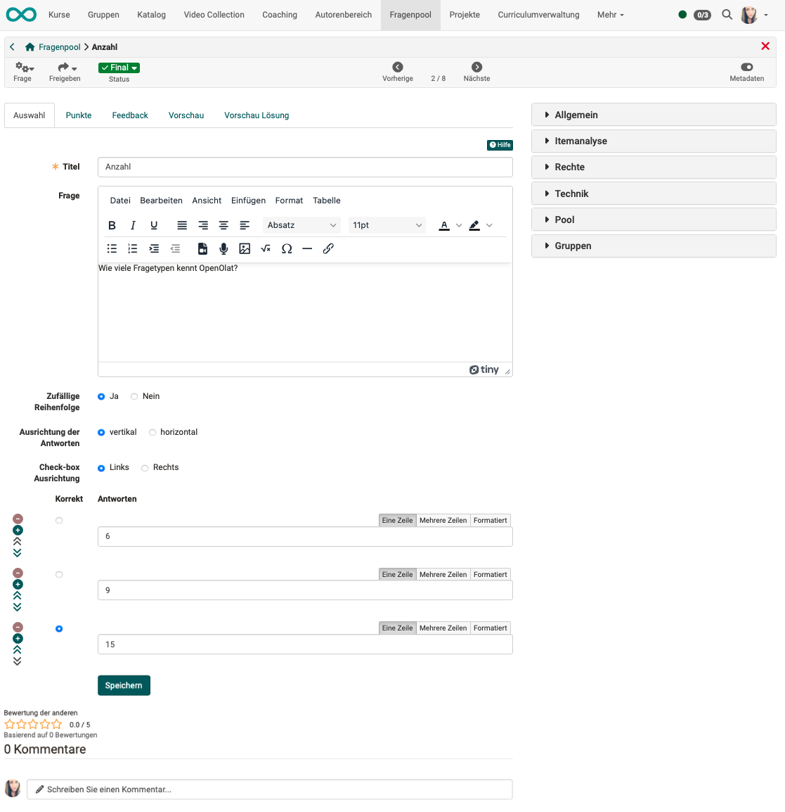
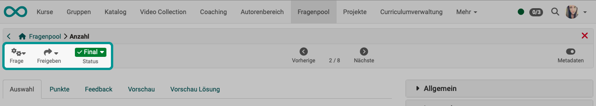
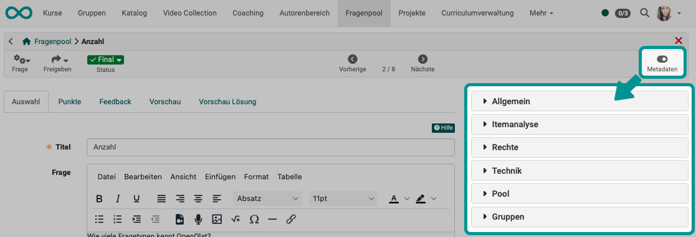
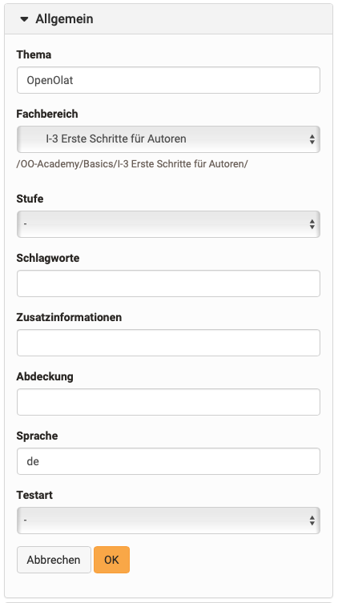
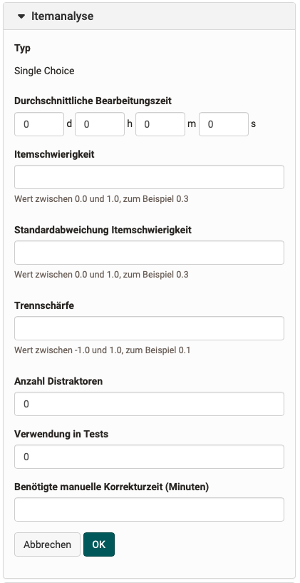
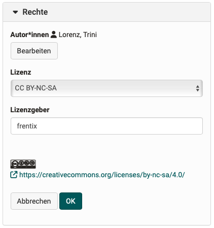
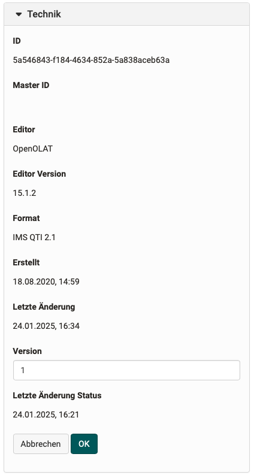
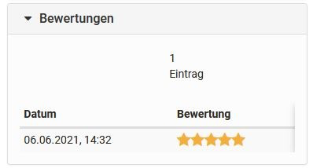

# Item Detailed View {: #question_details}

When you select a question in the question bank, you are in its detailed view and directly in the question editor.
You can edit the question there and make further configurations, e.g. assign metadata.

{ class="shadow lightbox" }

## Toolbar {: #toolbar}

{ class="shadow lightbox" }

In the toolbar, you can copy or delete the selected question via the "**Question**" menu.

Under "**Share**" you can

* export the question
* or share it with a pool
* or share it with a group.

The **status** of a question can also be defined. This allows you to quickly see whether this question is a draft or a final question, or which stage of a possible revision the question is in.

[To the top of the page ^](#question_details)

## Editor

The same editor is used for creating and editing questions in the question bank as for creating questions in a test learning resource.

[To the details about the question editor >](../learningresources/Configure_test_questions.md) 
[To the top of the page ^](#question_details)

## Metadata {: #metadata}

In the question bank, a question, or rather an item, does not only consist of the question itself. In addition, further information about the question, so-called meta information or metadata, can be available. They describe a question item more precisely and enable and simplify the selection and compilation of questions for a test for authors. The majority of the metadata is entered by the authors.
All in all, more than 20 metadata fields according to the [Learning Objects Metadata](http://en.wikipedia.org/wiki/Learning_object_metadata "Learning Objects Metadata") are available for description in the question bank. 

The metadata can be displayed in the detailed view using a toggle button at the top right.

{ class="shadow lightbox" }

!!! info "Important"

    If the [review process](Question_Bank_Review_Process.md) is activated, the option ["Ratings"](#metadata_ratings) is also displayed.

[To the top of the page ^](#question_details)

### Edit metadata {: #metadata_edit}

If the review process is activated, the metadata can be edited in the "Draft" and "In revision" status. Users with "Manage" rights, question bank managers or system administrators can also edit the metadata in the "Review" and "Final" status.

The metadata can be edited under **General**, **Item analysis**, **Rights** and **Technical**. Please note, however, that changes under Item analysis in particular should only be made with prior knowledge in this area.
The entries must then be saved with "OK".

[To the top of the page ^](#question_details)

### General {: #metadata_general}

{ class="aside-right lightbox"}

This settings area contains information on the categorization of the question. 

The **topic** can be freely formulated and based on the content of the question.

The **subject** refers to the taxonomy stored for the question bank. The offered selection should cover the areas of your institution. Here you can select from the subject areas that have been assigned to you. Contact your question bank manager or administrator if subject areas are missing.

Under "**Level**", for example, a school or university level can be selected. Competence levels or difficulty levels can also be selected here. These have also been defined beforehand by the question bank managers.

**Keywords** can be freely assigned. In contrast to the subject, they are not linked to a taxonomy.

Further metadata can be entered under **Additional information**. 

**Coverage** describes the subject area and narrows it down together with the keywords.

Your OpenOlat language is entered by default in **Language**.

Under **Assessment type** you can select whether the question is intended for a summative (evaluative) or formative (diagnostic) test or for both variants. 

[To the top of the page ^](#question_details)

### Item analysis {: #metadata_item_analysis}

{ class="aside-right lightbox"}

Contains information on item analysis and the use in tests. 

The item analysis is a set of (statistical) methods with which individual questions are evaluated and assessed with regard to their suitability for measuring or querying knowledge of the object of investigation. Typical parameters are the difficulty index and the discrimination index.

Indicate what _**average processing time**_ you assume for processing the question. This will make it easier for you to compile tests for a specific processing time later on.

The _**difficulty index**_ expresses with a value between 0 and 1 how difficult it is to answer a question, and thus indicates how many individuals of a group of candidates correctly solve the question in relation to the maximum achievable score. The purpose of the difficulty index is to discriminate individuals with high characteristic values from those with low characteristic values. Therefore all items that could be solved by every individual or items that could not be solved by anyone are useless (index value close to 1 or 0). Items with values close to 1 are too simple and do not distinguish between the performance of individuals, and items with values close to 0 are too difficult. Please note that in a multiple choice question with 5 response options (4 distractors), there is already a 20% probability of guessing. Items in the range of 0.4-0.9 or 40-90% are suitable for a good performance differentiation.

The _**standard deviation**_ (of the item difficulty) indicates with an index value between 0 and 1 how much the answers to a question differ between several individuals, how widely the answers are scattered around the mean (range of variation). One standard deviation comprises slightly more than 68% of all values around the mean, two standard deviations comprise almost 95.5% of all values in the value distribution. The smaller the standard deviation, the more "stable" the item difficulty across one or more test candidate populations, the larger, the more "unstable" it is. Items with a high standard deviation should therefore be selected with some caution.

The _**discrimination index**_ indicates with a value between -1 and +1 the ability of an item to separate candidates with good and poor performance in the overall exam. It indicates whether a question asks something similar to the rest of the test. The discrimination index is therefore the most important parameter in item selection. It is calculated as the correlation coefficient between the score achieved in this item and the total score in the exam without this item. For a good performance differentiation, items with a clearly positive discrimination index are required, if possible greater than or equal to 0.2, but certainly greater than 0.1. Items with a discrimination index around 0 do not contribute to differentiation, those with a negative index even run counter to the differentiation goal and should no longer be used in follow-up tests.

Furthermore, information on the _**distractors**_ can be entered here, i.e. how many alternative answers are available. 

Whether the item is already **used in a test** is determined automatically by the system. You can find the exact number here. If it is included in a test, it is automatically increased.

The estimated **correction time for a manual assessment** can also be assigned to the item.

In the test statistics of a test, an item analysis is carried out and output for each question item. The data can then be manually transferred from the test statistics to the metadata of the question item.

All other parameters are _not_ calculated by OpenOlat. If data are available (e.g. from other systems or after manual calculation) they can be entered _manually_ at the question item.

[To the top of the page ^](#question_details)

### Rights {: #metadata_rights}

{ class="aside-right lightbox"}

This section contains information about the creator or the author of the question item. All persons who have created or edited the question are listed as authors. The authors can also be added or removed manually. The creator can only be added or removed manually.

Furthermore, the copyright can be defined. By default, Creative Commons licences are available. Information on Creative Commons can be found in the [Wikipedia](http://en.wikipedia.org/wiki/Creative_Commons "Wikipedia") and on [www.creativecommons.org](http://www.creativecommons.org/ "www.creativecommons.org"). If further additional licences are required, they can be created by system administrators.

Both licensor and licence can be added manually and have no further effects. If an initial licence or an initial licensor is configured for the question bank in the administration, they are automatically entered when a new question is created. As soon as somebody has the rights to edit a question item, this person can adapt the licence and the licensor.

[To the top of the page ^](#question_details)

### Technical {: #metadata_technical}

{ class="aside-right lightbox"}

Under "Technical" you will find information on the **Editor** in which the question was created, as well as its **Version**. The **Format** indicates the technical format of the question. **Created** and **Last change** indicate when the question was created or imported and whether any changes were made to it afterwards, for example.

If the review process is activated, the version is created automatically. Each time a question is put into review and thus into the Review status, the version is incremented by one. If the review process is not activated, the version can be entered and adjusted manually.

All other attributes in the Technical section cannot be edited.

[To the top of the page ^](#question_details)

### Ratings {: #metadata_ratings}

{ class="aside-right lightbox"}

If the review process is activated, the ratings of the question in connection with the review process are displayed in this section. These ratings from the review process are also displayed in the [comments and ratings](#comments) by other people at the bottom of the screen.

If the review process is not activated, the "Ratings" dropdown in the metadata is missing.

[Details about the review process >](Question_Bank_Review_Process.md) 
[Activation of the review process by administrators >](../../manual_admin/administration/eAssessment_Question_bank.md) 
[To the top of the page ^](#question_details)

### Pool {: #metadata_pool}

Lists the pools in which the question item has been shared.

[To the top of the page ^](#question_details)

### Groups {: #metadata_groups}

Lists the groups in which the question item has been shared.

[To the top of the page ^](#question_details)

!!! warning "Attention"

    If a question item is imported from a test in the standard QTI 2.1 into the question bank, it loses all metadata.

## Comments {: #comments}

{ class="shadow lightbox" }

The comments and ratings (stars) that are entered here at the bottom of the detailed view of a question come from authors and people who have administrative access to this question. Anyone with access can leave a comment here. 

The ratings in connection with a review process (see metadata) are also displayed below.

[To the top of the page ^](#question_details)

## Further information {: #further_information}

**Mentioned on this page** 
[Configure test questions >](../learningresources/Configure_test_questions.md) 
[Learning Objects Metadata (Wikipedia) >](http://en.wikipedia.org/wiki/Learning_object_metadata) 
[Details about the review process >](Question_Bank_Review_Process.md) 
[Creative Commons (Wikipedia) >](http://en.wikipedia.org/wiki/Creative_Commons) 
[www.creativecommons.org >](http://www.creativecommons.org/) 
[e-Assessment Administration: Question bank >](../../manual_admin/administration/eAssessment_Question_bank.md)

**Further reading** 
[Create questions >](Question_Bank_Create_Questions.md) 
[Import questions >](Question_Bank_Import_Questions.md) 
[Details about sharing >](Question_Pool_Sharing_Options.md) 
[Instructions for creating the test >](../../manual_how-to/test_creation_procedure/test_creation_procedure.md)

[To the top of the page ^](#question_details)
