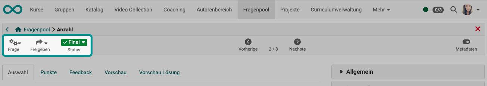
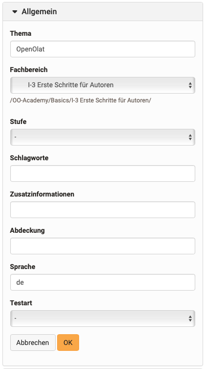
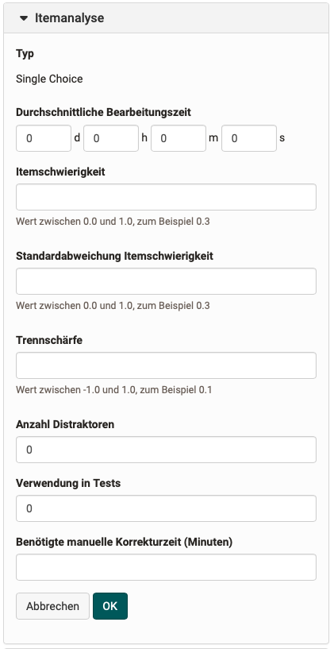
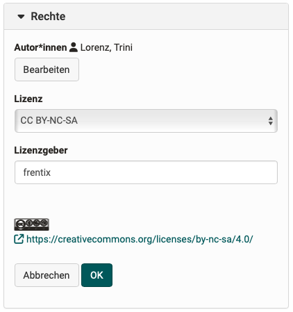

# Item Detailed View

When you select a question in the question pool, you are in its detailed view and directly in the question editor.
You can edit the question there and make further configurations, e.g. assign metadata.

{ class="shadow lightbox" }

## Toolbar {: #toolbar}

{ class="shadow lightbox" }

In the toolbar, you can copy or delete the selected question via the "**Question**" menu.

Under "**Share**" you can:

* export the question
* or a pool
* or a group

The **status** of a question can also be defined. This allows you to quickly see whether this question is a draft or a final question, or which stage of a possible revision the question is in.

[To the top of the page ^](#question_details)

## Editor

The same editor is used for creating and editing questions in the question pool as for creating questions in a test learning resource.

[To the details about the question editor >](../learningresources/Configure_test_questions.md) 
[To the top of the page ^](#question_details)

## Metadata {: #metadata}

In the question bank, a question or an item does not only consist of the question itself. In addition, further information about the question itself, so called meta information or meta data, can be available. They describe an item more precisely and thus enable and simplify the selection and compilation for test authors. The majority of the metadata must be entered by an author.
All in all, more than 20 metadata attributes, according to the [learning object metadata](http://en.wikipedia.org/wiki/Learning_object_metadata "learning object metadata"), are available for further item specification. 

The metadata can be displayed in the detailed view using a toggle button at the top right.

{ class="shadow lightbox" }

!!! info "Info"

    If the [Review process](Question_Bank_Review_Process.md) is activated, the option ["Rating"](#metadata_ratings) is also displayed.

[To the top of the page ^](#question_details)

### Edit Metadata {: #metadata_edit}

If the review process is activated, the metadata can be edited in the "Draft" and "In revision" status. Users with "Manage" rights, pool managers or system administrators can also edit the metadata in the "Review" and "Final" status.

The metadata can be edited under **General**, **Item analysis**, **Rights** and **Technique**. Please note, however, that changes under Item analysis in particular should only be made with prior knowledge in this area.
The entries must then be saved with "OK".

[To the top of the page ^](#question_details)

### General {: #metadata_general}

{ class="aside-right lightbox"}

This settings area contains information on the categorization of the question.

The **topic** can be freely formulated and based on the content of the question.

This **settings area** contains categorization information such as subject and subject area as well as keywording. The selection of subject areas should cover the areas of your institution. Here you can select from the subject areas that have been assigned to you. Contact your pool manager or administrator if subject areas are missing.

Under "**Level**", for example, a school or university level can be selected. Competence levels or difficulty levels can also be selected here. These have also been previously defined by the administrator.

**Keywords** can be freely assigned. In contrast to the subject area, they are not linked to a taxonomy.

Further metadata can be entered under **Additional information**. 

**Coverage** describes the subject area and narrows it down together with the keywords.

Your OpenOlat language is entered by default in **Language**.

In the **Test start** you can select whether the question is intended for a summative (evaluative) or formative (diagnostic) test or for both variants.

[To the top of the page ^](#question_details)

###  Item analysis {: #metadata_item_analysis}

{ class="aside-right lightbox"}

Contains information on item analysis and the use of the item in tests.

The Item analysis is a set of (statistical) methods, with which individual question items are evaluated and assessed pertaining to their suitability for knowledge measurement respectively assessment. Typical parameters are the difficulty index and the discrimination index.

Indicate what _**average processing**_ time you assume for the processing of the question. This will make it easier for you to compile tests for a specific processing time later on.

The _**difficulty index**_ expresses with a value between 0 and 1 how difficult it is to answer a question, and thus indicates how many individuals of a group of candidates correctly solve the question in relation to the maximum achievable score. The purpose of the difficulty index is to discriminate individuals with high characteristic values from those with low characteristic value. Therefore all items that could be solved by any individual or items that could not be solved by anyone, are useless (index value close to 0 or 1). Items with values close to 0 are too simple and do not distinguish between the performance of individuals and items with values close to 1 are too difficult. Please note that in a multiple choice question with 5 response options (4 distractors), there is a 20% probability that the answer was guessed. Items in the area of 0.4-0.9 or 40-90% are suitable for a good performance discrimination.

The _**standard deviation**_ (of the item difficulty) expresses with a value between 0 and 1 the dispersion of individual scores on that item, thus indicating how widespread the responses were. If the test scores are distributed as a normal curve, one standard deviation comprises about 68% of the scores above and below the mean, while two standard deviations cover 95.5% of all values in the value distribution. The lower the standard deviation, the more "stable" the difficulty index on one or several test candidate universes, the larger, the more "unstable" it is. Items with a high standard deviation should therefore be selected with utmost care.

The _**discrimination index**_ expresses with a value between -1 and +1 the ability of an item to discriminate candidates with good and poor knowledge of the material being tested. It provides an estimate of the degree to which an individual item is measuring the same thing as the rest of the items of the test. The discrimination index is therefore the most important parameter in the item selection process. It is calculated as the product moment correlation coefficient between student responses to a particular item and total scores on all other items on the test. In order to achieve a good performance discrimination items with distinct positive indices are required, if possible higher than or equal to .20, but certainly higher than .10. Items with a very low discrimination index do not contribute to differentiation, those with negative indices even run counter to the item selection process and should not be used in follow-up testing.

Furthermore, information on the _**distractors**_ can be entered here, i.e. how many alternative answers are available.

Whether the item is already **used in a test** is determined automatically by the system. You can find the exact number here. If it is included in a test, it is automatically increased.

The estimated **correction time for a manual assessment** can also be assigned to the item.

In the test statistics of a test, an item analysis is carried out and output for each question item. The data can then be manually transferred from the test statistics to the metadata of the question item.

All other parameters are _not_ calculated by OpenOlat. If data are available (e.g. from other systems or after manual calculation) they can be entered manually at the question item.

[To the top of the page ^](#question_details)

###  Rights {: #metadata_rights}

{ class="aside-right lightbox"}

This section contains information about the owner of the item, and whether the item holds a copyright. All persons who have either created or edited a question are listed as authors. In addition, authors can also be manually added or removed. The owner must always be manually added or removed.

By default, Creative Commons licenses are already available. Information on Creative Commons can be found in the [Wikipedia](http://en.wikipedia.org/wiki/Creative_Commons "Wikipedia") and on [www.creativecommons.org](http://www.creativecommons.org/ "www.creativecommons.org"). If more licenses are required, please contact your administrator.

License and licensor can both be added manually and do not have any further impact. If, under Administration, an initial license and licensor have been configured for the question pool, they will automatically be added when a new question is being generated. As soon as somebody got the rights to edit an item, this person can adapt the owner as well as the copyright (license and licensor).

[To the top of the page ^](#question_details)

  

###  Technical {: #metadata_technical}

{ class="aside-right lightbox"}

Under "Technical" you will find information on the **Editor** in which the question was created, as well as its **Version**. The **Format** indicates the technical format of the question. **Created** and **Last change** indicate when the question was created or imported and whether any changes were made to it afterwards, for example.

Provided that the assessment process is activated, the version is created automatically. Each time a question is put into assessment and thus into the Review status, the version is incremented by one counter. If the assessment process is not activated, the version can be entered and adjusted manually.

All other attributes in the Technical section cannot be edited.

[To the top of the page ^](#question_details)

### Ratings {: #metadata_ratings}

{ class="aside-right lightbox"}

If the assessment process is activated, the ratings of the question in connection with the assessment process are displayed in this section. These ratings from the assessment process are also displayed in the [Comments and ratings](#comments) by other people at the bottom of the screen.

If the assessment process is not activated, the "Ratings" dropdown in the metadata is missing.

[Details about the review process >](Question_Bank_Review_Process.de.md) 
[Activation of the review process by administrators >](../../manual_admin/administration/eAssessment_Question_bank.de.md) 
[To the top of the page ^](#question_details)

### Pool {: #metadata_pool}

Lists the pools in which the question item has been released.

[To the top of the page ^](#question_details)

### Groups {: #metadata_groups}

Lists the groups in which the question item has been released.

[To the top of the page ^](#question_details)

!!! Attention

    If a question item is imported from a test in standard QTI 2.1 into the question pool, it loses all metadata.

## Comments {: #comments}

{ class="shadow lightbox" }

The comments and ratings (stars) that are entered here at the bottom of the detailed view for a question come from authors and people who have administrative access to this question. Anyone with access can leave a comment here.

The ratings in connection with an assessment process (see metadata) are also displayed below.

[To the top of the page ^](#question_details)

## Further information {: #further_info}

[Create questions >](Question_Bank_Create_Questions.md) 
[Import questions >](Question_Bank_Import_Questions.md) 
[Details about the review process >](Question_Bank_Review_Process.md) 
[Details about share >](Question_Pool_Sharing_Options.md) 
[Test creation procedure >](../../manual_how-to/test_creation_procedure/test_creation_procedure.md)  

[To the top of the page ^](#question_details)