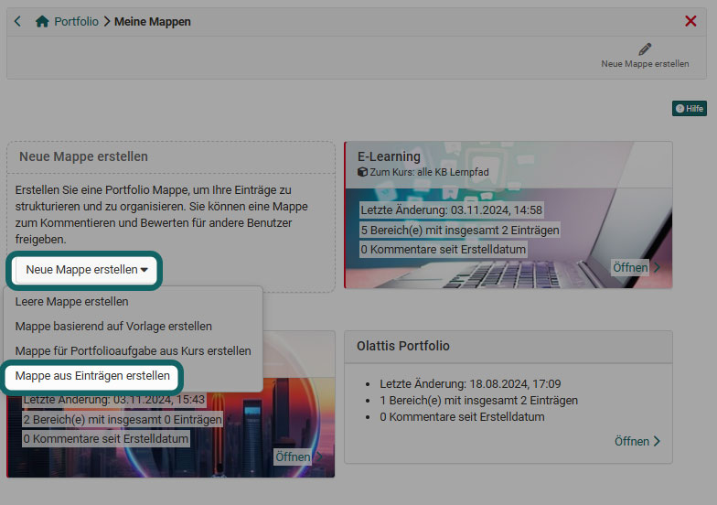
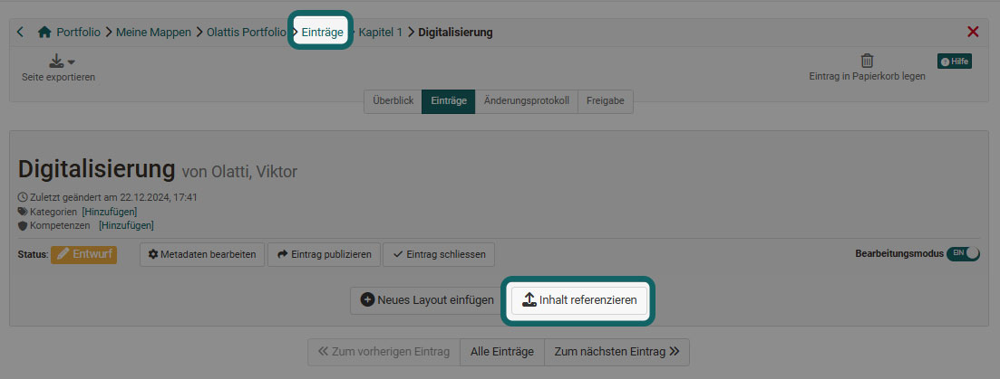
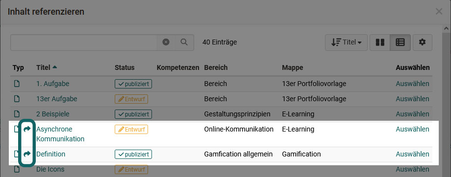
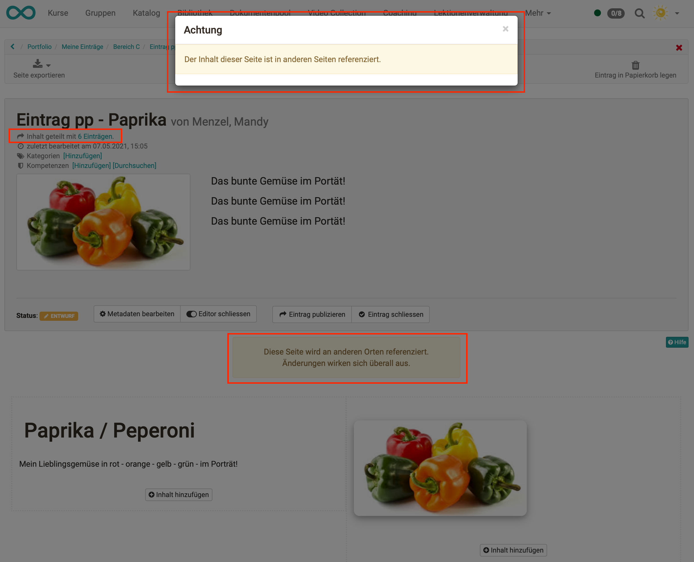

# Mehrfachverwendung von Einträgen {: #multiple_use_of_entries}

Es gibt verschiedene Szenarien, in denen Benutzer:innen denselben Portfolioeintrag in mehreren Mappen verwenden möchten. Dies kann z. B. die Präsentation des Lebenslaufs oder der eigenen Hobbys sein, oder auch eine Sammelmappe für die Betreuenden, in der Lernende ihren Werdegang und die wesentlichen Reflexionen zur Ausbildung zusammentragen und stetig ergänzen.

Um den gleichen Portfolioeintrag in mehrere Mappen einzubinden, gibt es folgende Möglichkeiten:

**a) Erstellen einer neuen Portfoliomappe aus bestehenden Einträgen**

Beim Anlegen einer neuen Portfoliomappe im Bereich ["Zu meinen Mappen"](../area_modules/My_portfolio_binders.de.md) steht die Option "Mappe aus Einträgen erstellen" zur Verfügung. Die gewünschten Einträge können anschliessend aus einer Liste gefiltert und selektiert werden.

{ class="shadow lightbox" }

**b) Import eines Eintrages in eine bestehende Portfoliomappe**

Existiert die Portfoliomappe schon und sollen dort Einträge aus anderen Kontexten oder anderen Mappen übernommen werden, bietet sich dieser Weg an. Gehen Sie in die konkrete (Ziel-)Mappe und wählen Sie den Tab "Einträge". Klicken Sie dann auf den Button "Eintrag importieren". Es öffnet sich ein Fenster mit allen Einträgen und Sie können den Eintrag oder die Einträge auswählen und in einem konkreten Bereich einfügen.

{ class="shadow lightbox" }

**c) Referenzierung des Inhaltes aus einem anderen Eintrag**

Dieses Vorgehen greift immer dann, wenn man einen neuen Eintrag angelegt hat. Dabei ist es egal, ob der Eintrag sich in einer Mappe befindet oder unabhängig ist (Floating Eintrag).

Über den Button "Inhalt referenzieren" kann anschliessend ein anderer Eintrag ausgewählt werden, dessen Inhalt im neuen Eintrag übernommen und weiterbearbeitet wird.

{ class="shadow lightbox" }

Es wird jeweils die Liste der Einträge angezeigt, die referenziert bzw. importiert werden können. Sind an den einzelnen Einträgen Kompetenzen oder Kategorien vergeben, kann in der Maske danach gefiltert werden. Mit der Suche können die Ergebnisse weiter verfeinert werden. Einträge, die bereits in Mappen referenziert sind, werden entsprechend mit einem gekrümmten Pfeil gekennzeichnet.

{ class="shadow lightbox" }

## Merkmale referenzierter Einträge

Im Eintrag selbst werden Meldungen zur Referenzierung angezeigt sowie ein Hinweis unterhalb des Titels, in wie vielen anderen Einträgen der gleiche Inhalt verwendet wird.

{ class="shadow lightbox" }

!!! warning "Achtung"

    Es handelt sich stets um *denselben* Eintrag. Ist ein Eintrag in Mappe A und Mappe B eingebunden, so werden Änderungen am Eintrag in Mappe A automatisch auch in Mappe B aktualisiert.

Ist ein referenzierter Eintrag in einer Mappe bereits (ab)geschlossen, so kann der gleiche Eintrag in einer anderen Mappe nicht mehr geöffnet und verändert werden. Bei unterschiedlichen Zuständen der Einträge gewinnt der restriktivste.

Die Metadaten eines Eintrages können immer bearbeitet werden. In der Bearbeitungsmaske der Metadaten wählen Sie im Feld "Bearbeitungsmodus", ob die Änderungen für alle referenzierten Einträge übernommen werden sollen ("Global") oder, z.B. im Sinne eines spezifischen Kontextes, nur im vorliegenden Eintrag ("Lokal").

{ class="shadow lightbox" }

## Weiterführende Informationen {: #further_information}

[Meine Portfolio Mappen >](My_portfolio_binders.de.md)

[Zum Seitenanfang ^](#multiple_use_of_entries)
