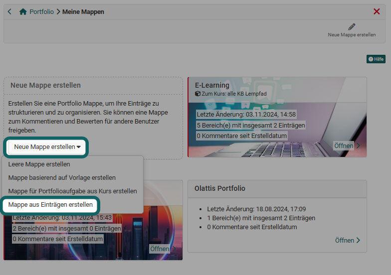
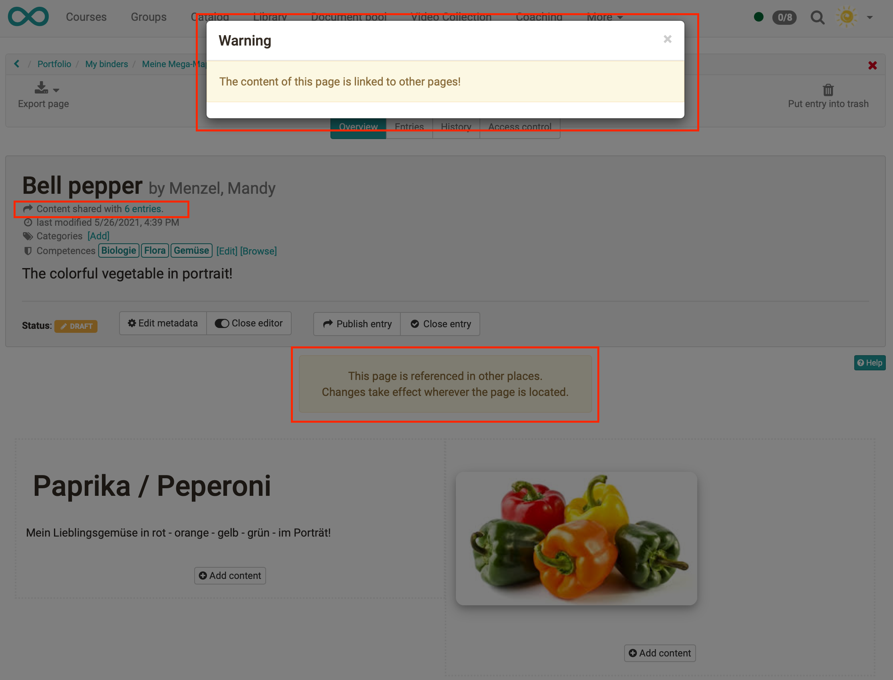

# Multiple use of entries

There are different scenarios where users may want to use the same portfolio entry in several binders. This could be, for example, the presentation of one's curriculum vitae or hobbies, or a collective portfolio for the coaches, in which learners compile and constantly add to their career and essential reflections on the training.

To include the same portfolio entry in several binders, there are the following possibilities:

 **a) Creating a new portfolio binder from existing entries**

When creating a new portfolio [binder](../area_modules/My_portfolio_binders.md), the option "Create binder from entries" is available. The desired entries can then be filtered and selected from a list.

 
   
  
 **b) Importing an entry into an existing portfolio binder**

If the portfolio binder already exists and you want to transfer entries from other contexts or other binders, you can use this method. Go to the specific (target) binder and select the "Entries" tab. Then click on the "Import entry" button. A window with all entries will open and you can select the entry or entries and insert them in a specific area. 

  
  
 **c) Referencing the content from another entry**

This procedure always applies when you have created a new entry. It does not matter whether the entry is in a folder or is independent (floating entry).

The "Reference content" button can then be used to select another entry, the content of which is transferred to the new entry and processed further.

  
  
The list of entries that can be referenced or imported is displayed. If competences or categories are assigned to the individual entries, they can be filtered in the mask. The results can be further refined with the search. Entries that are already referenced in folders are marked with an arrow.

## Characteristics of referenced entries

In the entry itself, referencing messages are displayed as well as a note below the title indicating in how many other entries the same content is used.

!!! warning "Attention"

    It is always the same entry. If an entry is included in binder A and binder B, changes to the entry in binder A are automatically updated in binder B as well.

  
If a referenced entry in a binder is already closed, the same entry in another binder can no longer be opened and changed. In case of different states of the entries, the most restrictive one wins.

The metadata of an entry can always be edited. In the metadata editing screen, you can decide whether the changes should be applied to all referenced entries or - e.g. in the sense of a specific context - only adapted in the current entry.

