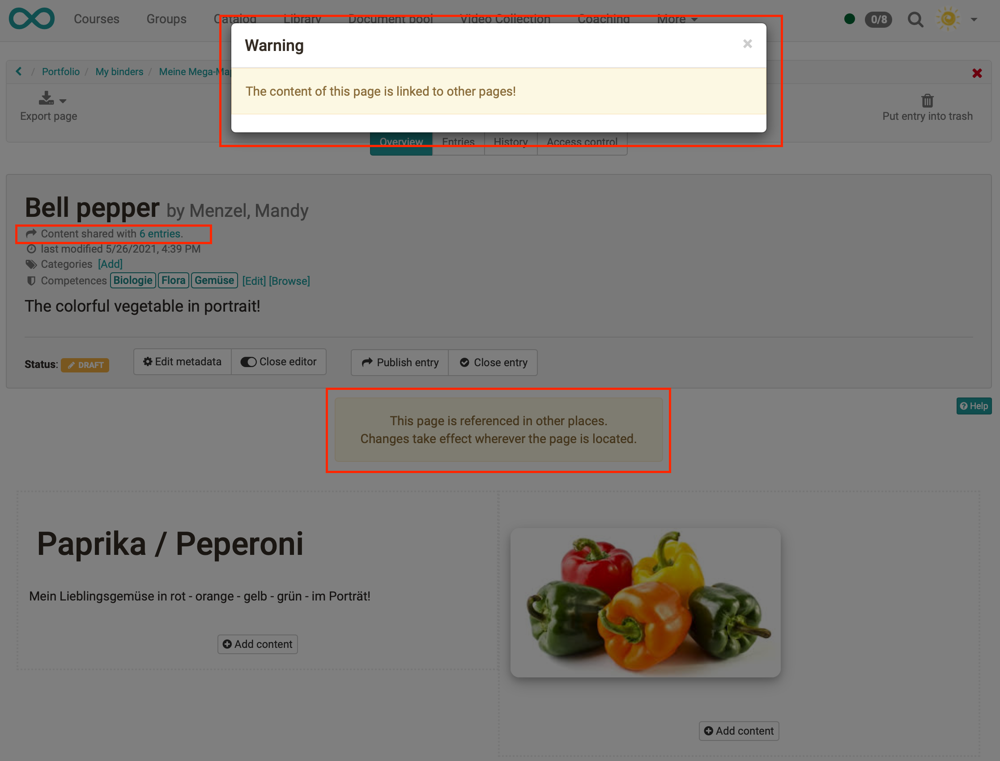

# Multiple use of entries {: #multiple_use_of_entries}

There are various scenarios in which users want to use the same portfolio entry in several binders. This could be, for example, the presentation of one's curriculum vitae or hobbies, or a collective binder for the coaches, in which learners compile their career and the essential reflections on their training and constantly add to it.

To include the same portfolio entry in several binders, there are the following possibilities:

**a) Creating a new portfolio binder from existing entries**

When creating a new portfolio binder in the area ["Go to my binders"](../area_modules/My_portfolio_binders.md), the option "Create binder from entries" is available. The desired entries can then be filtered and selected from a list.

{ class="shadow lightbox" }

**b) Importing an entry into an existing portfolio binder**

If the portfolio binder already exists and entries from other contexts or other binders are to be transferred there, this is the way to go. Go to the specific (target) binder and select the "Entries" tab. Then click on the "Import entry" button. A window with all entries opens and you can select the entry or entries and insert them in a specific section.

{ class="shadow lightbox" }

**c) Linking the content from another entry**

This procedure always applies when you have created a new entry. It does not matter whether the entry is in a binder or is independent (floating entry).

The "Link content" button can then be used to select another entry, the content of which is transferred to the new entry and edited further.

{ class="shadow lightbox" }

The list of entries that can be linked or imported is displayed. If competences or categories are assigned to the individual entries, the list can be filtered by them. The results can be further refined with the search. Entries that are already referenced in binders are marked with a curved arrow.

{ class="shadow lightbox" }

## Characteristics of referenced entries

In the entry itself, messages about the referencing are displayed as well as a note below the title indicating in how many other entries the same content is used.

{ class="shadow lightbox" }

!!! warning "Attention"

    It is always the *same* entry. If an entry is included in binder A and binder B, changes to the entry in binder A are automatically updated in binder B as well.

If a referenced entry in a binder is already closed, the same entry in another binder can no longer be opened and changed. In case of different states of the entries, the most restrictive one wins.

The metadata of an entry can always be edited. In the metadata editing screen, you select in the field "Edit mode" whether the changes should be applied to all referenced entries ("Global") or, e.g. in the sense of a specific context, only to the current entry ("Local").

{ class="shadow lightbox" }

## Further information {: #further_information}

[My portfolio binders >](My_portfolio_binders.md)

[To the top of the page ^](#multiple_use_of_entries)
