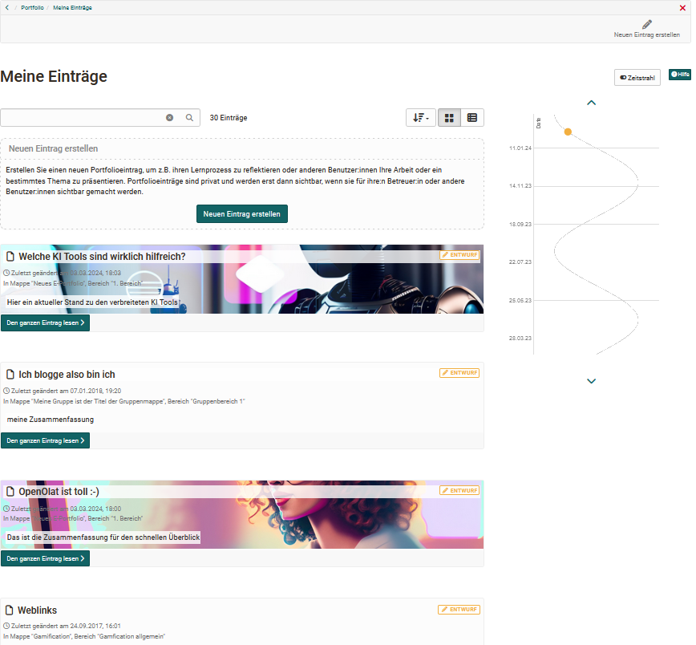

# Meine Einträge

Unter "Meine Einträge" eines Portfolios werden alle persönlichen Einträge in chronologischer Reihenfolge aufgelistet. Dabei kommt es nicht darauf an, in welcher Mappe sich ein Eintrag befindet. Sie erhalten so einen Überblick über alle Ihre Einträge und sehen anhand des Status, wie weit ein Eintrag fortgeschritten ist. Ein Eintrag kann mehrere Inhalte oder Artefakte umfassen.

Einzelne Inhalte eines Eintrages werden je nach Typ im [Medien Center](../personal_menu/Media_Center.de.md) abgelegt und können auch dort bearbeitet werden. Allerdings werden keine kompletten Einträge im Medien Center abgelegt.

!!! info "Info"
    
    "Meine Einträge" können in zwei unterschiedlichen Darstellungen angezeigt werden. Die Tabellenansicht bietet die Möglichkeit sich weitere Details der Einträge anzeigen zu lassen, z.B. ob ein Eintrag referenziert wurde oder ob dazu Kommentare vorliegen.

## Zeitstrahl

Mit Hilfe des Zeitstrahls erhält der User eine grafische Übersicht über die Tätigkeiten im Portfolio. Die farbigen Punkte zeigen an, wann etwas geändert wurde. Mit "Linksklick" auf einen Punkt erscheinen Details zu den entsprechenden Einträgen. Die unterschiedlichen Farben stehen für den jeweiligen Status des Eintrags. Der Zeitstrahl ist hilfreich, wenn ein E-Portfolio über einen bestimmten Zeitraum verwendet wird, z.B. über ein Semester oder ein Jahr.

