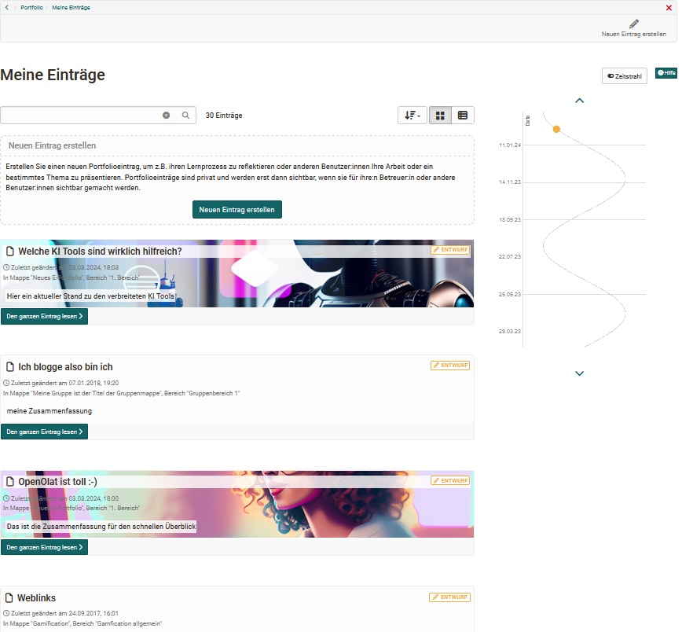

# Meine Einträge {: #my_entries}

Im Bereich "Zeige meine Einträge" des Portfolios 2.0 werden alle persönlichen Einträge, in der Regel in chronologischer Reihenfolge, aufgelistet. Sie erhalten so einen Überblick über alle Ihre Einträge und sehen anhand des Status (z.B. Entwurf oder publiziert), wie weit ein Eintrag fortgeschritten ist.

{ class="shadow lightbox" }

Im Bereich "Meine Einträge" kommt es nicht darauf an, in welcher Mappe sich ein Eintrag befindet oder ob ein Eintrag überhaupt einer Mappe zugeordnet ist. Alle Einträge werden aufgelistet.

!!! tip "Tipp"

    "Meine Einträge" können in zwei unterschiedlichen Darstellungen angezeigt werden. Die Tabellenansicht bietet die Möglichkeit, sich weitere Details der Einträge anzeigen zu lassen, z.B. ob ein Eintrag referenziert wurde oder ob dazu Kommentare vorliegen.

## Neue Einträge erstellen

Über den Link rechts oben können neue Einträge erstellt werden. Optional ist es möglich, ein Titelbild für den neuen Eintrag hochzuladen, unter Kategorie ein Stichwort hinzuzufügen und, sofern die Taxonomie aktiviert ist, den Eintrag einem Kompetenzbereich zuzuordnen. Der neue Eintrag kann entweder einer bereits existierenden Mappe und einem dort vorhandenen Bereich zugeordnet oder zunächst unabhängig von Mappen erstellt werden (sogenannter Floating Eintrag). Anschliessend gelangt man in den [Portfolio Editor](../area_modules/The_portfolio_editor_17_1.de.md) und kann den Eintrag mit Inhalten ausgestalten und auch eine Verbindung zu Elementen des [Media Centers](../personal_menu/Media_Center.de.md) herstellen. Allerdings werden keine kompletten Portfolioeinträge im Media Center abgelegt.

In den Portfolio Editor gelangt man auch, wenn man einen existierenden Eintrag anklickt.

!!! info "Wichtig"

    Einträge können sich auch auf Formulare beziehen und aus einer abgeholten Mappe stammen. In diesem Fall steht der Portfolio Editor nicht zur Verfügung.

## Zeitstrahl

Mit dem ein- und ausblendbaren Zeitstrahl erhalten Sie eine grafische Übersicht über die Aktivitäten im Portfolio. Farbig markierte Punkte zeigen an, wann ein Eintrag bearbeitet wurde. Detaillierte Informationen erscheinen, wenn der Mauszeiger über einen entsprechenden Punkt bewegt wird (Hover-Effekt). Die unterschiedlichen Farben der Punkte kennzeichnen den jeweiligen Status des Eintrags. Der Zeitstrahl ist besonders nützlich, wenn ein ePortfolio über einen längeren Zeitraum, wie ein Semester oder ein Jahr, verwendet wird.

## Weiterführende Informationen {: #further_information}

[Der Portfolio Editor >](The_portfolio_editor_17_1.de.md) 
[Persönliche Werkzeuge: Das Media Center >](../personal_menu/Media_Center.de.md)

[Zum Seitenanfang ^](#my_entries)
