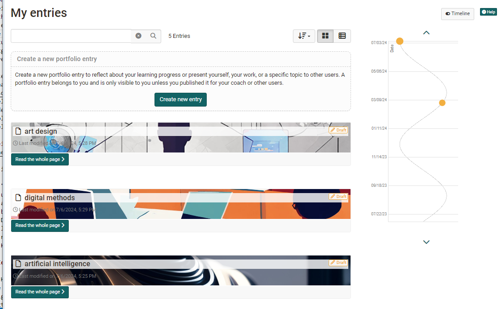

# My entries

In "My entries" all entries are listed in a chronological order. Therefore, it doesn't matter in which binder an entry is located. You've got a summary about all your entries and with the help of the status you can see their progress. One entry can contain several contents or artefacts.

Particular contents of an entry are added to the [media center](../personal_menu/Media_Center.md), depending on their type. There they can be edited as well. Entries are not added to the media center.

!!! info "Info"

    "My entries" can be displayed in two different ways. The table view offers the possibility to display further details of the entries, e.g. whether an entry was referenced or whether comments are available.

## Timeline

The timeline provides the user with a graphical overview of the activities in the portfolio. The colored dots indicate when something was changed. By left-clicking on a point, details of the corresponding entries appear. The different colors stand for the respective status of the entry. The timeline is helpful if an e-portfolio is used over a certain period of time, e.g. over a semester or a year.

