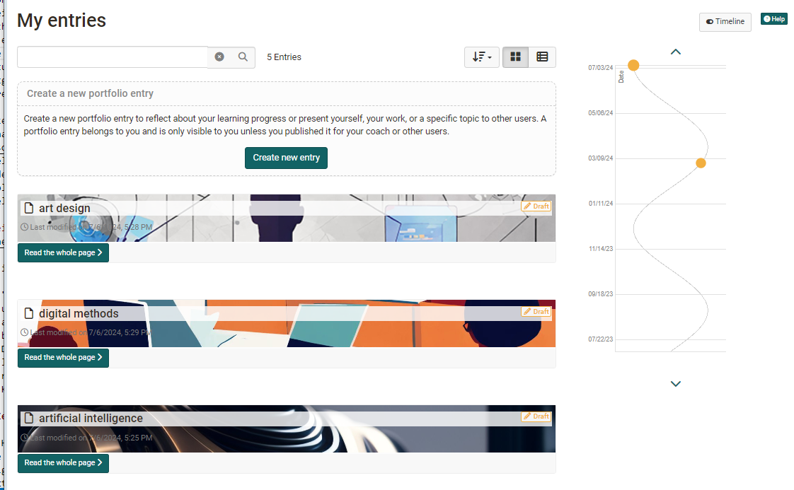

# My entries {: #my_entries}

In the "Show my entries" area of Portfolio 2.0, all personal entries are listed, usually in chronological order. This gives you an overview of all your entries and you can see how far an entry has progressed based on its status (e.g. draft or published).

{ class="shadow lightbox" }

In the "My entries" area, it does not matter in which binder an entry is located or whether an entry is assigned to a binder at all. All entries are listed.

!!! tip "Tip"

    "My entries" can be displayed in two different ways. The table view offers the possibility to display further details of the entries, e.g. whether an entry was referenced or whether comments are available.

## Create new entries

New entries can be created via the link at the top right. Optionally, it is possible to upload a cover image for the new entry, add a keyword under Category and, if the taxonomy is activated, assign the entry to a competence area. The new entry can either be assigned to an existing binder and an existing section there or initially created independently of binders (so-called floating entry). You then access the [Portfolio Editor](../area_modules/The_portfolio_editor_17_1.md) and can add content to the entry and also create a link to elements of the [Media Center](../personal_menu/Media_Center.md). However, no complete portfolio entries are stored in the Media Center.

You can also access the Portfolio Editor by clicking on an existing entry.

!!! info "Important"

    Entries can also refer to forms and originate from a collected binder. In this case, the Portfolio Editor is not available.

## Timeline

The timeline, which can be shown and hidden, gives you a graphical overview of the activities in the portfolio. Colored dots indicate when an entry was edited. Detailed information appears when you move the mouse pointer over a dot (hover effect). The different colors of the dots indicate the respective status of the entry. The timeline is particularly useful if an ePortfolio is used over a longer period of time, such as a semester or a year.

## Further information {: #further_information}

[The Portfolio Editor >](The_portfolio_editor_17_1.md) 
[Personal tools: Media Center >](../personal_menu/Media_Center.md)

[To the top of the page ^](#my_entries)
