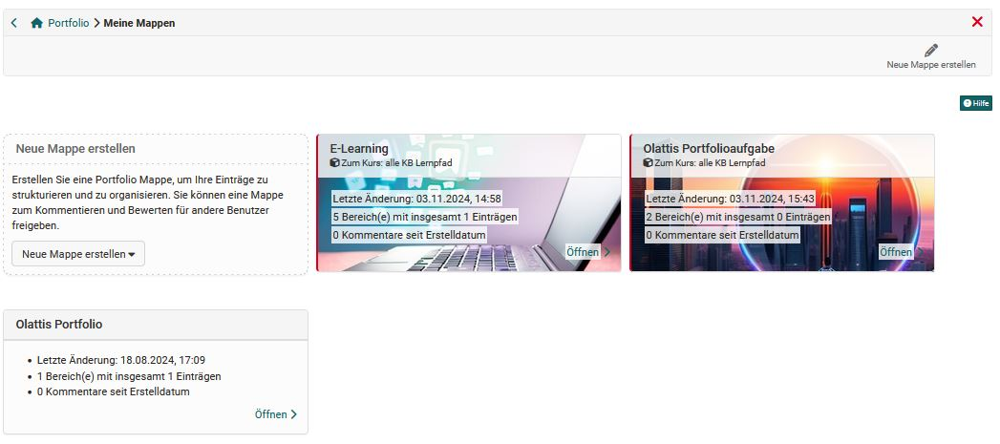
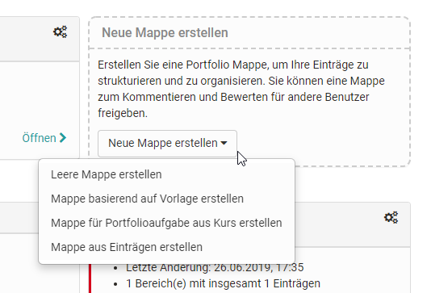

# Meine Portfolio Mappen {: #my_portfolio_binders}

Im persönlichen Menü erhält jede Benutzer:in Zugang zum eigenen Portfolio. Über den Link "Zu meinen Mappen" gelangt man zu allen eigenen Portfoliomappen und kann auch neue Mappen erstellen.

{ class="shadow lightbox" }

## Die zwei Mappenvarianten

Es werden grundsätzlich zwei Arten von Portfoliomappen unterschieden:

* In einem Kurs abgeholte Mappen
* Selbst erstellte, kursunabhängige Mappen

### Abgeholte, vorbereitete Mappen

In einem Kurs bei einer Portfolioaufgabe abgeholte Mappen erkennt man an dem roten Randstreifen und dem Hinweis auf den zugehörigen Kurs. Diese Mappen basieren auf einer ["Portfolio 2.0 Vorlage"](../learningresources/Portfolio_template_Creation.de.md) und werden in der Regel von einer anderen Person, meist den Lehrenden, erstellt. Die Abholung erfolgt im Kurs über die "[Portfolioaufgabe](../learningresources/Course_Element_Portfolio_Task.de.md)". Alternativ ist es auch möglich, Portfoliovorlagen kursunabhängig zu buchen und abzuholen.

Sobald Lernende eine Portfoliomappe abholen, wird eine Kopie der Vorlage erstellt und die abgeholte Mappe erscheint im persönlichen Portfoliobereich unter "Meine Mappen". Wer diese Mappe öffnet, kann die dort hinterlegten Aufgaben (Typ Freitext oder Formular) wählen bzw. abholen und die bereitgestellten Portfolioaktivitäten bearbeiten, indem diverse Artefakte (Texte, Dateien, Bilder usw.) hinterlegt oder ein vorbereitetes Formular ausgefüllt wird.

Im [Portfolio Editor](../area_modules/The_portfolio_editor_17_1.de.md) muss immer zuerst ein Layout ausgewählt werden, bevor es mit Inhalten und Artefakten, wahlweise auch aus dem [Media Center](../basic_concepts/Media_Center_Concept.de.md), gefüllt werden kann. Es können auch mehrere Layouts für eine bereitgestellte Aufgabe verwendet werden.

Alternativ können auch schon erstellte Portfolioeinträge über den Button ["Inhalt referenzieren"](Multiple_use_of_entries.de.md) verknüpft werden. Änderungen an den Einträgen sind dann an allen referenzierten Stellen möglich.

!!! info "Wichtig"

    Benutzer:innen können allerdings keine neuen "Bereiche" in einer abgeholten Portfoliomappe anlegen. Auch das Erstellen von eigenen "Einträgen" ist standardmässig deaktiviert.

### Individuelle Portfoliomappen

Alle OpenOlat Benutzer:innen können individuelle, unabhängige, persönliche Portfoliomappen mit Bereichen, Einträgen und diversen Inhalten erstellen und so z.B. den eigenen Lernprozess dokumentieren und begleiten, ohne dass ein Kursbezug oder ein formaler Lehrrahmen besteht.

Es gibt im Bereich "Meine Mappen" zwei Stellen, an denen neue Mappen erstellt werden können.

#### a) Über den Link "Neue Mappe erstellen" rechts oben

Auf diesem Weg gelangt man rasch zu einer neuen leeren Portfoliomappe. Dabei stehen grundsätzlich alle Möglichkeiten des Portfolios inklusive Gestaltung der Bereiche, Bearbeitung der Metadaten, Mappenexport, Mappe löschen und Vergabe des Zugangsrechts zur Verfügung.

#### b) Über das Ausklappmenü im Kasten "Neue Mappe erstellen"

Hier gibt es eine weitere Möglichkeit, eine neue Mappe zu erstellen.

{ class="shadow lightbox" }

Neben der Möglichkeit, eine leere Mappe wie unter a) zu erstellen, gibt es noch folgende weitere Optionen:

* **"Mappe basierend auf Vorlage erstellen"**: Hier kann als Basis eine Portfolio 2.0 Vorlage verwendet werden, für die die Benutzer:in die Berechtigung hat.
* **"Mappe für Portfolioaufgabe aus Kurs erstellen"**: Hier werden Portfolioaufgaben aus den eigenen Kursen angezeigt und es kann eine ausgewählt werden. Dieses Vorgehen führt zum selben Ergebnis wie das Abholen der Portfolioaufgabe im Kurs.
* **"Mappe aus Einträgen erstellen"**: Hier können zuvor erstellte Einträge in einer neuen Portfoliomappe gebündelt werden. Ein Wizard führt dabei Schritt für Schritt durch die Auswahl.

!!! info "Wichtig"

    Die Möglichkeit, selbst Mappen zu erstellen, kann von Ihrer [Administrator:in](../../manual_admin/administration/eAssessment_ePortfolio.de.md) eingeschränkt werden.

## Die Tabs einer Portfoliomappe

Eine geöffnete Mappe führt die Tabs "Überblick", "Einträge", "Änderungsprotokoll" und "Freigabe".

* Im **Änderungsprotokoll** sind alle Änderungen in chronologischer Reihenfolge aufgelistet, die neueste zuoberst.
* Unter **Freigabe** geben Sie Bereiche und Einträge frei. Mehr dazu unter [Sammeln und Bearbeiten](../learningresources/Portfolio_task_and_assignment_Collecting_and_editing.de.md).

Zwei weitere Tabs erscheinen abhängig von der Mappe und Ihren Rechten:

* **Vorlagen**, wenn Sie in dieser Mappe eine Aufgabe aus einer Vorlage abholen können.
* **Bewertung**, wenn die Mappe bewertbar ist und Sie die Bewertung einsehen dürfen.

!!! info "Wichtig"

    Die Tabs "Überblick", "Einträge" und "Änderungsprotokoll" kann Ihre [Administrator:in](../../manual_admin/administration/eAssessment_ePortfolio.de.md) ausschalten.

## Weiterführende Informationen {: #further_information}

[Portfoliovorlage: Erstellung >](../learningresources/Portfolio_template_Creation.de.md) 
[Kursbaustein "Portfolioaufgabe" >](../learningresources/Course_Element_Portfolio_Task.de.md) 
[Der Portfolio Editor >](The_portfolio_editor_17_1.de.md) 
[Media Center: Konzept >](../basic_concepts/Media_Center_Concept.de.md) 
[Mehrfachverwendung von Einträgen >](Multiple_use_of_entries.de.md) 
[e-Assessment Administration: ePortfolio >](../../manual_admin/administration/eAssessment_ePortfolio.de.md) 
[Portfolioaufgabe: abholen und bearbeiten >](../learningresources/Portfolio_task_and_assignment_Collecting_and_editing.de.md)

[Zum Seitenanfang ^](#my_portfolio_binders)
