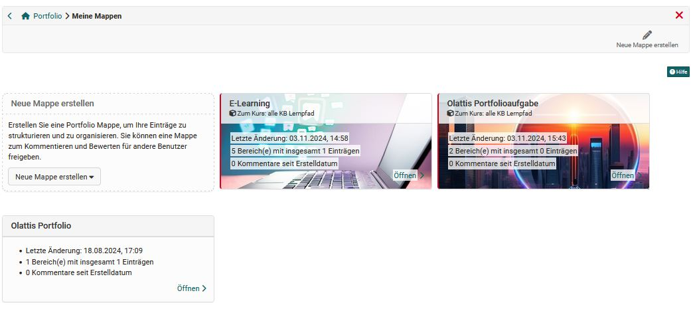

# Meine Portfolio Mappen

Im persönlichen Menü erhält jeder User Zugang zu seinem Portfolio. Über den Link "Zu meinen Mappen" gelangt man zu allen eigenen Portfolio Mappen und kann auch neue Mappen erstellen.

## Die 2 Mappen Varianten

Es werden grundsätzlich zwei Arten von Portfolio Mappen unterschieden:

* In einem Kurs abgeholte Mappen
* Selbst erstellte, kursunabhängige Mappen

### Abgeholte, vorbereitete Mappen

In einem Kurs bei einer Portfolioaufgabe abgeholte Mappen erkennt man an dem roten Randstreifen und dem Hinweis auf den zugehörigen Kurs. Diese Mappen  basieren auf einer ["Portfolio 2.0 Vorlage"](../learningresources/Portfolio_template_Creation.de.md) und werden in der Regel von einer anderen Person, meist den Lehrenden, erstellt. Die Abholung erfolgt im Kurs über die "[Portfolio Aufgabe](../learningresources/Course_Element_Portfolio_Task.de.md)". Alternativ ist es auch möglich, Portfolio Vorlagen kursunabhängig zu buchen und abzuholen.

Sobald eine Portfolio Mappe vom Lernenden abgeholt wurde, wird eine Kopie der Vorlage erstellt und die abgeholte Mappe erscheint in seinem persönlichen Portfolio-Bereich unter "Meine Mappen". Wenn der User diese Mappe öffnet, kann er die dort hinterlegten Aufgaben (Typ Freitext oder Formular) wählen bzw. abholen und die bereitgestellten Portfolioaktivitäten bearbeiten indem er diverse Artefakte (Texte, Dateien, Bilder usw.) hinterlegt bzw. ein vorbereitetes Formular ausfüllt. 

Im [Portfolio Editor](../area_modules/The_portfolio_editor_17_1.de.md) muss immer zuerst ein Layout ausgewählt werden bevor es mit Inhalten und Artefakten, wahlweise auch aus dem [Media Center](../basic_concepts/Media_Center_Concept.de.md), gefüllt werden kann. Es können auch mehrere Layouts für eine bereitgestellte Aufgabe verwendet werden. 

Alternativ können auch schon erstellte Portfolio Einträge über den Button ["Inhalt referenzieren"](Multiple_use_of_entries.de.md) verknüpft werden. Änderungen an den Einträgen sind dann an allen referenzierten Stellen möglich.

!!! warning  "Achtung" 

    User können allerdings keine neuen *"Bereiche"* in einer abgeholten Portfolio Mappe anlegen. Auch das Erstellen von eigenen "Einträgen" ist by default deaktiviert. 

### Individuelle Portfolio Mappen

Alle OpenOlat-User können individuelle, unabhängige, persönliche Portfolio Mappen mit Bereichen, Einträgen und diversen Inhalten erstellen und so z.B. den eigenen Lernprozess dokumentieren und begleiten, ohne dass ein Kursbezug oder ein formaler Lehrrahmen besteht. 

Es gibt im Bereich "Meine Mappen" zwei Stellen an denen neue Mappen erstellt werden können. 

#### a) Über den Link  "Neue Mappe erstellen" rechts oben.

Auf diesem Weg gelangt man rasch zu einer neuen leeren Portfolio Mappe. Dabei stehen grundsätzlich alle Möglichkeiten des Portfolios inklusive Gestaltung der Bereiche, Bearbeitung der Metadaten, Mappen Export, Mappe löschen, Vergabe des Zugangsrechts zur Verfügung.

#### b) Über das Ausklappmenü integriert in der Portfolio-Mappen-Seite

Hier gibt es eine weitere Möglichkeit eine neue Mappe zu erstellen. 

Neben der Möglichkeit eine leere Mappe wie über den a) zu erstellen gibt es noch folgende weitere Optionen: 
* **"Mappe basierend auf Vorlage erstellen"**: Hier kann als Basis eine Portfolio 2.0 Vorlage verwendet werden für die der User die Berechtigung hat. 
* **"Mappe für Portfolioaufgabe aus Kurs erstellen"**: Hier werden dem User Portfolioaufgaben aus eigenen Kursen angezeigt und es kann eine ausgewählt werden. Dieses Vorgehen führt zum selben Ergebnis wie, wenn der User das Portfolio im Kurs abholt.  
* **"Mappe aus Einträgen erstellen"**: Hier kann der User seine zuvor erstellten Einträge in einer neuen Portfolio Mappe bündeln. Ein Wizard führt dabei Schritt für Schritt durch die Auswahl. 

!!! info "Info"
    
    Die Möglichkeit, selbst Mappen zu erstellen, kann von Ihrem [Administrator](../../manual_admin/administration/eAssessment_ePortfolio.de.md)eingeschränkt werden.

    

