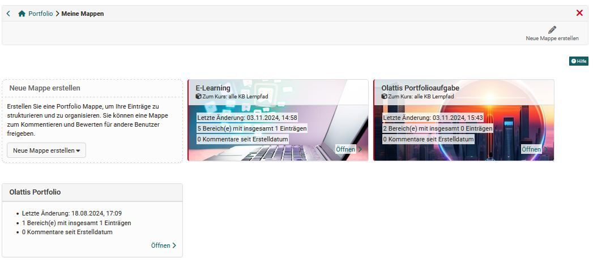
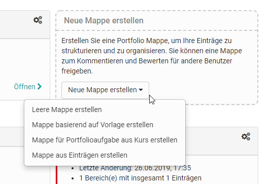

# My portfolio binders

Every user has access to their portfolio in the personal menu. The link "To my portfolios" takes you to all your own portfolio folders and you can also create new folders.

## The 2 types of binders

There are basically two types of binders:

* Folders collected in a course
* Self-created, course-independent portfolios

### Collected binders

You can recognize the retrieved folders by the red border and the reference to the corresponding course. These folders are based on a "[Portfolio 2.0 template](../learningresources/Portfolio_template_Creation.md)" and are usually created by another person, usually the teacher. The collection takes place in the course via the "[Portfolio Task](../learningresources/Course_Element_Portfolio_Task.md)". Alternatively, it is also possible to book and collect portfolio templates independently of the price.

As soon as a portfolio folder has been collected by the learner, a copy of the template is created and the collected folder appears in their personal portfolio area under "My folders". When the user opens this folder, they can select or collect the tasks stored there (free text or form type) and edit the portfolio activities provided by storing various artifacts (texts, files, images, etc.) or filling out a prepared form.

In the [Portfolio Editor](../area_modules/The_portfolio_editor_17_1.md), a layout must always be selected first before it can be filled with content and artifacts, optionally also from the [Media Center](../basic_concepts/Media_Center_Concept.md). Several layouts can also be used for a provided task. 

Alternatively, already created portfolio entries can also be linked via the ["Reference content"](Multiple_use_of_entries.md) button. Changes to the entries will then be reflected in all referenced locations.

!!! tip "Attention"

    "However, users cannot create new *"sections"* in a retrieved portfolio binder. By default, creating their own "entries" is also disabled.

### Individual portfolio binders

All OpenOlat users can create individual, independent, personal portfolio binders with sections, entries, and various types of content. This allows them, for example, to document and support their own learning process without the need for a course context or formal instructional framework.

In the "My Folders" section, there are two places where new binder can be created.

#### a) Through the link "Create new binder" at the top right

This way, users can quickly create a new, empty portfolio binder. All portfolio features are generally available, including the design of sections, editing metadata, exporting the binder, deleting the folder, and assigning access rights.

#### b) Via the dropdown menu integrated into the portfolio folder page

This provides an additional way to create a new binder.

In addition to the option of creating an empty binder as described in a), there are the following additional options:
* **"Create binder based on template"**: A Portfolio 2.0 template for which the user has permission can be used as the basis.
* **"Create binder for portfolio task from course"**: Portfolio tasks from the user's own courses are displayed here, and one can be selected. This approach leads to the same result as when the user retrieves the portfolio directly from the course.
* **"Create binder from entries"**: The user can bundle previously created entries into a new portfolio binder. A wizard guides the user step by step through the selection process.

!!! info "Info"

    The ability to create folders yourself can be restricted by your [administrator](../../manual_admin/administration/eAssessment_ePortfolio.md).