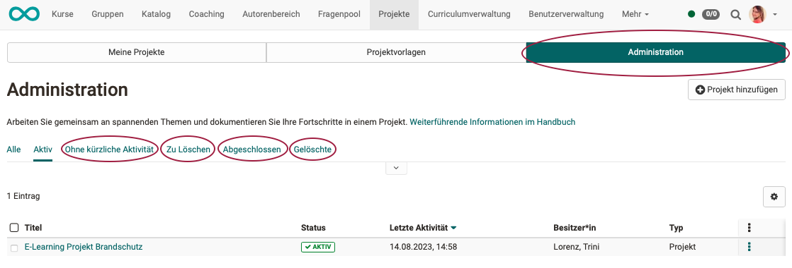

# Projekte - Administration

## Projekte kopieren 

Öffnen Sie das gewünschte Projekt und wählen Sie rechts oben unter den 3 Punkten die Option "Projekt kopieren".

{ class="shadow lightbox" }

Kopiert werden:

* alle To-dos
* alle Entscheide
* alle Notizen
* alle Dateien

**Nicht** kopiert werden:

* Projektmitglieder

**Teilweise** kopiert werden:

* Termine und Meilensteine (werden ohne Datum kopiert)

## Projektvorlagen 

Es vereinfacht die Erstellung eines neuen Projektes, wenn auf eine Vorlage zurückgegriffen werden kann.

Eine neue, leere Vorlage kann im Tab "Projektvorlagen" erstellt werden.

Es kann angegeben werden, ob die Vorlage nur für den eigenen Gebrauch oder für alle Mitglieder der Organisationseinheit zur Verfügung stehen soll.

{ class="shadow lightbox" }

Zum Erstellen einer Vorlage kann auch ein bereits angelegtes Projekt als Vorlage gespeichert werden. Sinnvoll ist es meistens, ein "neutrales" Projekt zu erstellen, das die gewünschte Prozessstruktur vorgibt.

{ class="shadow lightbox" }

## Projekte abschliessen 

Wird ein Projekt abgeschlossen, haben alle Projektmitglieder anschliessend nur noch schreibgeschützten Zugriff.

Abgeschlossen werden kann ein Projekt nur durch

* Projektbesitzer:innen,
* Projektleiter:innen,
* Projektbüro-Mitarbeiter:innen,
* Administrator:innen,
* und Projektverwalter:innen.

!!! Note "Hinweis"

    Durch diese Personen kann ein Projekt auch wieder reaktiviert werden.

{ class="shadow lightbox" }

## Projekte löschen 

Gelöscht werden können Projekte nur durch

* den/die Projektbesitzer:in,
* Administrator:innen,
* und Projektverwalter:innen.

{ class="shadow lightbox" }

!!! Note "Hinweis"

    Durch das Löschen eines Projektes erscheint es in der Liste "Gelöschte". Die Projekte können dort nur noch angesehen, aber nicht mehr bearbeitet werden.

## Tab Projektadministration 

Administratoren und Projektverwalter haben unter dem Menüpunkt "Projekte" ein weiteres Tab "Administration".

Für Ihre Verwaltungsaufgaben stehen dort folgende (Filter-) Funktionen zur Verfügung: 

* **Ohne kürzliche Aktivität** 
In dieser Liste befinden sich Projekte, in denen seit mehr als 28 Tagen keine Aktivität stattgefunden hat. Ihr Status kann "aktiv" oder "abgeschlossen" sein. Projekte in dieser Liste sollten geprüft werden, ob sie nicht evtl. abgeschlossen bzw. gelöscht werden können. (Man kann bei dem/der Projektbesitzer:in evtl. nachfragen.)

* **Zu löschen** 
Die Liste "Zu löschen" erscheint nur im Tab "Administration". In ihr werden Projekte mit Status "abgeschlossen" angezeigt, die ausserdem ohne kürzliche Aktivität sind.

* **Abgeschlossen** 
Sind Projekte seit längerem abgeschlossen, können Projektverwalter:innen auf Grund dieser Liste evtl. nachfragen, ob Projekte gelöscht werden können. 
Abgeschlossene Projekte können noch reaktiviert werden.

* **Gelöschte** 
Gelöschte Projekte können nur noch angesehen, aber nicht mehr bearbeitet werden.

{ class="shadow lightbox" }
