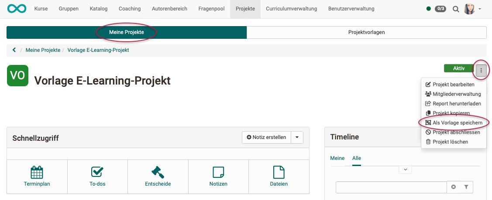
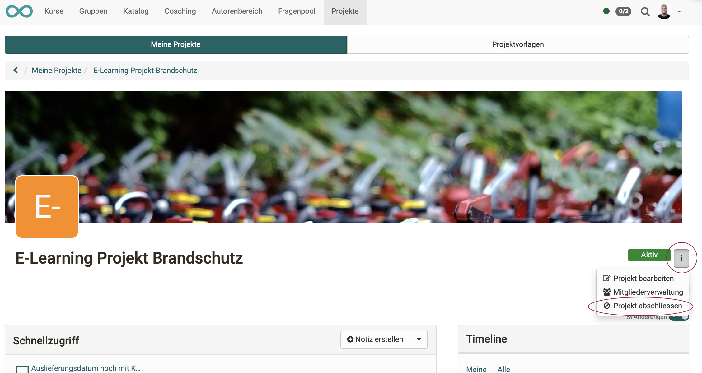

# Projekte - Administration

Um zur Projekt Administration Ihres Projektes zu gelangen öffnen Sie das gewünschte Projekt und klicken rechts oben auf die 3 Punkte. Im aufgeklappten Menü erscheinen mehrere administrative Möglichkeiten. 

Zur Administration eines Projektes gehören

* die Konfiguration und Darstellung der Startseite (Projekt bearbeiten) 
* die [Verwaltung der Mitglieder](../area_modules/Project_Member_Management.de.md) des Projektes
* die Möglichkeit [Reports](../area_modules/Project_Report.de.md) herunterzuladen
* Projekte zu kopieren
* Projekte als Vorlage zu speichern
* Projekte zu beenden und abzuschliessen
* Projekte zu löschen

!!! info "Info"

    Welche Menüpunkte in dem Bereich erscheinen ist von der Projektrolle abhängig. 

## Projekt bearbeiten

Mit "Projekt bearbeiten" ist nicht die inhaltliche Bearbeitung gemeint (Termine eintragen, To-dos erstellen, usw.), sondern die **Bearbeitung der Startseite** des Projektes.

{ class="shadow lightbox" }

{ class="shadow lightbox" }

## Projekt kopieren 

{ class="shadow lightbox" }

Kopiert werden:

* alle To-dos
* alle Entscheide
* alle Notizen
* alle Dateien

**Nicht** kopiert werden:

* Projektmitglieder

**Teilweise** kopiert werden:

* Termine und Meilensteine (werden ohne Datum kopiert)

## Projektvorlagen 

Es vereinfacht die Erstellung eines neuen Projektes, wenn auf eine Vorlage zurückgegriffen werden kann. 

Ein angelegtes Projekt kann als Vorlage gespeichert werden. Wählen Sie hierfür im 3-Punkte-Menü die Option "Als Vorlage speichern". 

{ class="shadow lightbox" }

Es erscheint ein Menü. Hier kann u.a. angegeben werden, ob die Vorlage nur für den eigenen Gebrauch oder für alle Mitglieder der Organisationseinheit zur Verfügung stehen soll.

Darüber hinaus kann eine leere Vorlage im Tab "Projektvorlagen" erstellt werden, was häufig ein sinnvollerer Weg ist. 

{ class="shadow lightbox" }

## Projekte abschliessen 

{ class="shadow lightbox" }

Wird ein Projekt abgeschlossen, haben alle Projektmitglieder anschliessend nur noch schreibgeschützten Zugriff.

Abgeschlossen werden kann ein Projekt nur durch

* Projektbesitzer:innen,
* Projektleiter:innen,
* Projektbüro-Mitarbeiter:innen,
* Administrator:innen,
* und Projektverwalter:innen.

!!! Note "Hinweis"

    Durch diese Personen kann ein Projekt auch wieder reaktiviert werden.

## Projekt löschen 

{ class="shadow lightbox" }

Gelöscht werden können Projekte nur durch

* den/die Projektbesitzer:in,
* Administrator:innen,
* und Projektverwalter:innen.

!!! Note "Hinweis"

    Durch das Löschen eines Projektes erscheint es in der Liste "Gelöschte". Die Projekte können dort nur noch angesehen, aber nicht mehr bearbeitet werden.

## Tab Projektadministration 

OpenOlat Administrator:innen und Projektverwalter:innen haben unter dem Menüpunkt "Projekte" einen weiteren Tab: "Administration".

{ class="shadow lightbox" }

Für Ihre Verwaltungsaufgaben stehen dort folgende (Filter-) Funktionen zur Verfügung: 

* **Ohne kürzliche Aktivität** 
In dieser Liste befinden sich Projekte, in denen seit mehr als 28 Tagen keine Aktivität stattgefunden hat. Ihr Status kann "aktiv" oder "abgeschlossen" sein. Projekte in dieser Liste sollten geprüft werden, ob sie nicht evtl. abgeschlossen bzw. gelöscht werden können. (Man kann bei dem/der Projektbesitzer:in evtl. nachfragen.)

* **Zu löschen** 
Die Liste "Zu löschen" erscheint nur im Tab "Administration". In ihr werden Projekte mit Status "abgeschlossen" angezeigt, die ausserdem ohne kürzliche Aktivität sind.

* **Abgeschlossen** 
Sind Projekte seit längerem abgeschlossen, können Projektverwalter:innen auf Grund dieser Liste evtl. nachfragen, ob Projekte gelöscht werden können. 
Abgeschlossene Projekte können noch reaktiviert werden.

* **Gelöschte** 
Gelöschte Projekte können nur noch angesehen, aber nicht mehr bearbeitet werden.

