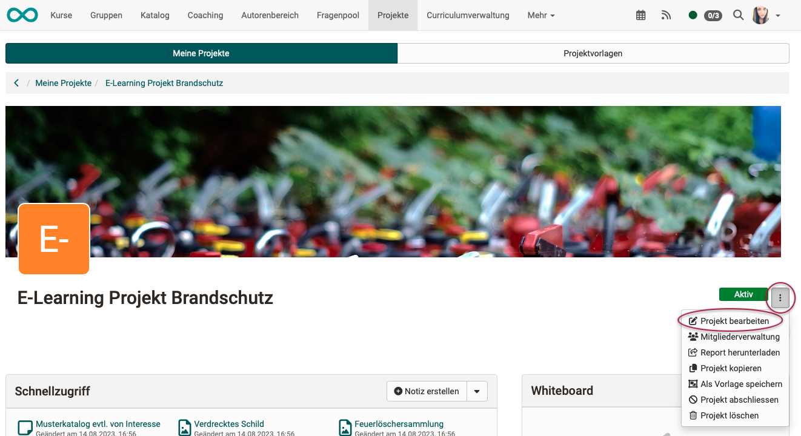
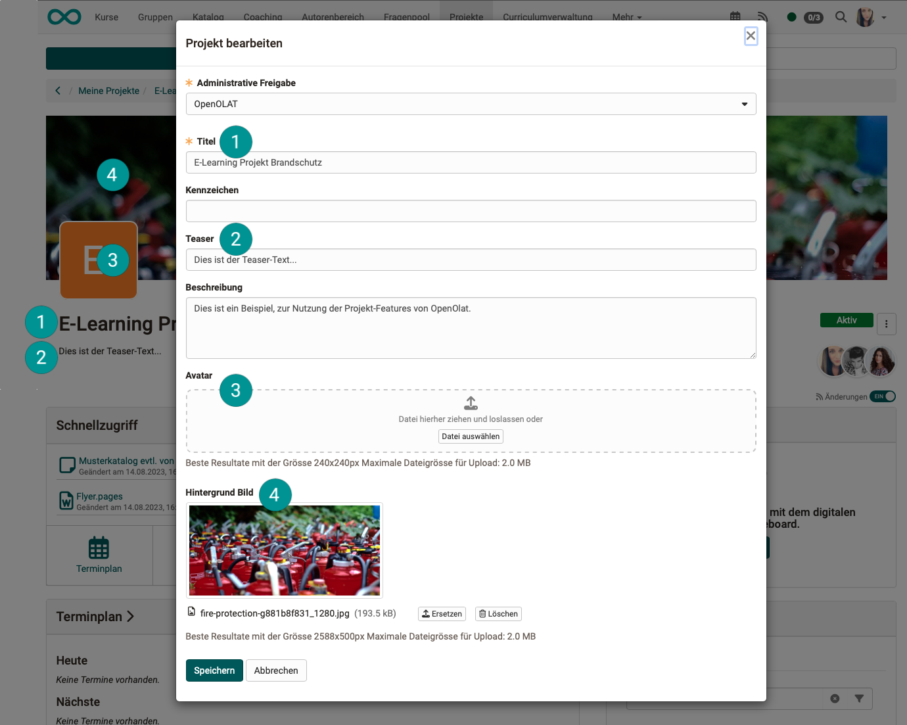
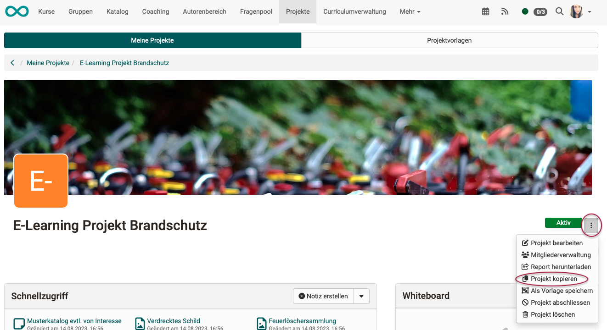
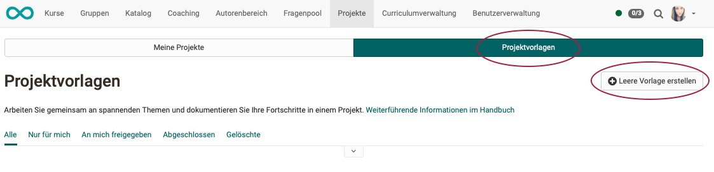
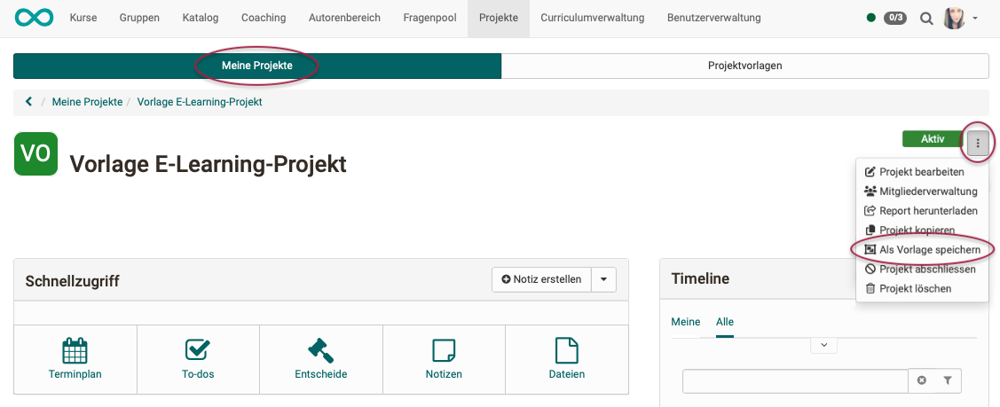
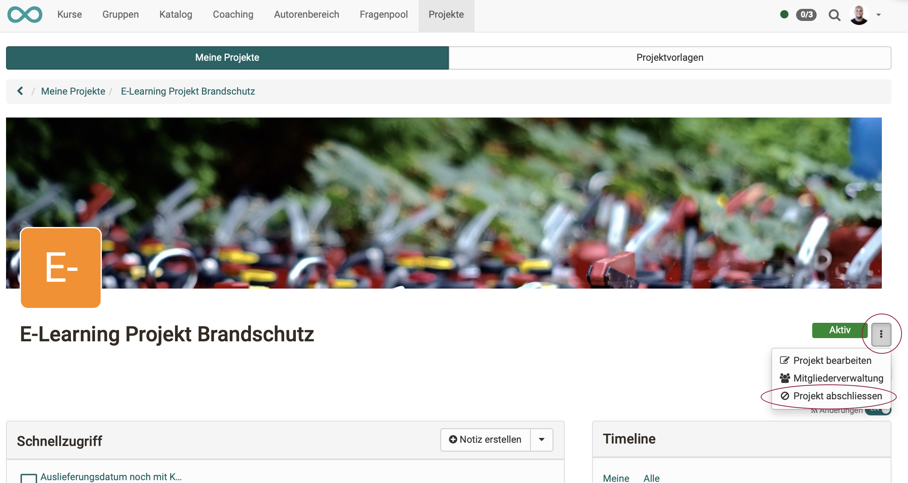
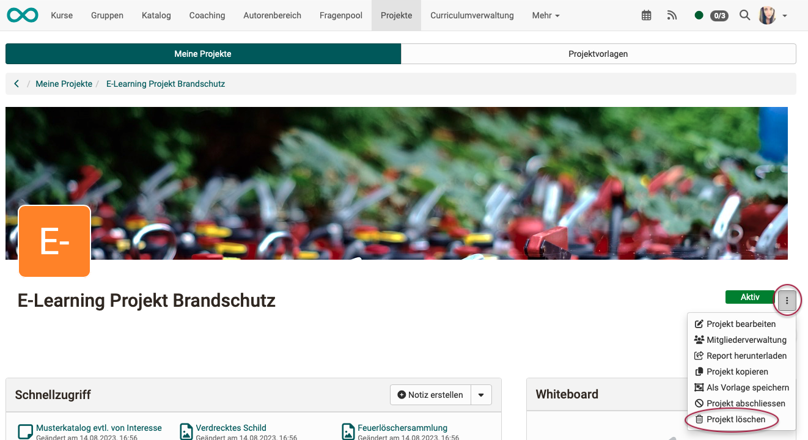
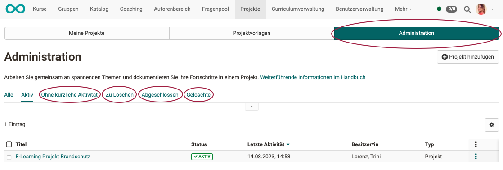

# Projects - Administration

## Copy Projects

Open the desired project and select the “Edit project” option at the top right under the 3 dots.
This editing does not refer to editing the content (entering appointments, creating to-dos, etc.), but to **editing the start page** of the project.

{ class="shadow lightbox" }

{ class="shadow lightbox" }

## Member management

See [Project Member Management](../area_modules/Project_Member_Management.md)

## Download report

See [Project report](../area_modules/Project_Report.md)

## Copy projects

This editing does not refer to editing the content (entering appointments, creating to-dos, etc.), but to **editing the start page** of the project.

{ class="shadow lightbox" }

The following will be copied:

* all To-dos
* all Decisions
* all Notes
* all Files

The following **will not** be copied:

* Project members

The following will **partially** be copied:

* Dates and milestones (are copied without date)

## Project templates

It simplifies the creation of a new project if a template can be used.

A new, empty template can be created in the "Project templates" tab.

It can be specified whether the template should only be available for own use or for all members of the organizational unit.

{ class="shadow lightbox" }

To create a template, an already created project can also be saved as a template. It usually makes sense to create a "neutral" project that specifies the desired process structure.

{ class="shadow lightbox" }

## Finalize Projects

If a project is completed, all project members subsequently have read-only access.

A project can only be completed by

* Project owners,
* Project leaders,
* Project office staff,
* Administrators,
* and project managers.

!!! Note "Note"

    Through these people, a project can also be reactivated.

{ class="shadow lightbox" }

## Delete Projects

Projects can only be deleted by

* the project owners,
* Administrators,
* and project managers.

{ class="shadow lightbox" }

!!! Note "Note"

    By deleting a project, it appears in the "Deleted" list. The projects can only be viewed there, but no longer edited.

## Tab Project administration 

Administrators and project managers have another tab "Administration" under the menu item "Projects".

{ class="shadow lightbox" }

The following (filter) functions are available there for your administrative tasks:

* **No activity recently** 
This list contains projects in which there has been no activity for more than 28 days. Their status can be "active" or "completed". Projects in this list should be checked to see if they can be closed or deleted. (You can check with the project owner).

* **To delete** 
The "To deleted" list only appears in the "Administration" tab. It displays projects with the status "completed" that also have no recent activity.

* **Closed** s
If projects have been closed for a long time, project managers can use this list to ask whether projects can be deleted. 
Completed projects can still be reactivated.

* **Deleted** 
Deleted projects can still be viewed, but no longer edited.

