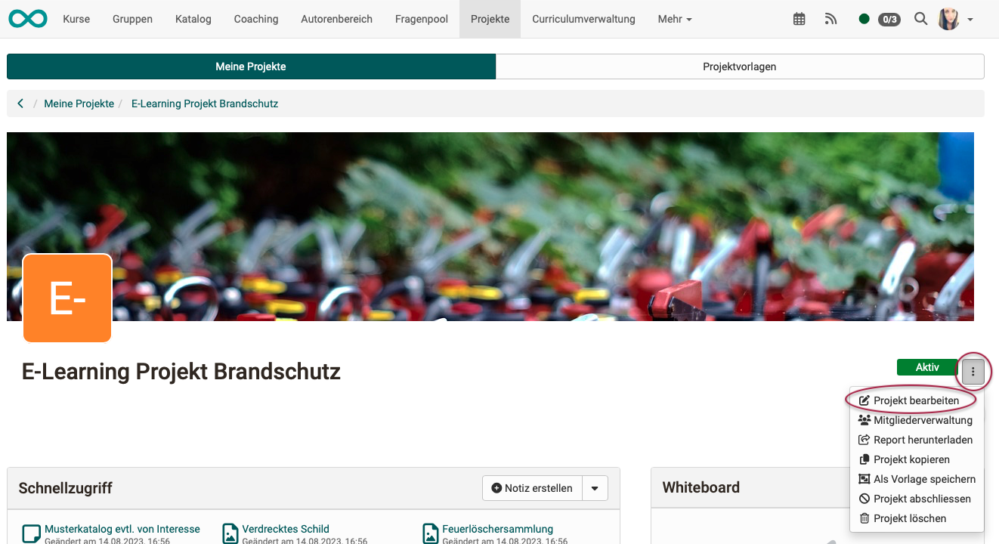
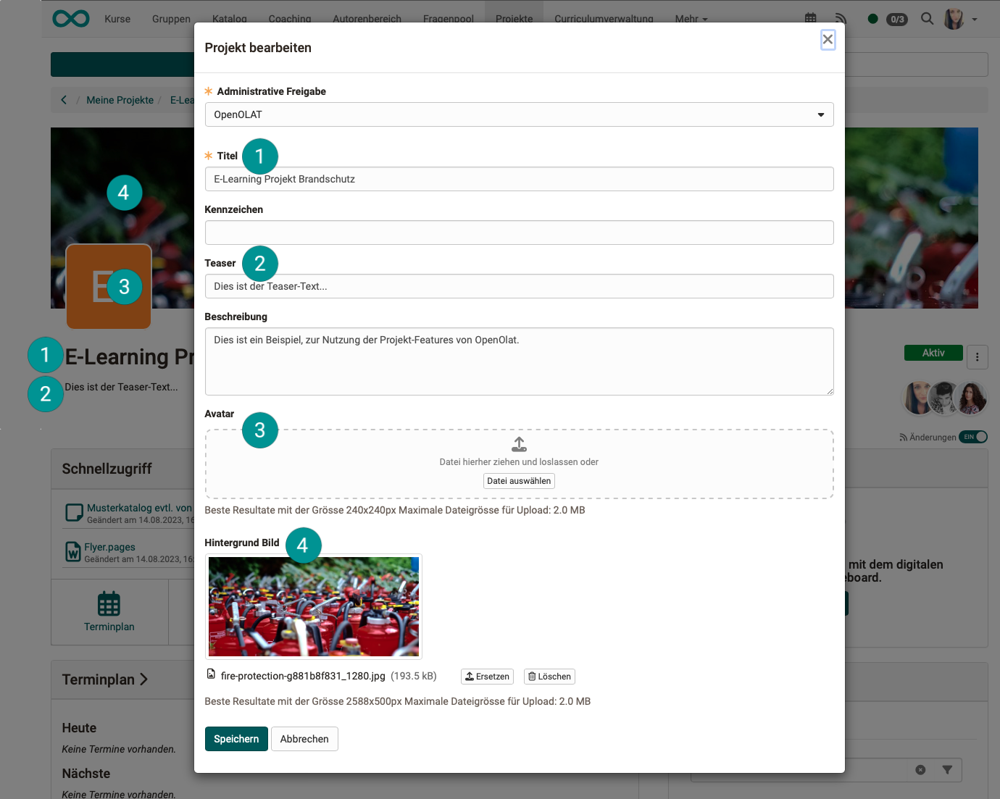
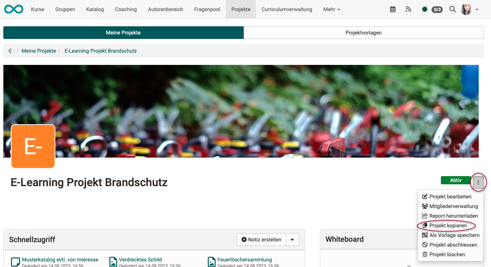
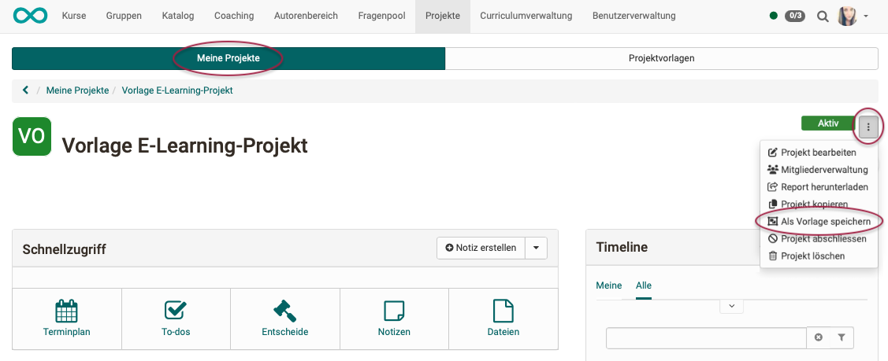
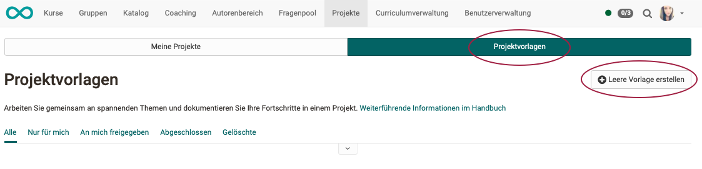
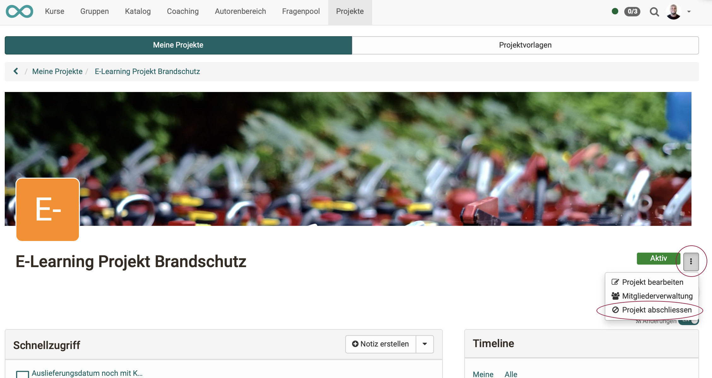
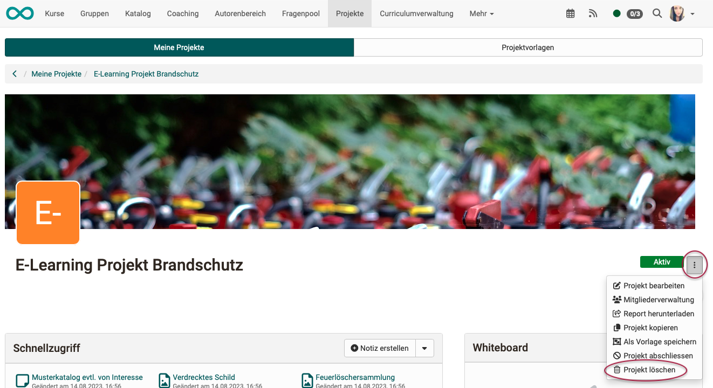
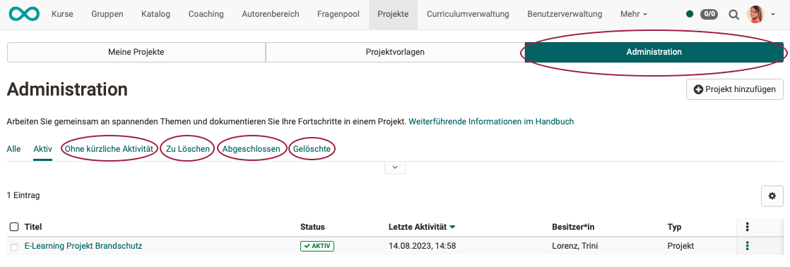

# Projects - Administration {: #administration}

To access the project administration of your project, open the desired project and click on the 3 dots at the top right. Several administrative options appear in the expanded menu.

The administration of a project includes

* the configuration and display of the start page (edit project)
* the [members management](../area_modules/Project_Member_Management.md) of the project
* the option to download [reports](../area_modules/Project_Report.md)
* copying projects
* saving projects as a template
* ending and closing projects
* deleting projects

!!! info "Important"

    Which menu items appear in the area depends on the project role.

## Edit project

"Edit project" does not refer to editing the content (entering appointments, creating to-dos, etc.), but to **editing the start page** of the project.

{ class="shadow lightbox" }

{ class="shadow lightbox" }

## Copy project

{ class="shadow lightbox" }

The following are copied:

* all to-dos
* all decisions
* all notes
* all files

The following are **not** copied:

* project members

The following are **partially** copied:

* appointments and milestones (are copied without date)

## Project templates

It simplifies the creation of a new project if a template can be used.

A created project can be saved as a template. To do this, select the option "Save as template" in the 3-dot menu.

{ class="shadow lightbox" }

A menu appears. Here you can specify, among other things, whether the template should only be available for your own use or for all members of the organisational unit.

You can also create an empty template in the tab "Project templates", which is often a more useful option.

{ class="shadow lightbox" }

## Close projects

{ class="shadow lightbox" }

If a project is closed, all project members subsequently have read-only access.

A project can only be closed by

* project owners,
* project leaders,
* project office staff,
* administrators,
* and project managers.

!!! info "Important"

    These people can also reopen a project.

## Delete project

{ class="shadow lightbox" }

Projects can only be deleted by

* the project owner,
* administrators,
* and project managers.

!!! info "Important"

    By deleting a project, it appears in the list "Deleted". The projects can only be viewed there, but no longer edited.

## Tab Project administration

OpenOlat administrators and project managers have another tab under the menu item "Projects": `Projects > Tab "Administration"`.

{ class="shadow lightbox" }

The following (filter) functions are available there for your administrative tasks:

* **No activity recently** 
This list contains projects in which there has been no activity for more than 28 days. Their status can be "active" or "closed". Projects in this list should be checked to see whether they can be closed or deleted. (You can check with the project owner.)

* **To delete** 
The list "To delete" only appears in the tab "Administration". It displays projects with the status "closed" that also have no recent activity.

* **Closed** 
If projects have been closed for a long time, project managers can use this list to ask whether projects can be deleted. 
Closed projects can still be reopened.

* **Deleted** 
Deleted projects can still be viewed, but no longer edited.

## Further information {: #further_information}

[Projects: Member Management >](../area_modules/Project_Member_Management.md) 
[Projects - Project report >](../area_modules/Project_Report.md)

[To the top of the page ^](#administration)
