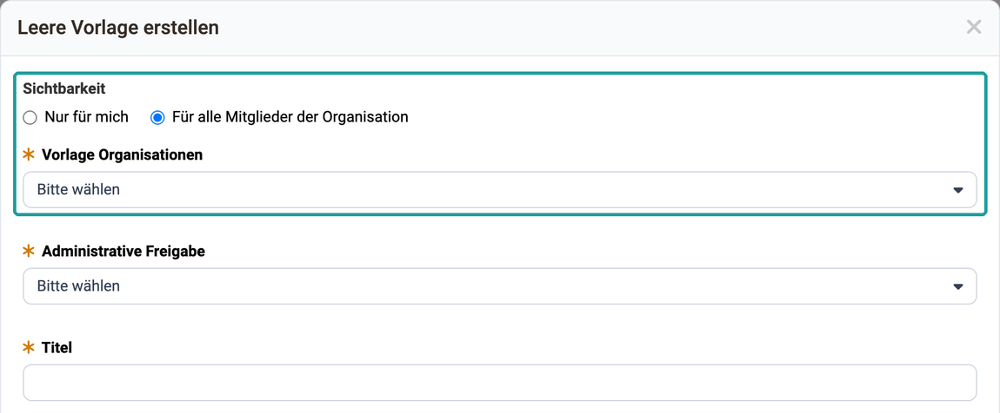

# Projects - Administration {: #administration}

To access the project administration of your project, open the desired project and click on the 3 dots at the top right. Several administrative options appear in the expanded menu.

The administration of a project includes

* the configuration and display of the start page (edit project)
* the [members management](../area_modules/Project_Member_Management.md) of the project
* the option to download [reports](../area_modules/Project_Report.md)
* copying projects
* saving projects as a template
* ending and closing projects
* deleting projects

!!! info "Important"

    Which menu items appear in the area depends on the project role.

## Edit project

"Edit project" does not refer to editing the content (entering appointments, creating to-dos, etc.), but to **editing the start page** of the project. To do this, open the 3-dot menu at the top right of the project cockpit and select "Edit project".

{ class="shadow lightbox" }

The dialog "Edit project" opens. The numbers in the image show where the entries from the dialog appear on the start page of the project.

{ class="shadow lightbox" }

*  **Title**: Mandatory field. The title is the heading of the start page and names the project in the project list.
*  **Teaser**: Short text that appears on the start page directly below the title.
*  **Avatar**: Square image at the top left of the start page. Best results with size 240x240px, maximum file size 2 MB.
*  **Background image**: Image across the full width of the start page. Best results with size 2588x500px, maximum file size 2 MB.

Three further fields do not appear on the start page, or only in small print:

* **Administrative access**: Mandatory field. The organisations the project is assigned to. Project managers and administrators of these organisations see the project in the tab "Administration". Without one of these roles, your own organisation is preset and cannot be changed.
* **Reference**: Freely selectable reference, for example a project number. It appears in small print below the title and as an optional column in the project list.
* **Description**: Detailed text about the project. It is not displayed on the start page.

## Copy project [:octicons-tag-16:{ title="from Release 18.0 (OO-6840)" }](https://track.frentix.com/issue/OO-6840)

{ class="shadow lightbox" }

The following are copied:

* all to-dos
* all decisions
* all notes
* all files

The following are **not** copied:

* project members

The following are **partially** copied:

* appointments and milestones (are copied without date)

## Project templates

If you repeatedly create similar projects, a template saves you the setup of each individual project.

A created project can be saved as a template. To do this, select the option "Save as template" in the 3-dot menu.

{ class="shadow lightbox" }

The dialog "Save as template" opens. A private template is available only to you. An organisation-wide template is available to all members of the selected organisations. The selection "Visibility" with the options "Only for me" and "All organisation members" is shown only to people with the organisation role administrator or project manager. If the system administration under `Administration > Modules > Projects` also allows authors to create projects and templates, authors see this selection as well. All other people always create a private template. With the option "All organisation members", select in the field "Template organisations" the organisations in which you hold one of these roles. :octicons-tag-16:{ title="from Release 21.0.3 (OO-9719)" }

{ class="shadow lightbox" }

You can also create an empty template in the tab "Project templates", which is often a more useful option: `Projects > Tab "Project templates" > Button "Create empty template"`. The same rule for visibility applies there as when saving a project as a template.

{ class="shadow lightbox" }

## Close projects

{ class="shadow lightbox" }

If a project is closed, all project members subsequently have read-only access.

A project can only be closed by

* project owners,
* project leaders,
* project office staff,
* administrators,
* and project managers.

!!! info "Important"

    These people can also reopen a project.

## Delete project

{ class="shadow lightbox" }

Projects can only be deleted by

* the project owner,
* administrators,
* and project managers.

!!! info "Important"

    By deleting a project, it appears in the list "Deleted". The projects can only be viewed there, but no longer edited.

## Tab Project administration [:octicons-tag-16:{ title="from Release 18.0 (OO-6845)" }](https://track.frentix.com/issue/OO-6845)

OpenOlat administrators and project managers have another tab under the menu item "Projects": `Projects > Tab "Administration"`.

{ class="shadow lightbox" }

The following (filter) functions are available there for your administrative tasks:

* **No activity recently** 
This list contains projects in which there has been no activity for more than 28 days. Their status can be "active" or "closed". Projects in this list should be checked to see whether they can be closed or deleted. (You can check with the project owner.)

* **To delete** 
The list "To delete" only appears in the tab "Administration". It displays projects with the status "closed" that also have no recent activity.

* **Closed** 
If projects have been closed for a long time, project managers can use this list to ask whether projects can be deleted. 
Closed projects can still be reopened.

* **Deleted** 
Deleted projects can still be viewed, but no longer edited.

## Further information {: #further_information}

**Mentioned on this page** 
[Projects: Member Management >](../area_modules/Project_Member_Management.md) 
[Projects - Project report >](../area_modules/Project_Report.md)

**Further reading** 
[Projects: Overview >](../area_modules/Project_Overview.md) 
[Roles and Rights: Which roles are available? >](../basic_concepts/Roles.md) 
[Module Projects >](../../manual_admin/administration/Modules_Projects.md)

[To the top of the page ^](#administration)
