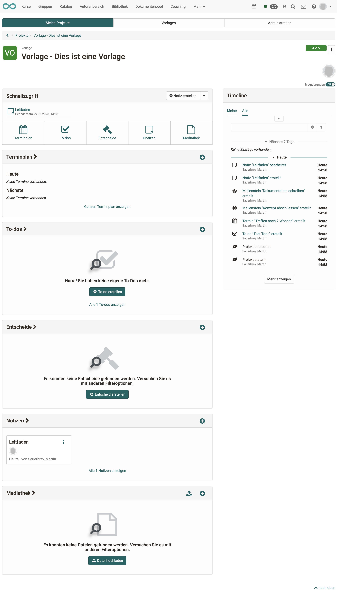
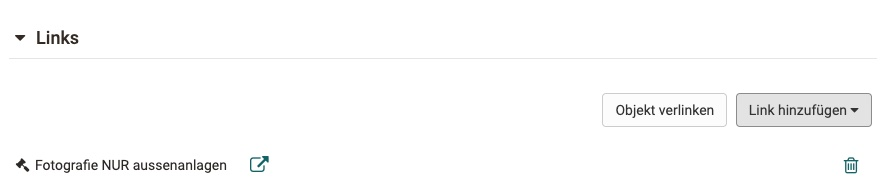

# Projekte - Cockpit

## Projektauswahl 

Ruft man das Projekt-Tool auf landet man in der Übersicht mit allen Projekte (Tab: Meine Projekte). 

## Startscreen eines Projekts (Cockpit)

Klickt man auf ein konkretes Projekt landet man im Cockpit des Projektes. Von hier aus kann man rasch auf alle zentralen Elemente dieses Projektes zugreifen z.B. Termine organisieren/einsehen, sich einen Überblick über die To-dos verschaffen, Entscheide einstellen/einsehen, Notizen erstellen/lesen und Dateien hochladen bzw. einsehen. Auch erhält man in der Timeline einen schnellen Überblick über die letzten Äderungen. 

!!! info "Info"

    Die genauen Möglichkeiten variieren leicht je nach Projekt-Rolle. 

{ class="shadow lightbox" }

## Objekte im Projekt

In einem Projekt kann man verschiedene Objekte anlegen/hochladen:

* Notizen
* Dateien
* Entscheide
* To-dos
* Termine

Diese Objekte lassen sich miteinander verknüpfen, um so zusammengehörige Themen besser zu finden.
Dabei öffnet man ein Objekt im Bearbeitungsmodus (ausser To-dos und Files, diese lassen sich direkt bearbeiten) und klickt unter Links entweder auf "Objekt verlinken", um ein bestehendes Objekt zu verlinken oder auf "Link hinzufügen" um ein Objekt mit Verknüpfung direkt zu erstellen.

