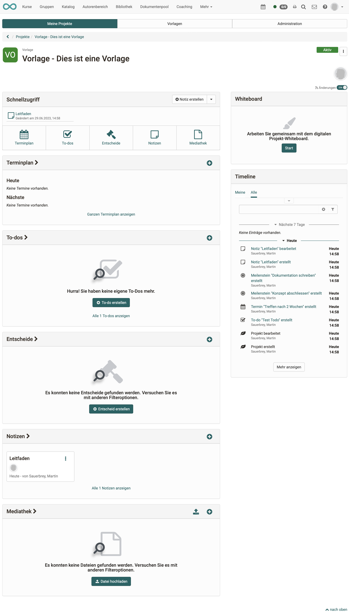

# Projekte - Cockpit

## Projektauswahl 

Ruft man das Projekt-Tool auf landet man in der Übersicht mit allen Projekte (Tab: Meine Projekte). 

## Startscreen eines Projekts (Cockpit)

Klickt man auf ein konkretes Projekt landet man im Cockpit des Projektes. Von hier aus kann man rasch auf alle zentralen Elemente dieses Projektes zugreifen z.B. Termine organisieren/einsehen, sich einen Überblick über die To-dos verschaffen, Entscheide einstellen/einsehen, Notizen erstellen/lesen und Dateien hochladen bzw. einsehen. Auch erhält man in der Timeline einen schnellen Überblick über die letzten Änderungen. 

!!! info "Info"

    Die genauen Möglichkeiten variieren leicht je nach Projekt-Rolle. 

{ class="shadow lightbox" }

## Objekte im Projekt

In einem Projekt kann man verschiedene Objekte anlegen/hochladen:

* Notizen
* Dateien
* Entscheide
* To-dos
* Termine
* Meilensteine
* Whiteboard-Dateien (draw.io)

## Objekte verknüpfen

Die Objekte eines Projektes lassen sich miteinander verknüpfen, um zusammengehörige Themen besser zu finden. Dazu öffnet man ein Objekt zum Bearbeiten und klickt unter **Links** entweder auf

* den Button **"Objekt verlinken"**, um ein bestehendes Objekt zu verlinken oder auf 
* den Button **"Link hinzufügen"**, um ein Objekt mit Verknüpfung direkt zu erstellen.

{ class="shadow lightbox" }

## Benachrichtigungen

In einem Projekt arbeiten mehrere Personen zusammen, deshalb ist es wichtig, über Fortschritte und Änderungen informiert zu werden. Verwenden Sie dazu die [Abonnement-Funktion](../personal_menu/Personal_Tools.de.md#subscriptions) (am rechten Rand, unter den Bildern der Projektmitglieder).

{ class="shadow lightbox" }

!!! Note "Hinweis"

    Standardmässig ist die Abonnement-Funktion in neuen Projekten aktiviert. Sie kann mit dem Toggle-Button ausgeschaltet werden.

Die [Abonnement-Funktion](../personal_menu/Personal_Tools.de.md#subscriptions) steht auch in vielen anderen OpenOlat-Kursbausteinen zur Verfügung. In Projekten hat sie die folgende Besonderheit:

* Es werden **Sammel-Mails** erzeugt, um zu vermeiden, dass wegen jeder kleinen Änderung im Projekt eine Mail verschickt wird.
* **Ausnahme**: Änderungen bei To-dos

