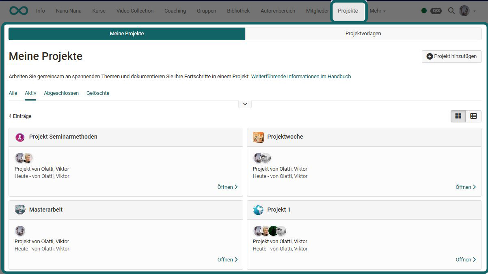
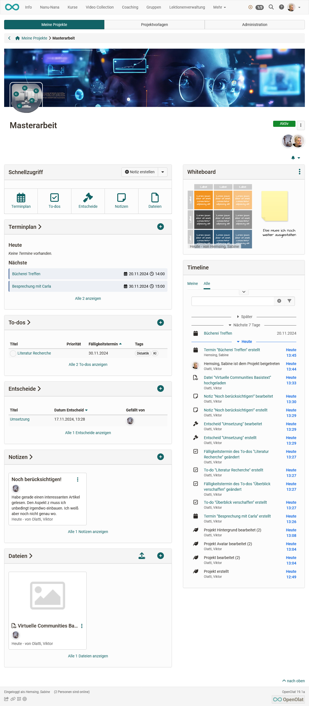
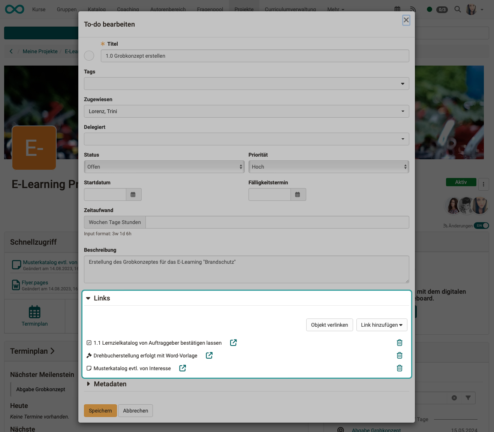

# Projects - Cockpit

## Project selection

If you open the project tool, you will get an overview of all projects (tab: My projects).

{ class="shadow lightbox" }

## Start screen of a project (cockpit)

Clicking on a specific project takes you to the project cockpit. From here, you can quickly access all central elements of this project, e.g. organize/view appointments, get an overview of to-dos, set/view decisions, create/read notes and upload/view files. The timeline also provides a quick overview of the latest changes. 

!!! info "Info"

    The exact options vary slightly depending on the project role. 

{ class="shadow lightbox" }

## Objects in the project

In a project you can create/upload different objects:

* Notes
* Files
* Decisions
* To-dos
* Appointments and Milestones
* Diagrams, Whiteboard files (draw.io)

## Link objects

The objects in a project can be linked to each other to make it easier to find related topics. To do this, open an object for editing and click under **Links** either on

* the **"Link object"** button to link to an existing object or to 
* the **"Add link"** button to create an object with a link directly.

{ class="shadow lightbox" }

!!! note 

    The links are links within the project, not links to external web content. 

## Notifications

Several people work together on a project, so it is important to be informed about progress and changes. To do this, use the [Subscription function](../personal_menu/Personal_Tools.md#subscriptions--subscriptions) (on the right-hand side, below the images of the project members).

{ class="shadow lightbox" }

!!! Note "Note"

    The subscription function is activated in new projects by default. It can be switched off using the toggle button.

The [Subscription function](../personal_menu/Personal_Tools.md#subscriptions--subscriptions) is also available in many other OpenOlat course elements. In projects it has the following special feature:

* **Bulk mails** are created to avoid sending a mail for every small change in the project.
* **Exception**: Changes to to-dos

