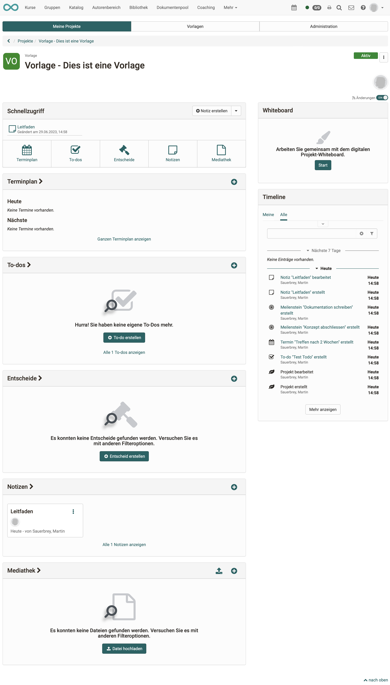

# Projects - Cockpit

## Project selection

If you open the project tool, you will get an overview of all projects (tab: My projects).

## Start screen of a project (cockpit)

Clicking on a specific project takes you to the project cockpit. From here you can quickly access all central elements of this project, e.g. organise/view appointments, get an overview of to-dos, set/view decisions, create/read notes and upload/view files. The timeline also provides a quick overview of the latest changes. 

!!! info "Info"

    The exact options vary slightly depending on the project role. 

{ class="shadow lightbox" }

## Objects in the project

In a project you can create/upload different objects:

* Notes
* Files
* Decisions
* To-dos
* Appointments
* Milestones
* Whiteboard files (draw.io)

These objects can be linked to each other in order to find related topics more easily.
To do this, open an object in edit mode (except for to-dos and files, which can be edited directly) and click either on "Link object" under Links to link an existing object or on "Add link" to create an object with a link directly.

