# Projekte - Entscheide

Getroffene Entscheidungen müssen nachvollziehbar sein und deshalb dokumentiert werden. OpenOlat stellt dazu hilfreiche Funktionen zur Verfügung.

## Entscheide erstellen

Um einen neuen Entscheid innerhalb eines Projektes zu erstellen haben Sie folgende Möglichkeiten:

**a) Projekte > Tab „Meine Projekte“ > Projekt wählen > Abschnitt „Schnellzugriff" > im Pulldown: „Entscheid erstellen“**

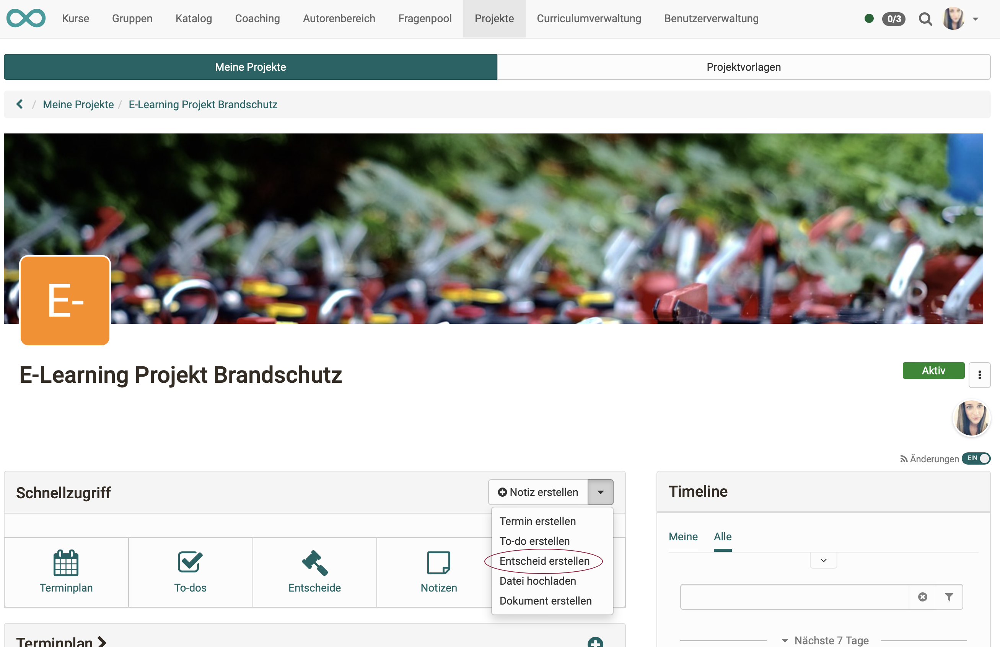{ class="shadow lightbox" }

**b) Projekte > Tab „Meine Projekte“ > Projekt wählen > Klick auf das Plus-Symbol im Abschnitt „Entscheide“**

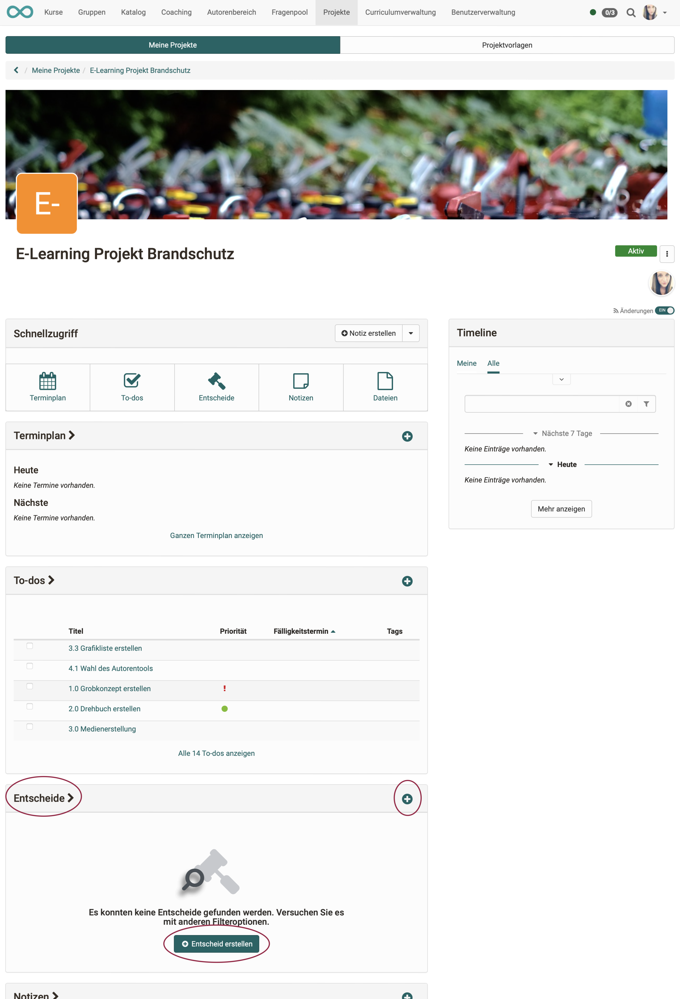{ class="shadow lightbox" }

 

**c) Projekte > Tab „Meine Projekte“ > Projekt wählen > Schnellzugriff Button „Entscheide“ > Klick auf den Button „Entscheid erstellen“**<

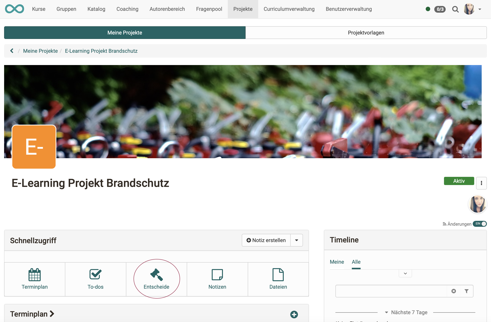{ class="shadow lightbox" }

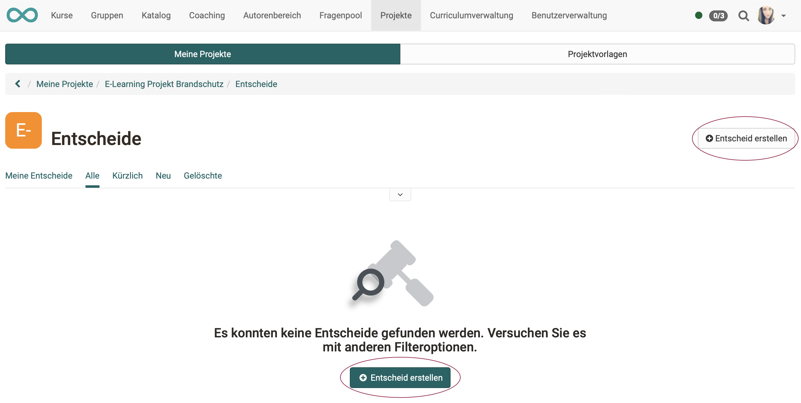{ class="shadow lightbox" }

## Liste der Entscheide anzeigen

Haben Sie Ihr Projekt gewählt, können Sie vom Startscreen (Cockpit) aus auf verschiedene Arten auf die Entscheide der jeweiligen Projekte zugreifen.

**a) Projekte > Tab „Meine Projekte“ > Projekt wählen > Schnellzugriff Button „Entscheide“** 
oder 
**b) Projekte > Tab „Meine Projekte“ > Projekt wählen > Titel im Abschnitt „Entscheide“ anklicken** 
oder 
**c) Projekte > Tab „Meine Projekte“ > Projekt wählen > im Abschnitt „alle Entscheide anzeigen“ klicken**

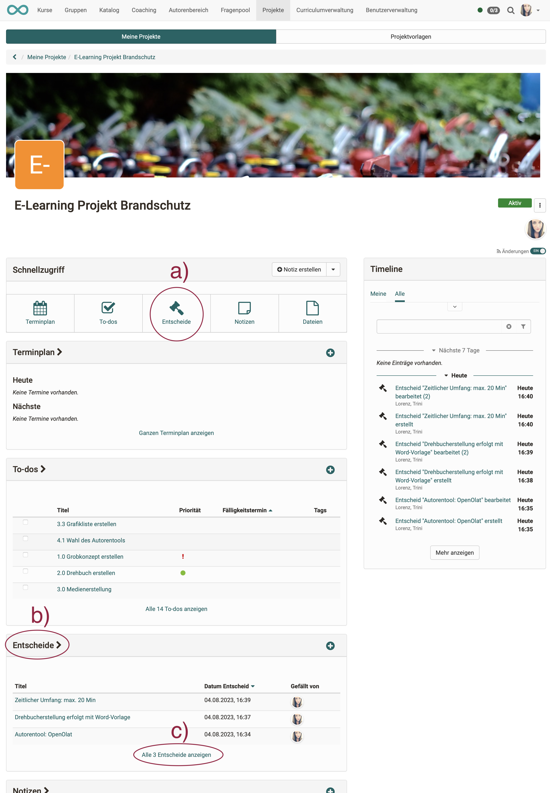{ class="shadow lightbox" }

## Entscheide bearbeiten

Um einen Entscheid zu bearbeiten klicken Sie in der Liste der Entscheide

**a) auf den Titel des Entscheids** 
oder 
**b) auf die 3 Punkte am Ende einer Zeile.**

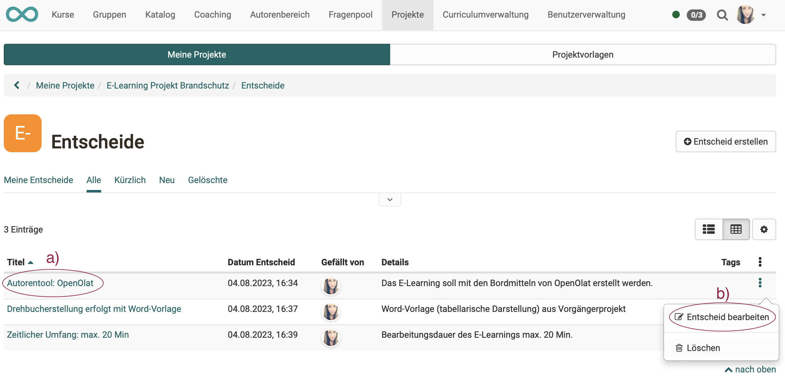{ class="shadow lightbox" }

## Entscheide verlinken

Wenn Sie einen Entscheid bearbeiten, können Sie Links zu anderen Objekten dieses Projekts erstellen, indem Sie zu einem bereits bestehenden Objekt verlinken **(Button „Objekt verlinken")**.

**Unterschied „Objekt verlinken" und „Link hinzufügen"** 
Oft taucht während dem Durchdenken eines Entscheids das Bedürfnis auf, noch eine weitere Notiz, einen zusätzlichen Termin oder eine weiteres To-Do zu erstellen.
Mit dem **Button „Link hinzufügen"**, können Sie diese Objekte neu erstellen und sie sind dann automatisch schon mit dem aktuellen Entscheid verlinkt. Der lange Umweg (anderen Objekttyp wählen, Objekt neu erstellen, Rückkehr zum Entscheid und erst dann die Verlinkung vornehmen) entfällt dadurch.

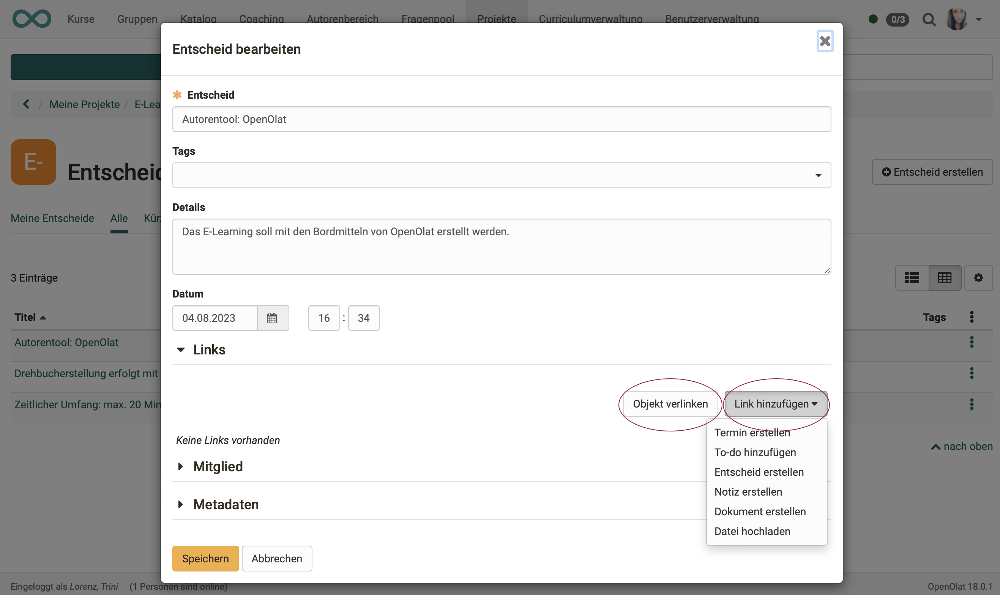{ class="shadow lightbox" }

Verlinkte Objekte können z.B. To-dos sein: 

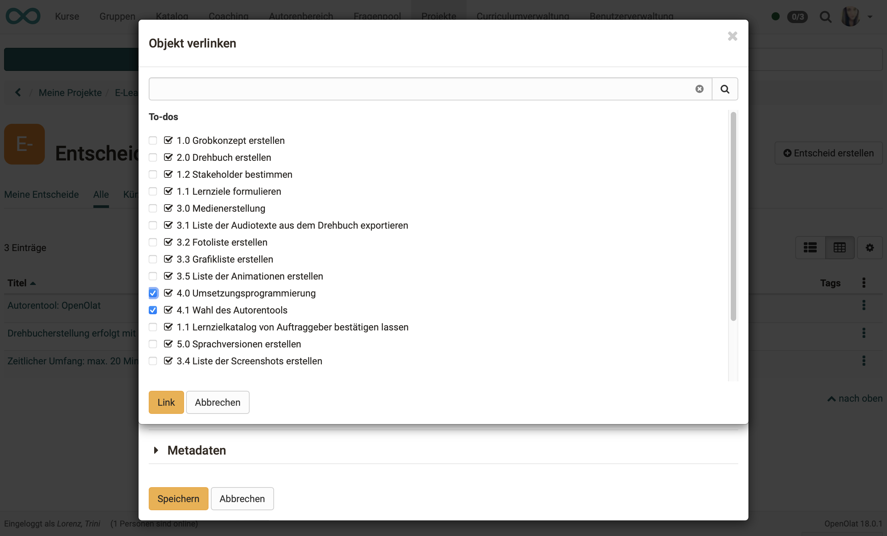{ class="shadow lightbox" }

Einem Entscheid hinzugefügte Links können direkt aufgerufen werden.

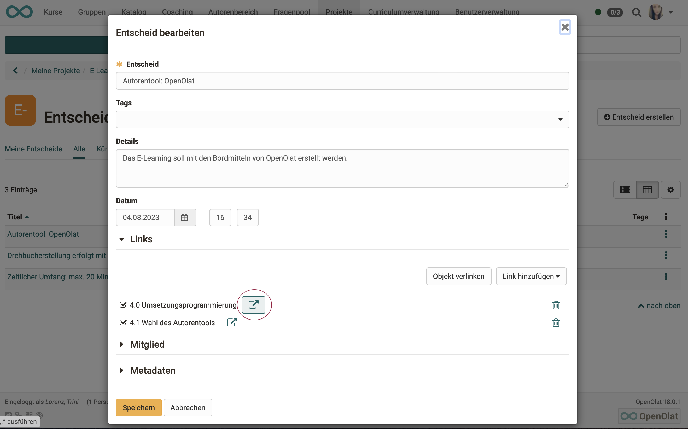{ class="shadow lightbox" }

## Mitglieder eines Entscheids

In OpenOlat reden wir analog zu Mitgliedern eines Kurses usw. auch von Mitgliedern eines Entscheids. Damit sind also nicht unbedingt die tatsächlichen Entscheidungsträger gemeint, sondern analog zum Konzept "Mitglieder" in OpenOlat auch hier alle Personen, die Zugriff auf ein Objekt "Entscheid" haben.

!!! info "Hinweis"

    Aufgrund dieses Konzepts von Mitgliedschaft kann ein Mitglied einem Entscheid auch nachträglich hinzugefügt werden, nachdem der Entscheid bereits gefällt worden ist. Man kann somit eher sagen, die Mitglieder eines Entscheides sind diejenigen, die einen Entscheid mittragen oder betroffen sind.
    
    Beispiel: Ein Projektsponsor kann als Mitglied einem Entscheid hinzugefügt werden, obwohl er nicht aktiv an der Projektabwicklung beteiligt ist und bei diesem Entscheid nicht aktiv mitentschieden hat.

!!! info "Hinweis"

    Als Mitglied eines **Entscheides** kann nur hinzugefügt werden, wer bereits Mitglied im **Projekt** ist. Auf der Auswahlliste möglicher neuer Mitglieder eines Entscheids erscheinen nur Personen, die bereits in der Projektmitgliederverwaltung eingefügt wurden.

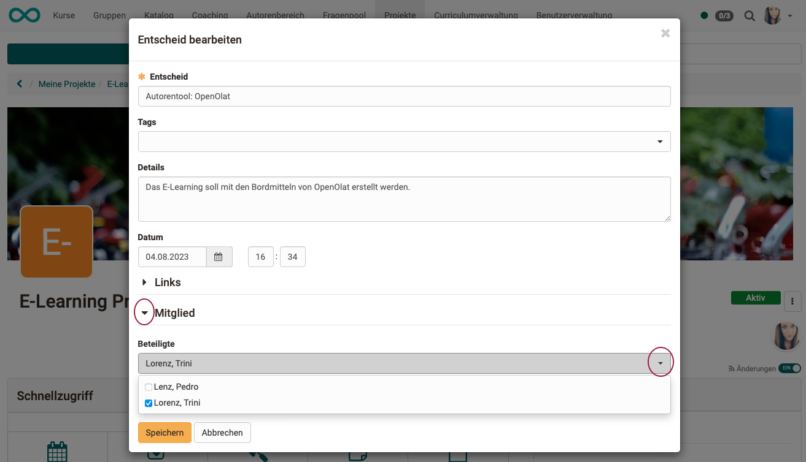{ class="shadow lightbox" }

## Metadaten eines Entscheids

Zu den Metadaten eines Entscheids gehören Erstellungs- und letztes Änderungsdatum.

Der **Aktivitätslog** mit weiteren Änderungsdaten wird sichtbar und kann für die Details aufgeklappt werden, sobald die Metadaten aufgeklappt sind.

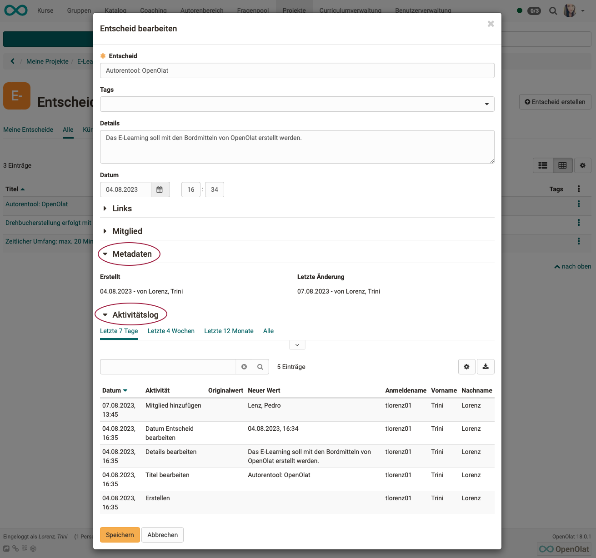{ class="shadow lightbox" }

## Entscheide löschen

Zum Löschen eines Entscheides klicken Sie auf die 3 Punkte am Ende einer Zeile und dann auf „Löschen". Der Entscheid erscheint dann nur noch unter dem Tab „Gelöschte“. Er kann nicht wiederhergestellt werden.

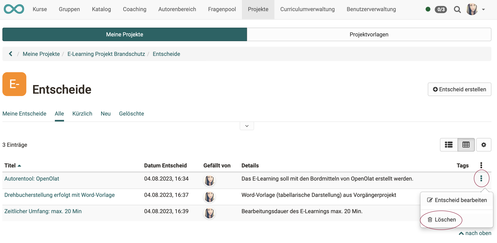{ class="shadow lightbox" }
