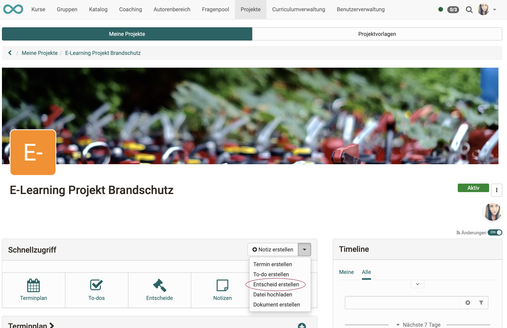
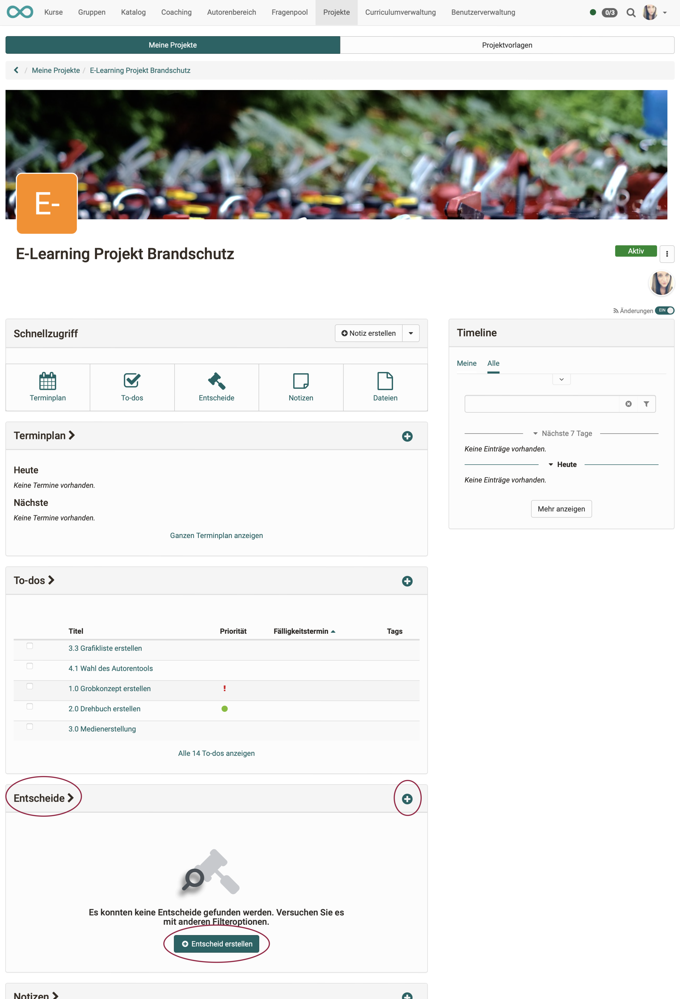
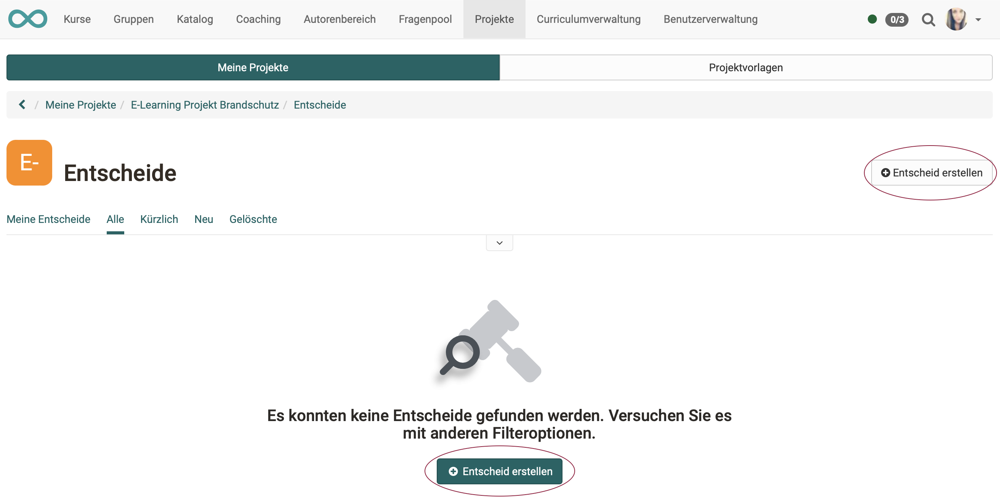
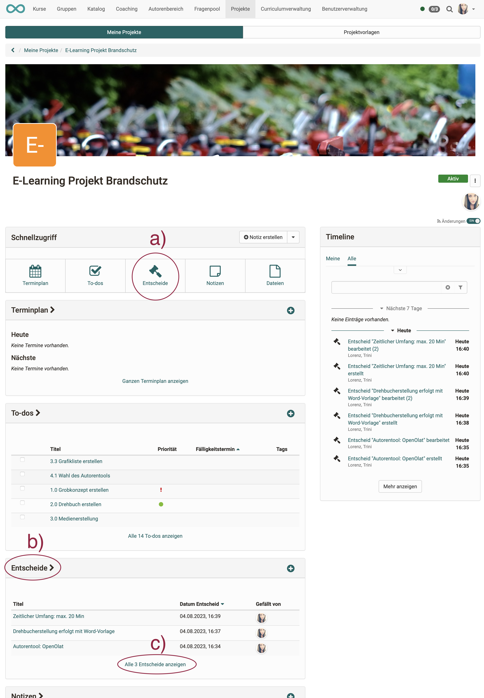
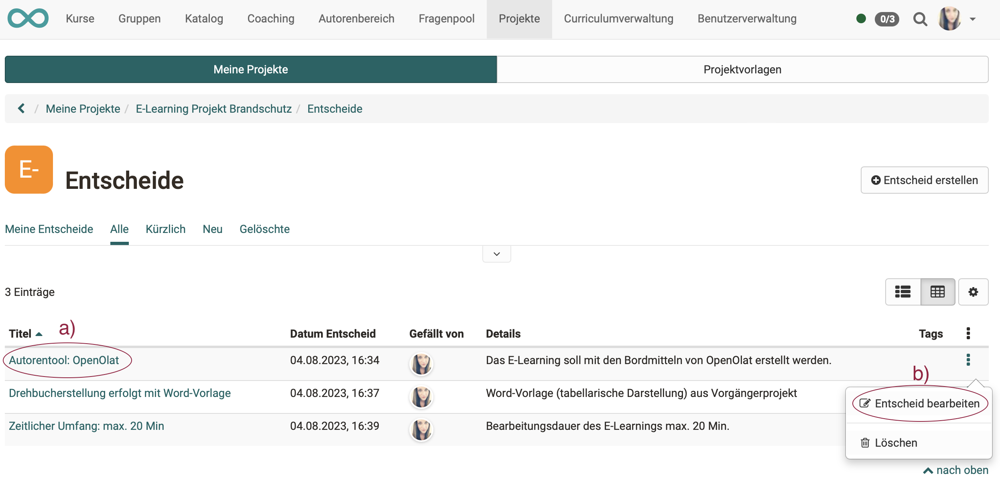
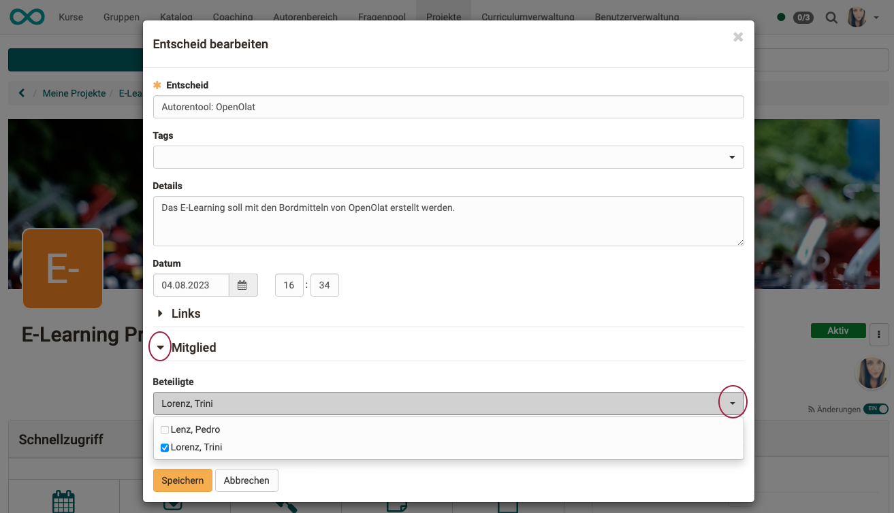
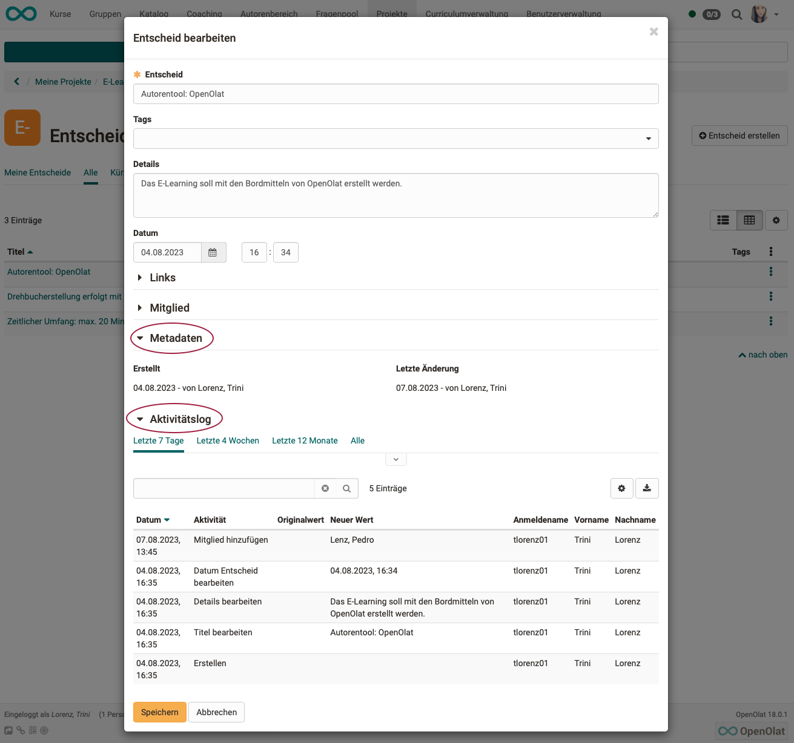
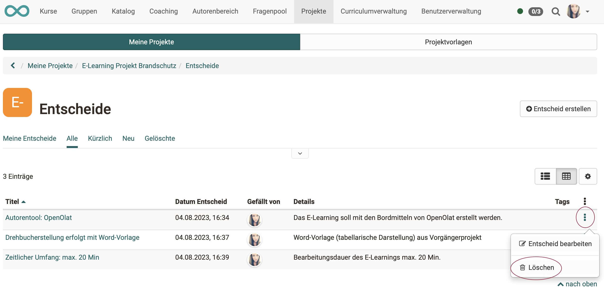

# Projects - Decisions

The decisions taken must be comprehensible and therefore documented. OpenOlat provides helpful functions for this purpose.

## Create decisions

To create a new decision within a project, you have the following options:

**a) Projects > Tab "My projects" > Select project > Section "Quick start" > in the pulldown: "Create decision"**

{ class="shadow lightbox" }

**b) Projects > Tab "My projects" > Select project > Click on the plus-symbol in the section "Decisions"**

{ class="shadow lightbox" }

 

**c) Projects > Tab "My projects" > Select project > Quick start button "Decisions" > Click on the button "Create decision"**

{ class="shadow lightbox" }

{ class="shadow lightbox" }

## Show list of decisions

Once you have selected your project, you can access the decisions of the respective projects from the start screen (cockpit) in various ways.

**a) Projects > Tab "My projects" > Select project > Quick start button "Decisions"** 
oder 
**b) Projects > Tab "My projects" > Select project > Press title in the section "Decisions"** 
oder 
**c) Projects > Tab "My projects" > Select project > in the section, click on "show all decisions"**

{ class="shadow lightbox" }

## Edit decisions

To edit a decision, click on the following in the list of decisions

**a) on the title of the decision** 
or 
**b) on the three dots at the end of a line.**

{ class="shadow lightbox" }

## Link decisions

When editing a decision, you can create links to other objects of this project by linking to an already existing object **(Button "Link object")**.

**Difference between "Link object" and "Add link"** 
Often, while thinking through a decision, the wish to create one more note, appointment or to-do arises. 
With the button "Add link", you can create these objects and they are then automatically linked to the current decision. The long diversions (select a different object type, create a new object, return to the decision and only then make the link) are thus eliminated.

{ class="shadow lightbox" }

Linked objects can for example be to-dos: 

{ class="shadow lightbox" }

Links added to a decision can be called up directly.

{ class="shadow lightbox" }

!!! info "What happens if a linked object is deleted?"

    If a linked object is deleted, the links pointing to this object from other objects are also deleted.

## Members of a decision

In OpenOlat, as well as speaking about members of a course etc., we also talk about members of a decision. This does not necessarily mean the actual decision-makers, but in analogy to the concept of "members" in OpenOlat, all persons who have access to a "decision" object.

!!! info "Note"

    Because of this concept of membership, a member can be added to a decision even after the decision has been made. One can thus rather say that the members of a decision are those who support or are affected by a decision.
    
    Example: A project sponsor can be added as a member to a decision, even though he is not actively involved in the project implementation and did not actively participate in the decision.

!!! info "Note"

    Only those who are already members of the **project** can be added as members of a **decision**. On the selection list of possible new members of a decision only persons appear who have already been added in the project member administration..

{ class="shadow lightbox" }

## Metadata of a decision

The metadata of a decision includes the date of creation and the date of last modification.

The **activity log** with further change data becomes visible and can be expanded for the details as soon as the metadata is expanded.

{ class="shadow lightbox" }

## Delete decision

To delete a decision, click on the 3 dots at the end of a line and then on "Delete". The decision will then only appear in the tab "Deleted". It cannot be restored.

{ class="shadow lightbox" }
