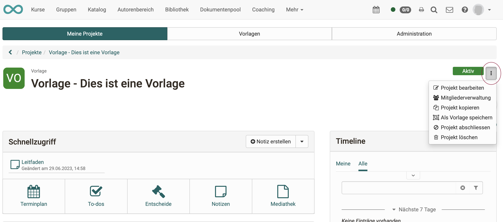

# Projects - Edit projects

To edit the project title and other general project settings, select the **icon with the three dots**. To edit projects, click the option "Edit project".

{ class="shadow lightbox" }