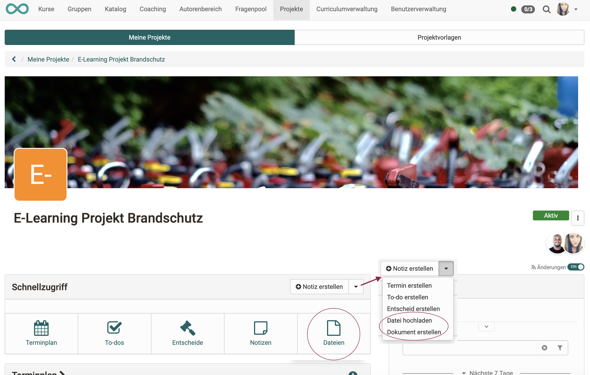
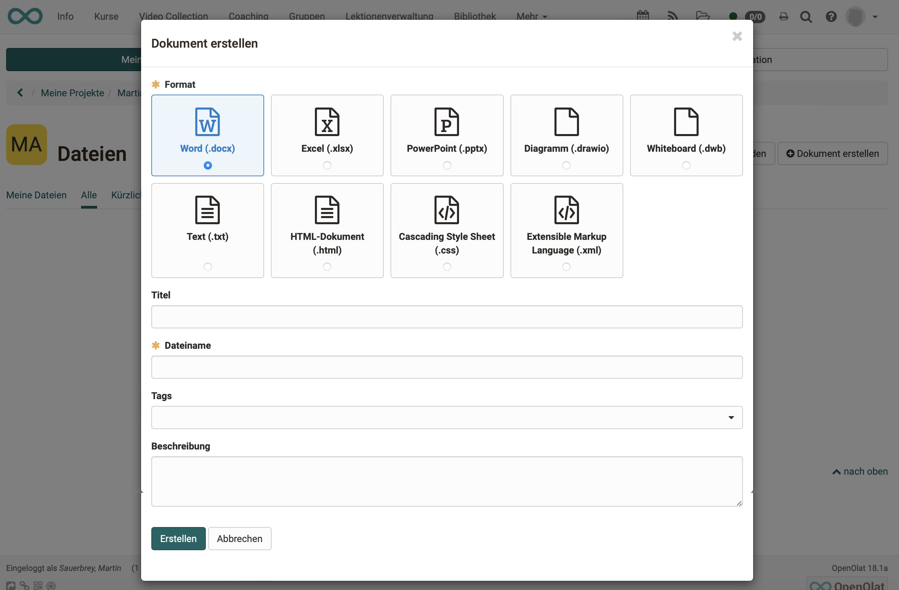
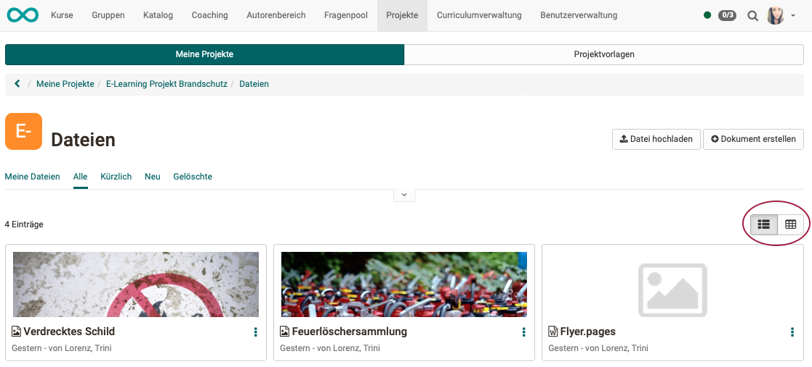
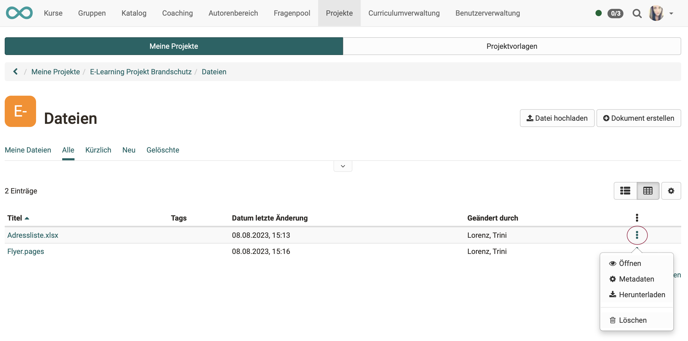
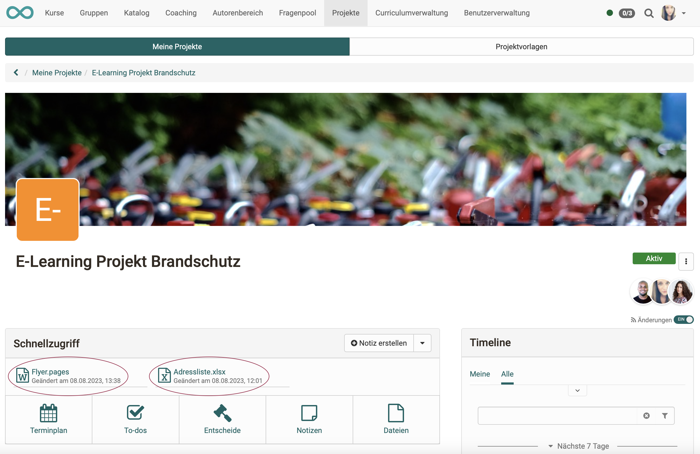

# Projekte - Dateien

Unter "Dateien" im Abschnitt "Schnellzugriff" können in einem Projekt Dateien **hochgeladen** und neue Dateien **erstellt** werden.
So können alle Dateien zusammen mit dem Projekt gespeichert werden. Alle Medien befinden sich dann am gleichen Ort. 
Sie sind nur innerhalb des Projektes verfügbar.

{ class="shadow lightbox" }

## Dateien hochladen

Es kann eine Vielzahl an Dateiformaten hochgeladen werden, z.B.

* pdf
* xmlx 
* docx
* pptx
* png
* jpg 
und viele andere

 

Die hochgeladenen Dateien können je nach Format direkt geöffnet werden. 
Es gelten folgende Grundsätze:

- Wenn keine Microsoft-Lizenenz vorhanden ist, werden docx, pptx und xlsx mit OnlyOffice geöffnet.
- Pdf werden in der Regel mit OnlyOffice geöffnet.
- Bilder werden im Browser geöffnet.
- Dateiformate, die eine spezielle Software benötigen, werden nicht geöffnet. OpenOlat bietet statt dessen einen Download an. Die Datei kann so trotzdem zusammen mit den übrigen Daten im Projekt gespeichert werden. Beispiel: Mac-Dateiformate, wie z.B. Pages oder Keynote. 

!!! info "Technische Info zu den Dateien"

    * Für die maximale Grösse der Einzeldateien besteht per Voreinstellung keine Beschränkung.
    
    * Das maximale Gesamtvolumen pro Projekt bzw. für alle Projekte ist per Voreinstellung ebenfalls nicht begrenzt.

    * Eine Versionierung wird derzeit derzeit nicht vorgenommen.
 

## Dateien erstellen

{ class="shadow lightbox" }

Es können folgende Dateiformate erstellt werden:

* .docx (Word, Lizenz erforderlich)
* .xlxs (Excel, Lizenz erforderlich)
* . pptx (PowerPoint, Lizenz erforderlich)
* .drawio (Diagramm)
* .dwb (Whiteboard)
* .text (unformatierter Text)
* .html (HTML-Dokument)
* .css (Cascading Style Sheet)
* .xml (Extensible Markup Language)

!!! info "Erstellen von Office-Dokumenten"

    Ob Microsoft-Dateiformate erstellt werden können, hängt davon ab, ob Lizenzen verfügbar sind. Wenden Sie sich dafür an Ihren Administrator. 
    
    Ohne Lizenzen werden die Optionen zum Erstellen der Formate docx, pptx und xlsx nicht angezeigt. (Eine Anzeige und Bearbeitung vorhandener Dokumente mit ONLYOFFICE ist jedoch möglich.)

## Liste der Dateien anzeigen

Die Liste aller im Projekt vorhandenen Dateien öffnen Sie analog zu den To-dos oder Entscheiden: 

**a) Projekte > Tab „Meine Projekte“ > Projekt wählen > Schnellzugriff Button „Dateien“** 
oder 
**b) Projekte > Tab „Meine Projekte“ > Projekt wählen > Titel im Abschnitt „Dateien“ anklicken** 
oder 
**c) Projekte > Tab „Meine Projekte“ > Projekt wählen > im Abschnitt „alle Dateien anzeigen“ klicken**

Beachten Sie, dass Sie zwischen der Ansicht der Karten und der Listenansicht wechseln können.  

{ class="shadow lightbox" }

Unter den 3 Punkten am Ende jedes Listeneintrags finden Sie weitere Optionen.

{ class="shadow lightbox" }

## Schnellzugriff auf Dateien 

Im Abschnitt Schnellzugriff werden die zuletzt verwendeten Dateien und Notizen angezeigt (max. 6, erstellt, hochgeladen, geändert, angesehen, heruntergeladen). Sie können direkt durch Anklicken vom Ersteller oder Mitgliedern geöffnet und weiterbearbeitet werden.

{ class="shadow lightbox" }

