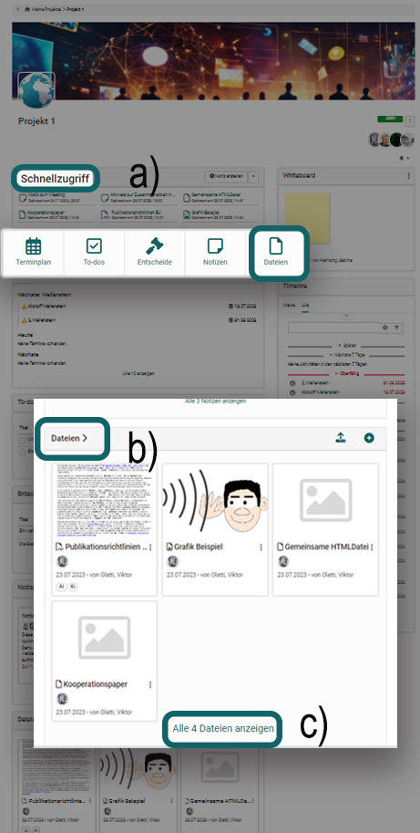

# Projekte: Dateien {: #files}

Generell können Dateien für ein Projekt hochgeladen, erstellt oder aus anderen OpenOlat Bereichen hinzugefügt werden. Dies erfolgt jeweils entweder über den "Schnellzugriff" oder im Bereich "Dateien". Dabei sind die Möglichkeiten im Bereich "Dateien" umfangreicher. 

Im Abschnitt "Schnellzugriff" werden generell die sechs zuletzt verwendeten Dateien *und* Notizen angezeigt. Diese können einfach mit Klick auf das Dokument geöffnet bzw. heruntergeladen und gegebenenfalls weiterbearbeitet werden.

Im Abschnitt "Dateien" werden die sechs zuletzt hinzugefügten Dateien angezeigt und können ebenfalls direkt geöffnet bzw. heruntergeladen und gegebenenfalls weiterbearbeitet werden. 

## Dateien hochladen {: #upload}

Am schnellsten lassen sich Dateien im Bereich "Schnellzugriff" hochladen. 

{ class="shadow lightbox" } 

Die hochgeladenen Dateien können je nach Format direkt geöffnet werden.  
Es gelten folgende Grundsätze:

- Wenn keine Microsoft-Lizenz vorhanden ist, werden docx, pptx und xlsx z.B. mit OnlyOffice geöffnet, wenn dafür eine Lizenz vorhanden ist.
- Pdf werden in der Regel mit OnlyOffice geöffnet.
- Bilder werden im Browser geöffnet.
- Dateiformate, die eine spezielle Software benötigen, werden nicht geöffnet. OpenOlat bietet stattdessen einen Download an. Die Datei kann so trotzdem zusammen mit den übrigen Daten im Projekt gespeichert werden. Beispiel: Mac-Dateiformate, wie z.B. Pages oder Keynote. 

!!! info "Technische Info zu den Dateien"

    * Für die maximale Grösse der Einzeldateien besteht keine Beschränkung.
    
    * Das maximale Gesamtvolumen pro Projekt bzw. für alle Projekte ist per Voreinstellung ebenfalls nicht begrenzt.

    * Eine Versionierung wird derzeit nicht vorgenommen.

    * Hinsichtlich der Dateiformate gibt es keine Einschränkungen.
 
[Zum Seitenanfang ^](#files)

---

## Dateien erstellen {: #create}

Ebenfalls im Schnellzugriff können auch rasch Dateien erstellt werden. Folgende Dokument-Formate stehen dabei zur Verfügung: 

{ class="shadow lightbox" }

* .docx (Word, Lizenz erforderlich)
* .xlxs (Excel, Lizenz erforderlich)
* .pptx (PowerPoint, Lizenz erforderlich)
* .drawio (Diagramm)
* .dwb (Whiteboard)
* .text (unformatierter Text)
* .html (HTML-Dokument)
* .css (Cascading Style Sheet)
* .xml (Extensible Markup Language)

!!! info "Erstellen von Office-Dokumenten"

    Ob Microsoft-Dateiformate erstellt werden können, hängt davon ab, ob Lizenzen verfügbar sind. Wenden Sie sich dafür an Ihren OpenOlat Administrator. 
    
    Ohne Lizenzen werden die Optionen zum Erstellen der Formate docx, pptx und xlsx nicht angezeigt. (Eine Anzeige und Bearbeitung vorhandener Dokumente mit OnlyOffice ist jedoch in der Regel möglich.)

[Zum Seitenanfang ^](#files)

---

## Video- und Audio-Recording {: #audio_video}

Um Video- oder Audiodateien per Webcam aufzunehmen wechseln Sie in den Bereich "Dateien". Wählen sie hier "Video oder Audio aufzeichnen" und erlauben Sie den Zugriff auf Ihre Webcam bzw. Ihr Mikrofon um die Aufnahme vorzunehmen. 

{ class="shadow lightbox" }

Neu aufgenommene Videos werden als mp4-Dateien gespeichert, Audios als m4a-Dateien. Die Dateien stehen dann im Bereich "Dateien" für alle Projektmitglieder zur Verfügung. 

[Zum Seitenanfang ^](#files)

---

## Liste der Dateien anzeigen {: #list}

Alle Dateien eines Projektes finden Sie im Bereich "Dateien" des Projektes. Es gibt mehrere Wege um hierhin zu gelangen:

a) Schnellzugriff Button "Dateien

b) Titel im Abschnitt "Dateien" anklicken

c) im Abschnitt "alle Dateien anzeigen" klicken

{ class="shadow lightbox" }

Beachten Sie, dass Sie auf der Übersichtsseite aller Dateien zwischen der Ansicht der Karten und der Listenansicht wechseln können.  

{ class="shadow lightbox" }

Unter den 3 Punkten am Ende jedes Listeneintrags finden Sie weitere Optionen.

{ class="shadow lightbox" }

Zum Ausklappen der Buttons zum Filtern klicken Sie auf den kleinen Pfeil in der Mitte oberhalb der Liste.

[Zum Seitenanfang ^](#files)

---

## Dateien hinzufügen {: #add}

Im Bereich "Dateien" können auch Dateien, die sich an anderen Stellen in OpenOlat befinden hinzugefügt werden. Dabei hat man Zugriff auf alle Elemente des File-Hubs und des Media Centers.

{ class="shadow lightbox" }

[Zum Seitenanfang ^](#files)

---

## Dateien gemeinsam bearbeiten {: #edit}

Die Integration von Dokumenten-Editoren ermöglicht kollaboratives Arbeiten.

* Die vorhandenen Dateien können von allen Projektmitgliedern bearbeitet werden.
* Auch ein **gleichzeitiges Bearbeiten** (z.B. einer Word-Datei während einer Online-Besprechung) ist möglich, wenn die entsprechenden Lizenzen für den Dokumenteneditor vorhanden sind.

Wenden Sie sich ggf. an Ihre Administratorin / Ihren Administrator.

[Zum Seitenanfang ^](#files)

---

## Dateien löschen {: #delete}

Zum Löschen einer Datei klicken Sie auf die 3 Punkte am Ende einer Zeile und dann auf "Löschen". Die Datei erscheint dann nur noch unter dem Tab "Gelöscht". Sie kann innerhalb eines gewissen Zeitraums wieder hergestellt werden.

{ class="shadow lightbox" }

Wollen Sie mehrere Dateien auf einmal löschen (Sammelaktion), dann wählen Sie die Listenansicht und markieren die gewünschten Checkboxen am Anfang der Zeilen. Dadurch wird ein Button "Löschen" oberhalb der Liste eingeblendet.

{ class="shadow lightbox" }

[Zum Seitenanfang ^](#files)
