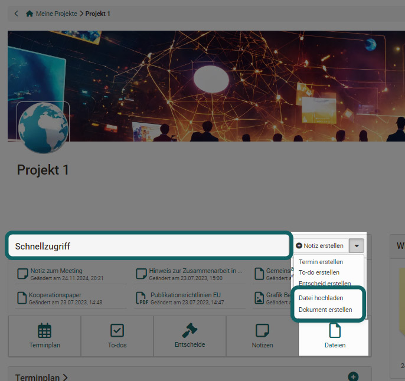
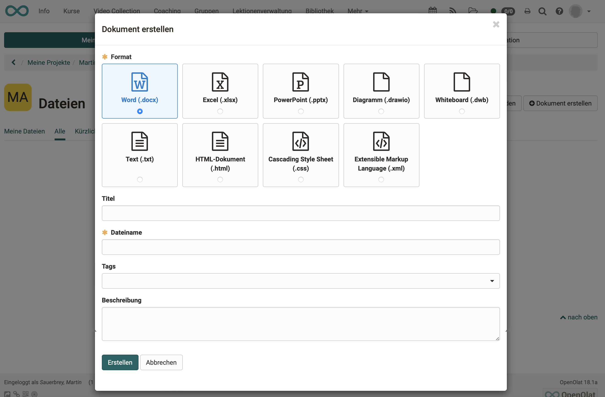
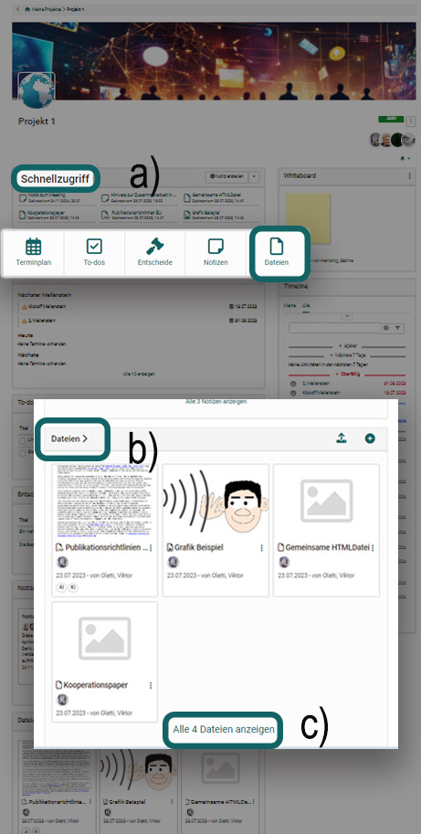
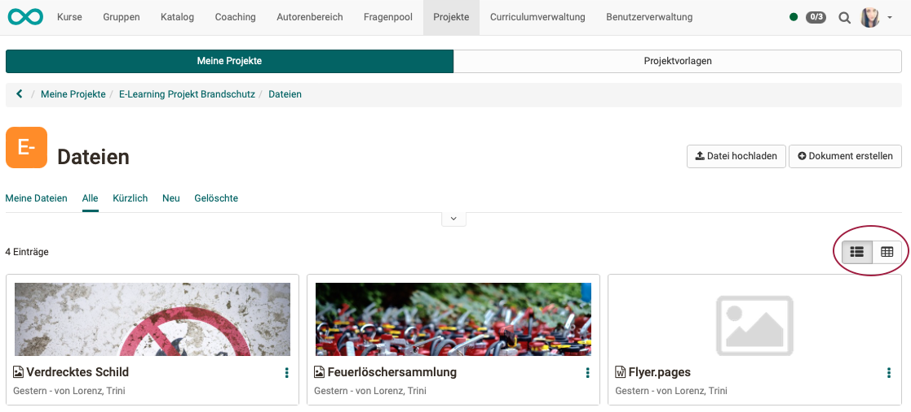
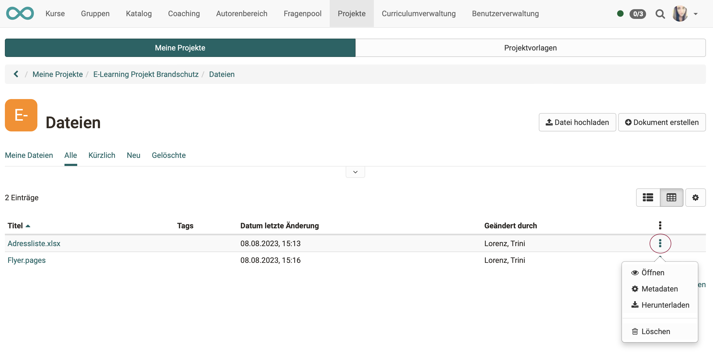
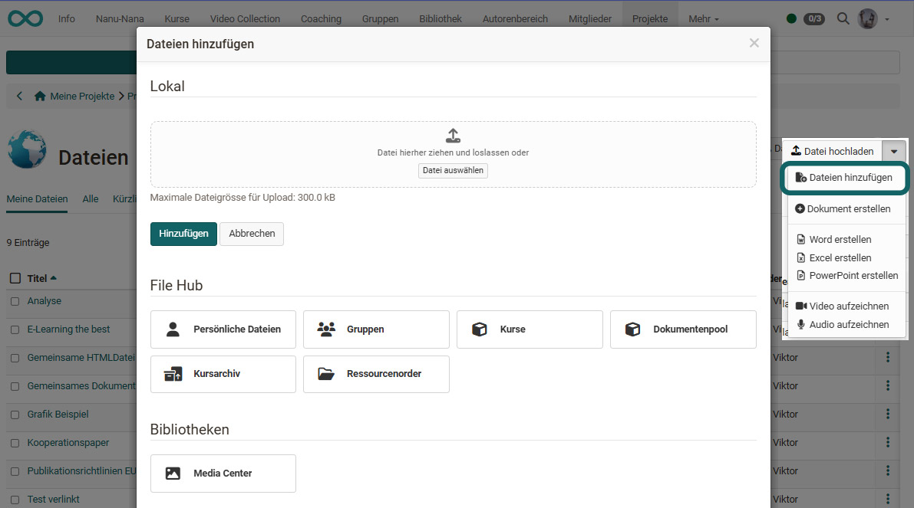
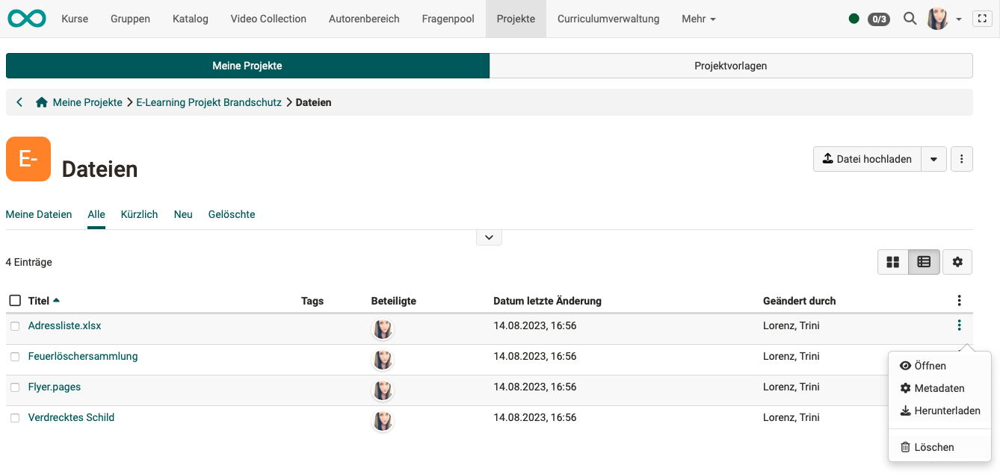
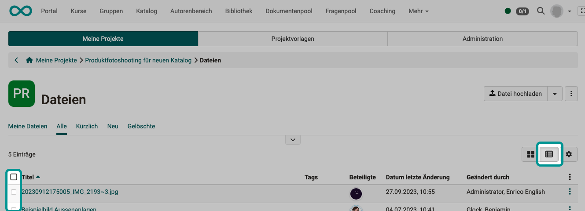

# Projects: Files {: #files}

In general, files for a project can be uploaded, created or added from other OpenOlat areas. This is done either via the "Quick start" or in the "Files" area. The options in the "Files" area are more extensive.

The "Quick start" section generally displays the six most recently used files *and* notes. These can simply be opened or downloaded by clicking on the document and edited further if necessary.

The six most recently added files are displayed in the "Files" section and can also be opened or downloaded directly and edited further if necessary.

## Upload files {: #upload}

The quickest way to upload files is in the "Quick start" area.

{ class="shadow lightbox" }

The uploaded files can be opened directly depending on the format. 
The following principles apply:

- If no Microsoft licence is available, docx, pptx and xlsx are for example opened with OnlyOffice, if a licence is available for it.
- Pdf files are usually opened with OnlyOffice.
- Images are opened in the browser.
- File formats that require special software are not opened. OpenOlat offers a download instead. The file can thus still be saved together with the other data in the project. Example: Mac file formats, such as Pages or Keynote.

!!! info "Technical info about the files"

    * There is no limit to the maximum size of the individual files.

    * The maximum total volume per project or for all projects is also not limited by default.

    * Versioning is currently not carried out.

    * There are no restrictions regarding the file formats.

[To the top of the page ^](#files)

---

## Create files {: #create}

Files can also be created quickly in the Quick start. The following document formats are available:

{ class="shadow lightbox" }

* .docx (Word, licence required)
* .xlsx (Excel, licence required)
* .pptx (PowerPoint, licence required)
* .drawio (Diagram)
* .dwb (Whiteboard)
* .txt (Unformatted text)
* .html (HTML document)
* .css (Cascading Style Sheet)
* .xml (Extensible Markup Language)

!!! info "Create office documents"

    Whether Microsoft file formats can be created depends on whether licences are available. Contact your administrator for this.

    Without licences, the options for creating docx, pptx and xlsx formats are not displayed. (However, displaying and editing existing documents with OnlyOffice is usually possible.)

[To the top of the page ^](#files)

---

## Video and audio recording {: #audio_video}

To record video or audio files via webcam, switch to the "Files" area. Select "Record video or audio" there and allow access to your webcam or microphone to make the recording.

{ class="shadow lightbox" }

Newly recorded videos are saved as mp4 files, audio as m4a files. The files are then available to all project members in the "Files" area.

[To the top of the page ^](#files)

---

## Show list of files {: #list}

All files of a project can be found in the "Files" area of the project. There are several ways to get there:

a) Quick start button "Files"

b) Click on the title in the section "Files"

c) Click on "Show all files" in the section

{ class="shadow lightbox" }

Note that you can switch between the card view and the list view on the overview page of all files.

{ class="shadow lightbox" }

You will find more options under the 3 dots at the end of each list entry.

{ class="shadow lightbox" }

To expand the filter buttons, click on the small arrow in the centre above the list.

[To the top of the page ^](#files)

---

## Add files {: #add}

Files located elsewhere in OpenOlat can also be added in the "Files" area. This gives you access to all elements of the File Hub and the Media Center.

{ class="shadow lightbox" }

[To the top of the page ^](#files)

---

## Edit files together {: #edit}

The integration of document editors enables collaborative work.

* The existing files can be edited by all project members.
* Even **simultaneous editing** (e.g. of a Word file during an online meeting) is possible if the corresponding licences for the document editor are available.

If necessary, contact your administrator.

[To the top of the page ^](#files)

---

## Delete files {: #delete}

To delete a file, click on the 3 dots at the end of a line and then on "Delete". The file then only appears under the tab "Deleted". It can be restored within a certain period of time.

{ class="shadow lightbox" }

If you want to delete several files at once (bulk action), select the list view and tick the desired checkboxes at the beginning of the lines. This will display a "Delete" button above the list.

{ class="shadow lightbox" }

[To the top of the page ^](#files)
