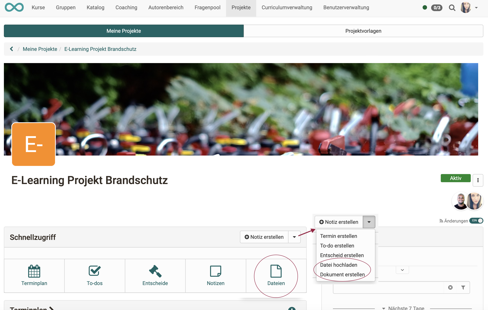

# Projects - Files

Under "Files" in the "Quick Access" section, files can be **uploaded** and new files **created** in a project. This way, all files can be saved together with the project. All media are then in the same place.  They are only available within the project.

{ class="shadow lightbox" }

## Upload files

There are no restrictions regarding the file formats.

The uploaded files can be opened directly depending on the format. 
The following principles apply:

- If no Microsoft licence is available, docx, pptx and xlsx are for example opened with OnlyOffice, if a licence is available for it.
- Pdf files are usually opened with OnlyOffice
- Images are opened in the browser.
- File formats that require special software are not opened. OpenOlat offers a download instead. The file can thus still be saved together with the other data in the project. Example: Mac file formats, such as Pages or Keynote.

!!! info "Technical info about the files"

    * There is no limit to the maximum size of the individual files.
    
    * The maximum total volume per project or for all projects is also not limited by default.

    * Versioning is currently not carried out.
 

## Create files

{ class="shadow lightbox" }

The following file formats can be created:

* .docx (Word, Licence required)
* .xlxs (Excel, Licence required)
* .pptx (PowerPoint, Licence required)
* .drawio (Diagram)
* .dwb (Whiteboard)
* .text (Unformatted text)
* .html (HTML-Document)
* .css (Cascading Style Sheet)
* .xml (Extensible Markup Language)

!!! info "Create office documents"

    Whether Microsoft file formats can be created depends on whether licences are available. Contact your administrator for this.
    
    Without licences, the options for creating docx, pptx and xlsx formats are not displayed. (However, displaying and editing existing documents with ONLYOFFICE is usually possible.)

## Video and audio recording

In the **Files** section of an OpenOlat project, it is also possible to record videos and audio files directly in OpenOlat.

Newly recorded videos are saved as mp4 files, audio as m4a files.

{ class="shadow lightbox" }

## Show list of files

Open the list of all files in the project in the same way as the to-dos or decisions.: 

**a) Projects > Tab "My projects" > Select project > Quick access button "Files"** 
or 
**b) Projects > Tab "My projects" > Select project > Click on the title in the "Files" section** 
or 
**c) Projects > Tab "My projects" > Select project > click in the "show all files" section**

Note that you can switch between the map view and the list view.  

{ class="shadow lightbox" }

You will find more options under the 3 dots at the end of each list entry.

{ class="shadow lightbox" }

## Quick access to files 

The Quick Access section displays the most recently used files and notes (max. 6, created, uploaded, changed, viewed, downloaded). They can be opened and edited directly by the creator or members by clicking on them.

{ class="shadow lightbox" }

## Edit files together 

The integration of document editors enables collaborative work.

* The existing files can be edited by all project members.
* Even **simultaneous editing** (e.g. of a Word file during an online meeting) is possible if the corresponding licences for the document editor are available.

If necessary, contact your administrator.