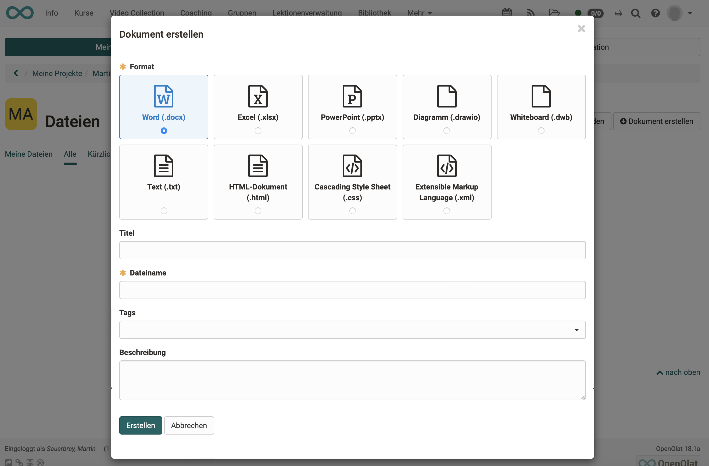

# Projects - Files

Under "Files" in the "Quick Access" section, files can be **uploaded** and new files **created** in a project. This way, all files can be saved together with the project. All media are then in the same place.  They are only available within the project.

Generell können Dateien für ein Projekt hochgeladen, erstellt oder aus anderen OpenOlat Bereichen hinzugefügt werden. Dies erfolgt jeweils entweder über den "Schnellzugriff" oder im Bereich "Dateien". Dabei sind die Möglichkeiten im Bereich "Dateien" umfangreicher. 

Im Abschnitt "Schnellzugriff" werden generell die sechs zuletzt verwendeten Dateien *und* Notizen angezeigt. Diese können einfach mit Klick auf das Dokument geöffnet bzw. heruntergeladen und gegebenenfalls weiterbearbeitet werden.

Im Abschnitt "Dateien" werden die sechs zuletzt hinzugefügten Dateien angezeigt und können ebenfalls direkt geöffnet bzw. heruntergeladen und gegebenenfalls weiterbearbeitet werden. 

## Upload files

Am schnellsten lassen sich Dateien im Bereich "Schnellzugriff" hochladen. 

{ class="shadow lightbox" } 

The uploaded files can be opened directly depending on the format. 
The following principles apply:

- If no Microsoft licence is available, docx, pptx and xlsx are for example opened with OnlyOffice, if a licence is available for it.
- Pdf files are usually opened with OnlyOffice
- Images are opened in the browser.
- File formats that require special software are not opened. OpenOlat offers a download instead. The file can thus still be saved together with the other data in the project. Example: Mac file formats, such as Pages or Keynote.

!!! info "Technical info about the files"

    * There is no limit to the maximum size of the individual files.
    
    * The maximum total volume per project or for all projects is also not limited by default.

    * Versioning is currently not carried out.
    
    * There are no restrictions regarding the file formats.
 

## Create files
Ebenfalls im Schnellzugriff können auch rasch Dateien erstellt werden. Folgende Dokument-Formate stehen dabei zur Verfügung:

{ class="shadow lightbox" }

The following file formats can be created:

* .docx (Word, Licence required)
* .xlxs (Excel, Licence required)
* .pptx (PowerPoint, Licence required)
* .drawio (Diagram)
* .dwb (Whiteboard)
* .text (Unformatted text)
* .html (HTML-Document)
* .css (Cascading Style Sheet)
* .xml (Extensible Markup Language)

!!! info "Create office documents"

    Whether Microsoft file formats can be created depends on whether licences are available. Contact your administrator for this.
    
    Without licences, the options for creating docx, pptx and xlsx formats are not displayed. (However, displaying and editing existing documents with ONLYOFFICE is usually possible.)

## Video and audio recording

Um Video- oder Audiodateien per Webcam aufzunehmen wechseln Sie in den Bereich "Dateien". Wählen sie hier Video oder Audio aufzeichnen und erlauben Sie den Zugriff auf Ihre Webcam bzw. Ihr Mikrofon um die Aufnahme vorzunehmen. 

{ class="shadow lightbox" }

Newly recorded videos are saved as mp4 files, audio as m4a files. The files are then available to all project members in the “Files” area. 

## Show list of files

Alle Dateien eines Projektes finden Sie im Bereich "Dateien" des Projektes. Es gibt mehrere Wege um hierhin zu gelangen: 

a) Quick access button "Files"

b) Click on the title in the "Files" section

c) click in the "show all files" section**

{ class="shadow lightbox" }

Note that you can switch between the map view and the list view.  

{ class="shadow lightbox" }

You will find more options under the 3 dots at the end of each list entry.

{ class="shadow lightbox" }

## Dateien hinzufügen

Im Bereich "Dateien" können auch Dateien, die sich an anderen Stellen in OpenOlat befinden hinzugefügt werden. Dabei hat man Zugriff auf alle Elemente des File-Hubs und des Media Centers.

{ class="shadow lightbox" }

## Edit files together 

The integration of document editors enables collaborative work.

* The existing files can be edited by all project members.
* Even **simultaneous editing** (e.g. of a Word file during an online meeting) is possible if the corresponding licences for the document editor are available.

If necessary, contact your administrator.
