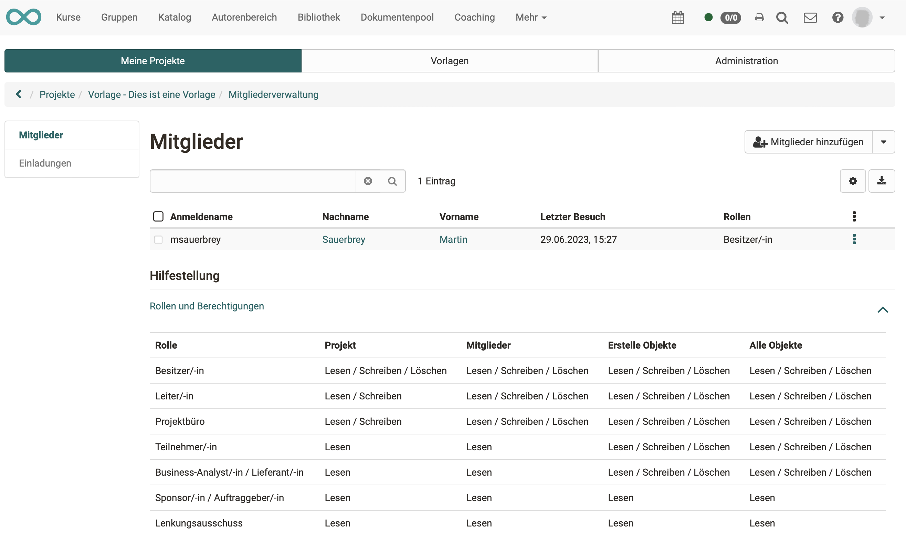
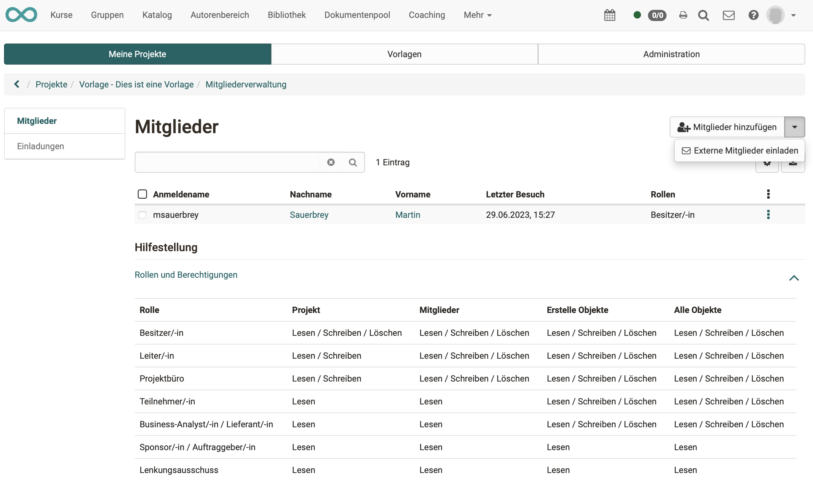

# Projekte - Mitgliederverwaltung

Die Projektmitglieder werden in der Regel durch den/die Projektbesitzer:in zu Projektmitgliedern gemacht. (In der Regel liegt die Projektleitung bei der Person, die das neue Projekt anlegt.)

{ class="shadow lightbox" }

{ class="shadow lightbox" }

## Externe Mitglieder

Sollen auch Personen im Projekt mitarbeiten, die nicht in OpenOlat als Benutzer registriert sind, können sie als externe Mitglieder eingeladen werden.

Sobald ein Projektmitglied erfasst ist, erhält es einen Link. Nach Aufruf des Links führt ein Wizard das neue Projektmitglied durch Anmeldung und Registration.

{ class="shadow lightbox" }

!!! info "Hinweis"

    „Externes Mitglied“ ist keine Rolle. Ein externes Mitglied kann alle Rollen erhalten, ausser Besitzer:in (Rolle, mit der das ganze Projekt gelöscht werden kann). 

## Rollen

|    | Projekt| Objekte im Projekt | Mitglieder verwalten | externe Mitglieder verwalten |
| ------------------------------------------------------------- | :--------------: | :--------------: | :--------------: | :--------------: |
|                                                                                       |
|**Besitzer:in (Projektbesitzer:in)** | anlegen, bearbeiten, löschen | anlegen, bearbeiten, löschen | anlegen, bearbeiten, löschen, kann Leitungsrolle vergeben | anlegen, bearbeiten, löschen |
|**Kursbesitzer:in** | tbd | tbd | tbd | :material-cancel: |
|**Leiter:in (Projektleiter:in)**| bearbeiten | anlegen, bearbeiten, löschen | anlegen, bearbeiten, löschen | :material-cancel: |
|**Projektbüro** | bearbeiten | anlegen, bearbeiten, löschen | anlegen, bearbeiten, löschen | :material-cancel: |
|**Teilnehmer:in (Projektmitarbeiter:in)**              | nur lesen | anlegen, bearbeiten, löschen            | :material-cancel: |     :material-cancel:    |
|**Business-Analyst:in/Lieferant:in**         | nur lesen           | anlegen, bearbeiten, löschen | :material-cancel:| :material-cancel: |
|**Sponsor:in/Auftraggeber:in**          | nur lesen           | :material-cancel: | :material-cancel: | :material-cancel: |
|**Lenkungsausschuss**         | nur lesen          | :material-cancel: | :material-cancel:| :material-cancel: |
| Rollen, die über mehrere Projekte hinweg agieren können:                                                                                                   |
|**Projektverwalter:in**                                        | anlegen, bearbeiten, löschen, Tab "Administration" im Bereich Projekte      | sieht keine Inhalte | anlegen, bearbeiten, löschen, kann Leitungsrolle vergeben | anlegen, bearbeiten, löschen  |
|**Administrator:in**                                         | Tab "Administration" im Bereich Projekte      | hat nur Einblick in ein Projekt, wenn auch Mitglied*       | kann Leitungsrolle vergeben | anlegen, bearbeiten, löschen  |

*Administrator:innen können sich zwar selbst zum Mitglied machen, aber das ist dann protokolliert. Auf diese Art soll missbräuchlicher Zugriff eingedämmt werden.

