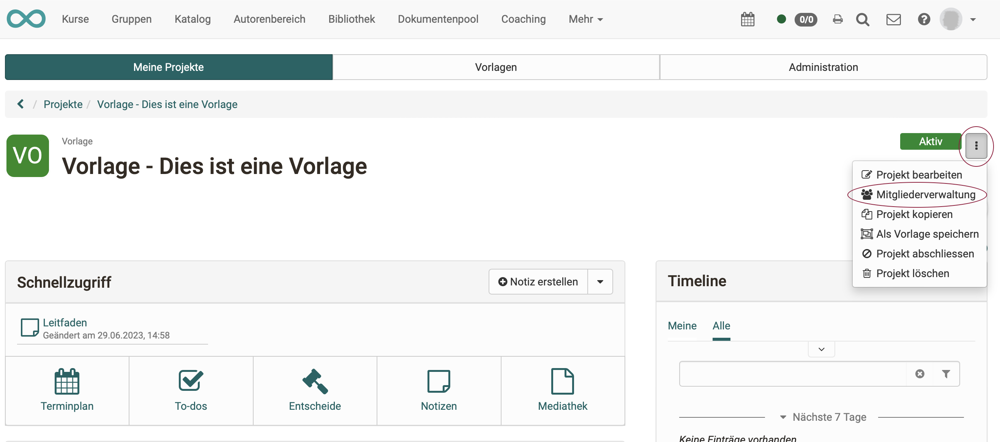

# Projekte - Mitgliederverwaltung

Die Projektmitglieder werden in der Regel durch den/die Projektbesitzer:in zu Projektmitgliedern gemacht. (In der Regel liegt die Projektleitung bei der Person, die das neue Projekt anlegt.)

{ class="shadow lightbox" }

{ class="shadow lightbox" }

## Externe Mitglieder

Sollen auch Personen im Projekt mitarbeiten, die nicht in OpenOlat als Benutzer registriert sind, können sie als externe Mitglieder eingeladen werden.

Sobald ein Projektmitglied erfasst ist, erhält es einen Link. Nach Aufruf des Links führt ein Wizard das neue Projektmitglied durch Anmeldung und Registration.

{ class="shadow lightbox" }

!!! info "Hinweis"

    „Externes Mitglied“ ist keine Rolle. Ein externes Mitglied kann alle Rollen erhalten, ausser Besitzer:in (Rolle, mit der das ganze Projekt gelöscht werden kann). 

## Rollen

In einem Projekt können verschiedene Rollen vergeben werden.

{ class="shadow lightbox" }

**Besitzer:in(Projektbesitzer:in)**

tbd

**Kursbesitzer:in**

tbd

**Leiter:in (Projektleiter:in)**

tbd

**Projektbüro**

tbd

**Teilnehmer:in (Projektmitarbeiter:in)**

tbd

**Business-Analyst/Lieferant**

tbd

**Sponsor/Auftraggeber**

tbd

**Lenkungsausschuss**

tbd

Ausserdem git es Rollen, die über mehrere Projekte hinweg agieren können:

**Projektverwalter:in**

Der/die Projektverwalter:in kann alle Projekte sehen, aktualisieren und verwalten, inklusive der Mitglieder. Sieht aber nicht deren Inhalt. Er ist neben dem/der Besitzer:in und dem/der Administrator:in, die Person, die die Leitungsrolle an andere vergebene kann. Er hat Zugriff auf den Tab "Administration" im Bereich Projekte.

**Administrator:in**

Die systemweit gültige Rolle der Administratorin / des Administrators hat auf Projekte nur einen eigeschränkten Zugriff. Administrator:innen haben nur Einblick in ein Projekt, wenn sie auch Mitglied im Projekt sind. Administrator:innen können sich zwar selbst zum Mitglied machen, aber das ist dann protokolliert. Auf diese Art soll missbräuchlicher Zugriff eingedämmt werden.